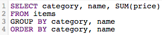

# SQL 쿼리 최적화

[!DNL SQL Report Builder]을(를) 사용하면 언제든지 쿼리를 실행하고 변경할 수 있습니다. 이 기능은 열이나 보고서를 수정하기 전에 업데이트 주기가 끝날 때까지 기다리는 대신 쿼리를 즉시 업데이트해야 하는 경우에 유용합니다.

쿼리를 실행하기 전에 [[!DNL Commerce Intelligence] 비용을 예상합니다](https://experienceleague.adobe.com/docs/commerce-knowledge-base/kb/troubleshooting/miscellaneous/sql-queries-explain-cost-errors.html?lang=ko). 비용은 쿼리를 실행하는 데 필요한 시간과 리소스 수를 고려합니다. 해당 비용이 너무 높거나 반환된 행 수가 [!DNL Commerce Intelligence] 제한을 초과하는 경우 쿼리가 실패합니다. [Data Warehouse](../data-analyst/data-warehouse-mgr/tour-dwm.md)을 쿼리하여 최대한 간소화된 쿼리를 작성할 수 있도록 하려면 Adobe에서 다음 사항을 권장합니다.

## SELECT 사용 또는 모든 열 선택

모든 열을 선택해도 적시에 쉽게 실행되는 쿼리는 수행되지 않습니다. `SELECT *`을(를) 사용하는 쿼리는 특히 테이블에 열이 많은 경우 실행하는 데 시간이 많이 걸릴 수 있습니다.

따라서 Adobe에서는 가능한 모든 곳에서 `SELECT *`을(를) 사용하지 말고 필요한 열만 포함할 것을 권장합니다.

| **이 대신...** | **사용해 보세요!** |
|-----|-----|
|  |  |

{style="table-layout:auto"}

## 전체 외부 조인 사용

외부 조인은 조인되는 두 테이블 전체를 선택하여 쿼리의 계산 비용을 증가시킵니다. 즉, 실행 제한보다 오래 걸리면 결과가 반환될 수 있으므로 쿼리를 실행하는 데 더 많은 시간이 소요되고 쿼리가 실패할 가능성이 높습니다.

이러한 유형의 조인 대신 내부 또는 왼쪽 조인을 사용하는 것이 좋습니다. 내부 조인은 테이블 간에 열 형식 일치가 있는 경우에만 결과를 반환합니다(예: `order_id`은(는) 일반적인 `customers` 테이블과 `orders` 테이블 모두에 있음). 왼쪽 조인은 왼쪽(첫 번째) 테이블의 모든 결과를 오른쪽(두 번째) 테이블의 일치 결과와 함께 반환합니다.

FULL OUTER JOIN 쿼리를 다시 작성하는 방법을 살펴봅니다.

| **이 대신...** | **사용해 보세요!** |
|-----|-----|
|  |  |

{style="table-layout:auto"}

이러한 쿼리는 사용하는 JOIN 유형을 제외하고 모든 면에서 동일합니다.

## 여러 조인 사용

쿼리에 여러 조인을 포함할 수 있지만, 이 경우 쿼리 비용이 증가할 수 있습니다. 비용 임계값에 도달하지 않도록 Adobe에서는 가능한 여러 조인을 피하는 것이 좋습니다.

## 필터 사용

가능하면 필터를 사용하십시오. `WHERE` 및 `HAVING` 절은 결과를 필터링하고 원하는 데이터만 제공합니다.

## JOIN 절에서 필터 사용

조인을 수행할 때 필터를 사용하는 경우 조인의 두 테이블 모두에 필터를 적용해야 합니다. 이는 중복이 되더라도 쿼리의 계산 비용을 감소시키고, 실행 시간을 감소시킨다.

| **이 대신...** | **사용해 보세요!** |
|-----|-----|
|  |  |

{style="table-layout:auto"}

## 연산자 사용

쿼리를 작성할 때 가능한 &quot;가장 저렴한&quot; 연산자 사용을 고려하십시오. 모든 쿼리에는 계산 비용이 있으며 이는 쿼리를 구성하는 함수, 연산자 및 필터에 의해 결정됩니다. 일부 연산자는 계산 노력이 덜 필요하므로 다른 연산자보다 비용이 덜 든다.

비교 연산자(>, &lt;, = 등)가 가장 저렴하고 그 뒤에 [LIKE가 있습니다. 가장 비싼 연산자인 및 POSIX 연산자](https://www.postgresql.org/docs/9.5/functions-matching.html)과(와) 비슷합니다.

## 존재함 대 위치 사용

`EXISTS`과(와) `IN`을(를) 사용하는 것은 반환하려는 결과의 유형에 따라 다릅니다. 단일 값에만 관심이 있는 경우 `EXISTS` 대신 `IN` 절을 사용하십시오. `IN`은(는) 쉼표로 구분된 값 목록과 함께 사용되므로 쿼리의 계산 비용이 증가합니다.

`IN`개의 쿼리가 실행되면 시스템은 먼저 하위 쿼리(`IN` 문)를 처리한 다음 `IN` 문에 지정된 관계를 기반으로 전체 쿼리를 처리해야 합니다. `EXISTS` 쿼리는 쿼리를 여러 번 실행할 필요가 없기 때문에 훨씬 효율적입니다. 쿼리에 지정된 관계를 확인하는 동안 true/false 값이 반환됩니다.

간단히 말해, `EXISTS`을(를) 사용할 때는 시스템이 많이 처리하지 않아도 됩니다.

| **이 대신...** | **사용해 보세요!** |
|-----|-----|
|  |  |

{style="table-layout:auto"}

## 정렬 기준 사용

`ORDER BY` 함수는 SQL에서 비싸며 쿼리 비용을 크게 높일 수 있습니다. 쿼리의 EXPLAIN 비용이 너무 높다는 오류 메시지가 표시되면 필요하지 않은 경우 쿼리에서 `ORDER BY`을(를) 제거하십시오.

`ORDER BY`을(를) 사용할 수 없다는 말은 아닙니다. 필요한 경우에만 사용해야 합니다.

## 그룹화 기준 및 정렬 기준 사용

이 접근 방식이 수행하려는 작업에 부합하지 않는 경우가 있을 수 있습니다. 일반적으로 `GROUP BY` 및 `ORDER BY`을(를) 사용하는 경우 두 절의 열을 같은 순서로 지정해야 합니다. For example:

| **이 대신...** | **사용해 보세요!** |
|-----|-----|
|  |  앞에 필터가 있는 SQL 쿼리 |

{style="table-layout:auto"}

## 요약

SQL을 작성하는 가장 좋은 방법은 시행착오를 통해서입니다. 가장 적합한 기능을 찾으려면 SQL 편집기만 사용하여 몇 개의 보고서를 다시 만드십시오.
