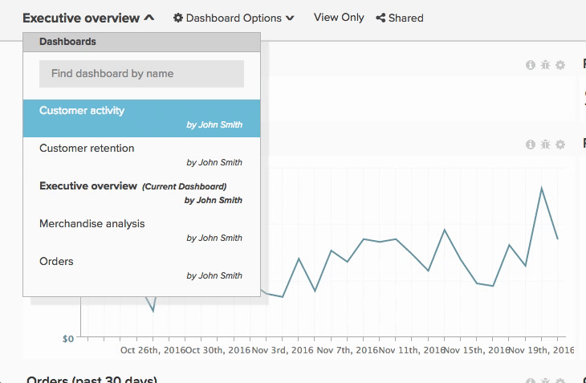

# 대시보드 공유

대시보드를 공유하면 사용자와 팀이 지정된 시간에 동일한 정보를 소유하게 되므로 이를 통해 공동 작업 및 토론을 수행할 수 있습니다. 대시보드를 공유하고 [!DNL Adobe Commerce Intelligence] 계정을 깔끔하게 유지하기 위한 몇 가지 권장 사항이 있습니다.

## 중복 대시보드 방지

동일한 이름의 대시보드가 여러 개 있는 경우가 있습니다. 이는 일반적으로 다른 사용자가 유사한 대시보드를 만들고 공유했기 때문입니다. 이러한 대시보드는 기본 사본의 중복일 수 있습니다. 이 경우 Adobe에서는 한 명의 사용자가 대시보드의 기본 복사본을 공유한 다음 모든 중복 대시보드를 제거하도록 권장합니다.

대시보드를 소유한 사용자를 보려면 왼쪽 상단 모서리에서 대시보드 드롭다운을 클릭합니다. 아래에 이름이 없는 모든 대시보드는 사용자의 것입니다.

모든 중복 대시보드를 제거하려면 다음 작업을 수행하십시오.

1. 팀과 동기화하고 대시보드를 유지해야 하는 사용자를 식별합니다.
1. 기본 사용자가 공유한 대시보드를 제외하고 유사한 모든 대시보드에서 [사용자 공유를 해제](../data-user/dashboards/leave-dashboard.md)합니다.
1. 대시보드 복사본이 있으면 [삭제하세요](../data-user/dashboards/deleting-dashboard.md).
1. 다른 사용자에게 대시보드 버전을 삭제하도록 요청하십시오.

## 핵심 대시보드 세트 만들기

새 사용자가 생성되면 대시보드 또는 차트를 소유하지 않습니다. 하지만 처음 로그인하면 조직에서 가장 인기 있는 대시보드 목록이 표시됩니다(전체 팀에 대한 보기 또는 편집 권한 포함). 새 사용자를 포함할 수 있도록 대시보드가 항상 이 목록에 있는지 확인하십시오.

## 새 사용자와 대시보드 공유

새 사용자는 조직 전체에서 공유되지 않는 일부 대시보드에 액세스할 수도 있습니다. 이러한 경우 Adobe은 계정을 만들 때 대시보드 소유자에게 [관련 대시보드를 새 사용자와 공유](../data-user/dashboards/share-dashboard-with-users.md)할 것을 권장합니다.

## 편집 권한 선택

`Edit` 권한은 사용자에게 많은 권한을 부여합니다. 하지만 큰 힘에는 큰 책임이 따른다. 차트 및 대시보드가 실수로 변경되는 것을 방지하기 위해 Adobe에서는 `Edit` 권한을 부여할 사용자를 선택할 것을 권장합니다.

## 차트에 주석 달기

대시보드를 공유하면 사용자에게 동일한 정보에 대한 액세스 권한만 제공됩니다. Adobe 정보를 이해하려면 차트 노트 기능을 사용하여 특정 데이터 포인트에 대한 지식과 뉘앙스를 공유하거나 분석 목적을 전달하는 것이 좋습니다.
