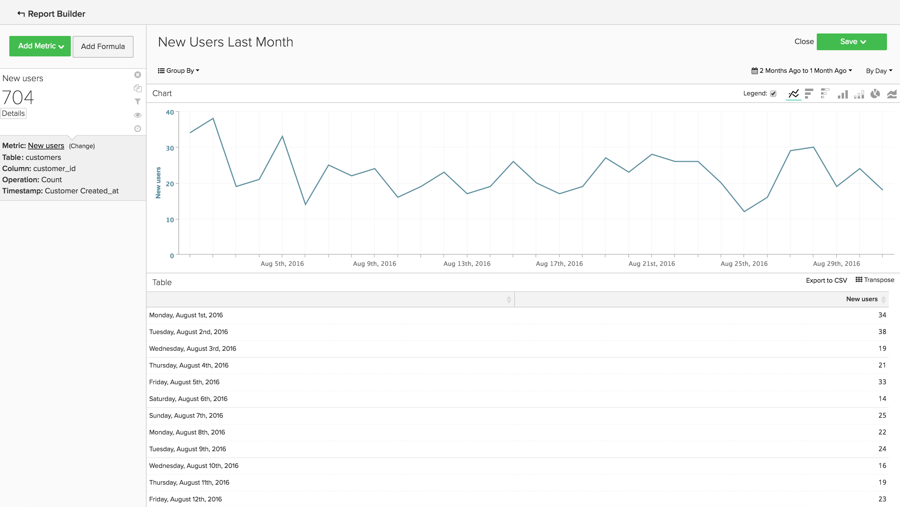
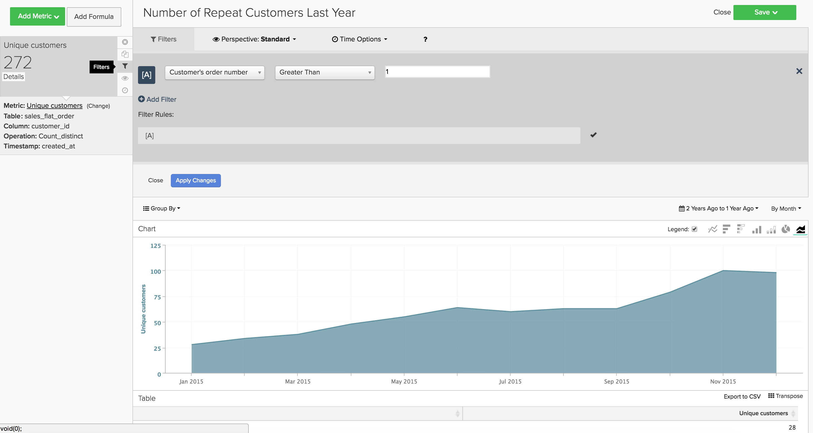
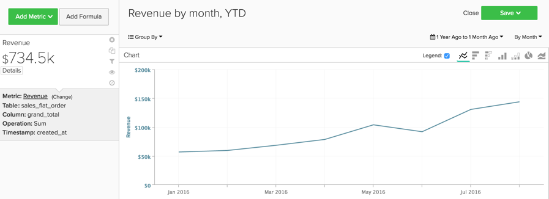

# 기본 분석

[!DNL Adobe Commerce Intelligence] 플랫폼을 잘 알고 있고 도구에 대한 기본 사항을 이해하면 보고서 작성을 시작할 수 있습니다. 가장 일반적인 질문 중 하나는 &quot;무엇을 봐야 합니까?&quot;입니다.

아래 정보에서는 유용한 정보를 찾을 수 있는 몇 가지 일반적인 지표와 보고서에 대해 간략히 설명합니다. 이러한 보고서 중 일부는 계정 내에 있으므로, 중복을 만들지 않도록 계정 내에 있는 지표 및 보고서를 검토해야 합니다.

## 이해할 테이블 및 열

지표를 작성할 때 다음 네 가지 정보를 알고 있어야 합니다.

1. 데이터가 있는 테이블,
1. 수행할 특정 작업
1. 해당 작업을 수행할 열입니다.
1. 해당 데이터를 추적하는 데 사용할 타임스탬프입니다.

이러한 예제에서 사용되는 테이블 이름은 각 데이터베이스가 고유하기 때문에 데이터베이스의 열 및 테이블 이름과 약간 다를 수 있습니다. 데이터베이스에서 해당 테이블이나 열을 식별하는 데 도움이 필요한 경우 아래 정의를 참조하십시오.

## Customers 테이블

이 표에는 고유한 고객 ID, 이메일 주소 등과 같은 각 고객에 대한 주요 정보가 포함되어 있습니다. 아래 예제에서는 샘플 고객 테이블의 이름으로 **[!UICONTROL customer_entity]**&#x200B;을(를) 사용합니다.

이러한 계산 중 일부가 현재 데이터베이스에 없는 경우 계정의 모든 관리자가 만들 수 있습니다. 또한 적용 가능한 모든 지표에 대해 이러한 차원을 그룹화할 수 있는지 확인해야 합니다.

**차원**

* **[!UICONTROL Entity_id]**: 각 고객의 고유 식별자입니다. 이는 고유 고객 번호 또는 고객 이메일 주소일 수도 있으며 주문 테이블에 대한 참조 키로 작동해야 합니다.
* **[!UICONTROL Created_at]**: 고객 계정이 만들어져 데이터베이스에 추가된 날짜입니다.
* **[!UICONTROL Customer's lifetime revenue]**: 고객이 생성한 총 라이프타임 매출입니다.
* **[!UICONTROL Customer's first 30-day revenue]**: 첫 30일 동안 고객이 생성한 총 매출액.
* **[!UICONTROL Customer's lifetime number of orders]**: 고객이 라이프타임 동안 수행한 주문 수
* **[!UICONTROL Customer's lifetime number of coupons]**: 고객이 라이프타임 동안 사용한 총 쿠폰 수입니다.
* **[!UICONTROL Customer's first order date]**: 고객의 첫 번째 주문일. 고객이 생성 시 주문을 하지 않은 경우 이는 created_at 날짜와 다를 수 있습니다.

**손님 주문을 수락하시겠습니까?**

*그럴 경우 이 테이블에 모든 고객이 포함되지 않을 수 있습니다. 고객 분석에 모든 고객이 포함되는지 확인하려면 [지원 팀](https://experienceleague.adobe.com/docs/commerce-knowledge-base/kb/troubleshooting/miscellaneous/mbi-service-policies.html?lang=ko)에 문의하십시오.*

*손님 주문을 수락할지 확실하지 않습니까? 자세한 내용은 [이 항목](../data-warehouse-mgr/guest-orders.md)을 참조하세요!*

## 주문 테이블

이 표에서 각 행은 하나의 순서를 나타냅니다. 이 테이블의 열에는 주문 ID, 생성 날짜, 상태, 주문한 고객의 ID 등과 같은 각 주문에 대한 기본 정보가 포함되어 있습니다. 아래 예제에서는 샘플 주문 테이블의 이름으로 **[!UICONTROL sales_flat_order]**&#x200B;을(를) 사용합니다.

**차원**

* **[!UICONTROL Customer_id]**: 주문한 고객의 고유 식별자입니다. 이 메서드는 종종 고객과 주문 테이블 간에 정보를 이동하는 데 사용됩니다. 이 예제에서는 **[!UICONTROL sales_flat_order]** 테이블의 customer_id가 **[!UICONTROL entitiy_id]** 테이블의 **[!UICONTROL customer_entity]**&#x200B;과(와) 일치할 것으로 예상합니다.
* **[!UICONTROL Created_at]**: 주문을 만들거나 수행한 날짜입니다.
* **[!UICONTROL Customer_email]**: 주문한 고객의 이메일 주소입니다. 고객의 고유 식별자일 수도 있습니다.
* **[!UICONTROL Customer's lifetime number of orders]**: `Customers` 테이블에서 이름이 같은 열의 복사본입니다.
* **[!UICONTROL Customer's order number]**: 주문과 연결된 고객의 순차적 주문 번호입니다. 예를 들어 표시되는 행이 고객의 첫 번째 주문인 경우 이 열은 &quot;1&quot;이지만, 고객의 15번째 주문인 경우 이 열에는 이 주문에 대한 &quot;15&quot;가 표시됩니다. 이 차원이 `Customers` 테이블에 없는 경우 [지원 팀](https://experienceleague.adobe.com/docs/commerce-knowledge-base/kb/troubleshooting/miscellaneous/mbi-service-policies.html?lang=ko)에 이 차원을 빌드하도록 요청하십시오.
* **[!UICONTROL Customer's order number (previous-current)]**: **[!UICONTROL Customer's order number]** 열에 있는 두 값의 연결입니다. 이 메서드는 아래 샘플 보고서에서 두 주문 간의 경과 시간을 표시하는 데 사용됩니다. 예를 들어, 고객의 첫 번째 주문 일자와 두 번째 주문 일자 사이의 시간은 이 계산과 함께 &quot;1-2&quot;로 표시됩니다.
* **[!UICONTROL Coupon_code]**: 각 주문에 사용된 쿠폰을 표시합니다.
* **[!UICONTROL Seconds since previous order]**: 고객의 주문 사이의 시간(초)입니다.

## 주문 항목 테이블

이 테이블에서 각 행은 판매된 하나의 품목을 나타냅니다. 이 표에는 주문 참조 번호, 제품 번호, 수량 등과 같이 각 주문에서 판매된 품목에 대한 정보가 포함되어 있습니다. 아래 예제에서는 `sales_flat_order_item`을(를) 샘플 주문 항목 테이블의 이름으로 사용합니다.

**차원**

* **[!UICONTROL Item_id]**: 테이블의 각 행에 대한 고유 식별자입니다.
* **[!UICONTROL Order_id]**: 같은 순서로 구매한 항목을 알려주는 `Orders` 테이블에 대한 참조 키입니다. 주문에 여러 항목이 포함되어 있는 경우 이 값이 반복됩니다.
* **[!UICONTROL Product_id]**: 구입한 특정 제품에 대한 정보(색상, 크기 등)가 필요한 경우 이 열을 사용하여 제품 테이블에서 해당 정보를 가져옵니다.
* **[!UICONTROL Order's created_at]**: 순서가 지정된 타임스탬프이며, 일반적으로 `order line items` 테이블에서 `Orders` 테이블로 복사됩니다.
* **[!UICONTROL Order's coupon_code]**: `Order's created_at` 차원과 마찬가지로 이 열은 orders 테이블에서 복사됩니다.

## 구독 테이블

이 테이블은 구독 ID, 구독자의 이메일 주소, 구독 시작 날짜 등 구독 정보를 관리하는 데 사용됩니다.

**차원**

* **[!UICONTROL Customer_id]**: 주문한 고객의 고유 식별자입니다. 다음은 Customers 테이블과 Orders 테이블 간의 경로를 만드는 일반적인 방법입니다. 이 예제에서는 **sales_flat_order** 테이블의 customer_id가 `entitiy_id` 테이블의 `customer_entity`과(와) 일치해야 합니다.
* **[!UICONTROL Start date]**: 고객의 구독이 시작된 날짜입니다.

## 마케팅 지출 테이블

마케팅 지출을 분석할 때 분석에 [!DNL Facebook], [!DNL Google AdWords] 또는 다른 소스를 포함할 수 있습니다. 여러 마케팅 지출 소스가 있는 경우 [Managed Services 팀](https://business.adobe.com/kr/products/magento/fully-managed-service.html)에 문의하여 마케팅 캠페인에 대한 통합 테이블을 설정하십시오.

**차원**

* **[!UICONTROL Spend]**: 총 광고 지출입니다. [!DNL Facebook]에서 `facebook_ads_insights_####` 테이블의 지출 열입니다. [!DNL Google AdWords]의 경우 `adCost` 테이블의 `campaigns####` 열입니다.
* 이러한 각 테이블에 추가된 `####`은(는) [!DNL Facebook] 또는 [!DNL Google AdWords] 계정의 특정 계정 ID와 관련되어 있습니다.
* **[!UICONTROL Clicks]**: 총 클릭 수입니다. [!DNL Facebook]에서 `facebook_ads_insights_####` 테이블의 클릭 수 열입니다. [!DNL Google AdWords]에서 `campaigns####` 테이블의 adClicks 열입니다.
* **[!UICONTROL Impressions]**: 총 노출 횟수입니다. [!DNL Facebook]에서 `facebook_ads_insights_####` 테이블의 노출 횟수입니다. [!DNL Google AdWords]에서 `campaigns####` 테이블의 노출 횟수입니다.
* **[!UICONTROL Campaign]**: 총 클릭 수입니다. [!DNL Facebook]에서 `facebook_ads_insights_####` 테이블의 campaign_name 열입니다. [!DNL Google AdWords]에서 이는 `campaigns####` 테이블의 캠페인 열입니다.
* **[!UICONTROL Date]**: 특정 캠페인에 대해 활동(지출, 클릭 수 또는 노출 수)이 발생한 시간 및 날짜입니다. [!DNL Facebook]에서 이는 `date_start` 테이블의 `facebook_ads_insights_####` 열입니다. [!DNL Google AdWords]에서 `campaigns####` 테이블의 날짜 열입니다.
* **[!UICONTROL Customer's first order's source]**: 고객의 첫 번째 주문에서 가져온 주문의 원본입니다. 먼저 계정에 이름이 `customer's first order's source`인 열이 있는지 확인하십시오. 이 열이 표시되지 않는 경우 다음 지침을 사용하여 원하는 열을 만들 수 있습니다.
* **[!UICONTROL Customer's first order's medium]**: 고객의 첫 번째 주문에서 중간 정도의 주문입니다. 먼저 계정에 이름이 `customer's first order's source`인 열이 있는지 확인하십시오. 이 열이 표시되지 않는 경우 다음 지침을 사용하여 원하는 열을 만들 수 있습니다.
* **[!UICONTROL Customer's first order's campaign]**: 고객의 첫 번째 주문에서 주문의 캠페인입니다. 먼저 계정에 이름이 `customer's first order's source`인 열이 있는지 확인하십시오. 이 열이 표시되지 않는 경우 다음 지침을 사용하여 원하는 열을 만들 수 있습니다.

## 일반적인 보고서 및 지표

다음은 유용하다고 판단될 수 있는 보고서 및 지표의 몇 가지 일반적인 예입니다.

* [고객 분석](#customeranalytics)
* [주문 분석](#orderanalytics)
* [마케팅 지출 분석](#mktgspendanalytics)

## 고객 분석 {#customeranalytics}

### 새 사용자

* **설명**: 지정된 기간 동안 새로 획득한 총 사용자 수 수입니다. `New Users`이(가) 하나 이상의 주문을 했지만 `Unique Customers`에는 사용자의 서비스로 계정을 만든 타임스탬프가 있으므로 `New Users`은(는) `Unique Customers`과(와) 다릅니다.
* **지표 정의**: 이 지표는 **이(가) 정렬한** 테이블에서 `entity_id`의 `customer_entity`Count`created_at`을(를) 수행합니다.
* **보고서 예제**: 지난 달에 만든 새 사용자 수
   * **[!UICONTROL Metric]**: `New Users`
   * **[!UICONTROL Time Range]**: `Last Month`
   * **[!UICONTROL Time Interval]**: `By Day`

<!--{: width="929"}-->

### 고유 고객 수

* **설명**: 지정된 기간 동안의 총 고유 고객 수 수입니다. 최소 하나 이상의 주문을 한 고객만 추적하므로 이는 `New Users`과(와) 다릅니다. 개별 고객의 보고서는 주어진 시간 간격에서 고객을 한 번만 추적합니다. 시간 간격을 `By Day`(으)로 설정하고 고객이 해당 날짜에 두 번 이상 구매하는 경우 고객은 한 번만 계산됩니다. 일반적으로 총 구매 횟수를 보려면 `Number of Orders`을(를) 살펴보세요.
* **지표 정의**: 이 지표는 **이(가) 정렬한** 테이블에서 `customer_id`의 `sales_flat_order`고유 개수`created_at`을(를) 수행합니다.
* **보고서 예**: 지난 90일 동안의 주별 고유 고객 수
   * **[!UICONTROL Metric]**: `Distinct Customers`
   * **[!UICONTROL Time Range]**: `Moving range > Last 90 Days`
   * **[!UICONTROL Time Interval]**: `By Day`

<!--{: width="929"}-->

### 새 구독자

* **설명**: 지정된 기간 동안 얻은 총 새 구독자 수 수입니다.
* **지표 정의**: 이 지표는 **이(가) 정렬한** 테이블에서 `customer_id`의 `subscriptions`고유 개수`start_date`을(를) 수행합니다.
* **보고서 예**: 올해 월별 신규 구독자
   * **[!UICONTROL Metric]**: `New Subscribers`
   * **[!UICONTROL Time Range]**: `1 Year Ago to 0 Days Ago`
   * **[!UICONTROL Time Interval]**: `By Month`

<!--{: width="929"}-->

### 반복 고객

* **설명**: 일정 기간 동안 두 개 이상의 주문을 한 고객의 총 수입니다. 반복 고객 보고서에서 `Distinct Customers` 테이블의 `Customer's Order Number` 지표와 `orders` 차원을 사용할 수 있습니다.
* **사용된 지표**: `Distinct Customers`
* **보고서 예**: 작년에 수행한 2차 및 3차 구매 횟수
   * **[!UICONTROL Metric]**: `Distinct Customers`
   * **[!UICONTROL Time Range]**: `Moving Range > Last Year`
   * **[!UICONTROL Time Interval]**: `By Month`
   * **[!UICONTROL Group By]**: `Customer's Order Number`, `2` 및 `3` 선택

  

* **보고서 예 2**: 지난 해 반복 고객 수
   * **[!UICONTROL Metric]**: `Distinct Customers`
   * **[!UICONTROL Filters]**: `Customer's Order Number Greater Than 1`
   * **[!UICONTROL Time Range]**: `Moving range > Last Year`
   * **[!UICONTROL Time Interval]**: `By Month`

  <!--{: width="929"}-->

### 라이프타임 주문 수별 상위 고객

* **설명**: 총 주문 수를 기반으로 하는 최상위 고객 목록입니다. 이렇게 하면 가장 자주 찾는 쇼핑객 목록을 직접 확인할 수 있습니다.
* **사용된 지표**: `Orders`
* **보고서 예**: 수명 주기 주문 수별로 상위 25명의 고객
   * **[!UICONTROL Metric]**: `Orders`
   * **[!UICONTROL Time Range]**: `All Time`
   * **[!UICONTROL Time Interval]**: `None`
   * **[!UICONTROL Group By]**: `customer_email`
   * **[!UICONTROL Show Top/Bottom]**: 주문별로 정렬된 상위 25개

  주문별 상위 25개 고객<!--{: width="929"}-->

### 라이프타임 매출별 상위 고객

* **설명**: 라이프타임 수입을 기반으로 하는 최상위 고객 목록입니다.
* **사용된 지표**: `Average Lifetime Revenue`
* **보고서 예**: 라이프타임 매출별 상위 25개 고객
   * **[!UICONTROL Metric]**: `Average Lifetime Revenue`
   * **[!UICONTROL Time Range]**: `All time`
   * **[!UICONTROL Time Interval]**: `None`
   * **[!UICONTROL Group By]**: `customer_email`
   * **[!UICONTROL Show Top Bottom]**: 라이프타임 수입별로 정렬된 상위 25개

  매출액 기준 <!--{: width="929"}-->

### 집단별 평균 라이프타임 수익

* **설명**: 성과가 가장 높은 집단을 식별하기 위해 시간 경과에 따라 고유한 집단의 [평균 라이프타임 수익](../dev-reports/lifetime-rev-cohort-analysis.md)을 추적합니다. 집단은 첫 번째 주문 날짜 또는 생성 날짜와 같은 공통 날짜로 그룹화됩니다.
* **사용된 지표**: `Revenue`
* **보고서 예**: 집단에 따른 평균 고객 생애 수익
   * **[!UICONTROL Metric]**: `Revenue`
   * **[!UICONTROL Cohort Date]**: `Customer's first order date`
   * **[!UICONTROL Time Interval]**: `Month`
   * **[!UICONTROL Time Period]**: 최소 4개월 이상의 데이터를 가진 가장 최근 8개 집단의 집단 이동
   * **[!UICONTROL Duration]**: `12 Month(s)`
   * **[!UICONTROL Table]**: `Customer_entity`
   * **[!UICONTROL Perspective]**: 집단 구성원당 누적 평균 값

  <!--{: width="929"}-->

### 쿠폰 사용별 고객

* **설명**: 쿠폰/할인 코드를 사용한 고객 수 카운트입니다. 이렇게 하면 할인 구매자와 정가 구매자를 명확하게 볼 수 있습니다.
* **사용된 지표**: `New Users`
* **보고서 예**: 월별 쿠폰 및 비쿠폰 고객
   * **[!UICONTROL Metric A]**: `Non coupon customers`
   * **[!UICONTROL Metric]**: `New Users`
   * **[!UICONTROL Filters]**: 고객의 라이프타임 주문 수가 0보다 크고 고객의 라이프타임 쿠폰 수가 0과 같음
   * **[!UICONTROL Metric B]**: `Coupon customers`
   * **[!UICONTROL Metric]**: `New Users`
   * **[!UICONTROL Filters]**: 고객 라이프타임 주문 수가 0보다 크고 고객 라이프타임 쿠폰 수가 0보다 큼
   * **[!UICONTROL Time range]**: `All Time`
   * **[!UICONTROL Time interval]**: `By Month`

  <!--{: width="929"}-->

* **보고서 예 2**: 월별 쿠폰 및 비쿠폰 고객 비율
   * **[!UICONTROL Metric A]**: `Non coupon customers`(지표 숨기기)
      * **[!UICONTROL Metric]**: `New Users`
      * **[!UICONTROL Filters]**: `Customer's Lifetime Number of Orders Greater Than 0` 및 `Customer's Lifetime Number of Coupons Equal to 0`
   * **[!UICONTROL Metric B]**: `Coupon customers`
      * **[!UICONTROL Metric]**: `New Users`
      * **[!UICONTROL Filters]**: `Customers Lifetime Number of Orders Greater Than 0` 및 `Customer's Lifetime Number of Coupons Greater Than 0`
   * **[!UICONTROL Time Range]**: `All Time`
   * **[!UICONTROL Time Interval]**: `By Month`
   * **[!UICONTROL Formula]**: `B/(A+B)`

>[!NOTE]
>
> **모든 지표 숨기기**

<!--{: width="929"}-->

### 평균 처음 30일 매출

* **설명**: 고객으로서 첫 30일 이내에 고객이 생성한 매출액의 평균입니다.
* **지표 설명**: 이 지표는 **이(가) 정렬한** 테이블에서 `Customer's First 30 Day Revenue`의 `customer_entity`평균`created_at`을(를) 수행합니다.
* **보고서 설명**: 고객의 첫 30일 매출에 대한 전체 평균
   * **[!UICONTROL Metric]**: `Average First 30 Day Revenue`
   * **[!UICONTROL Time Range]**: `All Time`
   * **[!UICONTROL Time Interval]**: `None`

<!--{: width="929"}-->

### 평균 고객 생애 수익

* **설명**: 고객이 라이프타임 동안 생성한 평균 매출액입니다.
* **지표 설명**: 이 지표는 **을(를) 기준으로** 테이블에서 `Customer's Lifetime Revenue` 열의 `customer_entity`평균`created_at`을(를) 수행합니다.
* **보고서 설명**: 고객 생애 수익의 전체 평균
   * **[!UICONTROL Metric]**: `Average Customer Lifetime Revenue`
   * **[!UICONTROL Time Range]**: `All Time`
   * **[!UICONTROL Time Interval]**: `None`

<!--{: width="929"}-->

## Order analytics {#orderanalytics}

### 매출

* **설명**: 매출 지표는 선택한 기간 동안 얻은 총 매출을 표시합니다.
* 이 지표는 **이(가) 정렬한** 테이블에서 `grand_total`의 `sales_flat_order`합계`created_at`를 수행합니다.
* **보고서 예**: 월별 수익, 연간
   * **[!UICONTROL Metric]**: `Revenue`
   * **[!UICONTROL Time Range]**: `1 Year Ago to 1 Month Ago`
   * **시간 간격**: `By Month`

>[!TIP]
>
>매출 지표의 계산이 내부적으로 논의하는 정의와 일치하는지 확인하십시오. 예를 들어 배송된 주문의 매출을 계산하거나 다른 지역의 통화를 변환하거나 세금을 제외할 수 있습니다. 또한 [필터 집합](../../data-user/reports/ess-manage-data-filters.md)을 사용하여 같은 테이블에 빌드된 모든 지표에서 일관성을 유지할 수 있습니다.

<!--{: width="929"}-->

### 주문 수

* **설명**: 지정된 기간 동안의 총 주문 수 수입니다. 주문 보고서는 새로운 제품 제공, 프로모션 또는 트랜잭션 량이 증가(또는 감소)할 수 있는 기타 모든 것에 의해 발생하는 주문 거래량의 변경 사항을 추적합니다. 질문에 답변하기 위해 종종 일부 변수로 이 지표를 세그먼트화할 수 있습니다.
* **지표 정의**: 이 지표는 **이(가) 정렬한** 테이블에서 `entity_id`의 `sales_flat_order`Count`created_at`을(를) 수행합니다.
* **보고서 예**: 월별 주문, 연간
   * **[!UICONTROL Metric]**: `number of orders`
   * **[!UICONTROL Time Range]**: `1 Year Ago to 1 Month Ago`
   * **[!UICONTROL Time Interval]**: `By Month`

>[!TIP]
>
>매출 지표와 마찬가지로 미완료, 테스트 또는 반환된 주문을 제외하려면 [필터 집합](../../data-user/reports/ess-manage-data-filters.md)이 있어야 합니다.

<!--{: width="929"}-->

### 주문한 제품

* **설명**: 제품 주문 지표는 특정 기간 동안 판매된 항목의 수량을 알려줍니다.
* **지표 정의**: 이 지표는 **이(가) 정렬한** 테이블에서 `qty_ordered`의 `sales_flat_order_item`합계`created_at`를 수행합니다.
* **보고서 예**: 월별로 판매된 항목, 연간
   * **[!UICONTROL Metric]**: `Products ordered`
   * **[!UICONTROL Time Range]**: `1 Year Ago to 1 Month Ago`
   * **[!UICONTROL Time Interval]**: `By Month`

  <!--{: width="929"}-->

* 이 지표를 주문 수 지표와 결합하여 주문당 항목 수를 계산합니다. 그런 다음 보고서에 쿠폰 코드를 추가하여 판촉 행사가 장바구니 크기에 미치는 영향을 확인하거나, 신규 및 반복 주문별로 분류하여 고객 행동을 더 잘 이해할 수 있습니다.
* **보고서 예**: 주문당 제품 수: 첫 번째 주문과 반복 주문 수
   * **[!UICONTROL Metric A]**: 주문한 제품: 첫 번째 주문
      * **[!UICONTROL Metric]**: `Products ordered`
      * **[!UICONTROL Filter]**: `Customer's order number = 1`
   * **[!UICONTROL Metric B]**: 주문: 첫 번째 주문
      * **[!UICONTROL Metric]**: `Orders`
      * **[!UICONTROL Filter]**: `Customer's order number = 1`
   * **[!UICONTROL Metric C]**: 주문된 제품: 반복 주문
      * **[!UICONTROL Metric]**: `Products ordered`
      * **[!UICONTROL Filter]**: `Customer's order number > 1`
   * **[!UICONTROL Metric D]**: 주문: 반복 주문
      * **[!UICONTROL Metric]**: `Orders`
      * **[!UICONTROL Filter]**: `Customer's order number > 1`
   * **[!UICONTROL Time Range]**: `1 Year Ago to 1 Month Ago`
   * **[!UICONTROL Time Interval]**: `By Week`
   * **[!UICONTROL Formula 1]**: `A/B`
   * **[!UICONTROL Formula 2]**: `C/D`

>[!NOTE]
>
>`Multiple Y-Axes box` 및 `Hide` 모든 지표의 선택을 취소합니다

<!--{: width="929"}-->

### 평균 주문 가격

* **설명**: 일정 기간 동안 수행한 주문의 평균 값을 추적합니다. 이 지표를 사용하여 마케팅, 제품 제공 및/또는 비즈니스의 기타 변경 사항의 결과로 평균 주문 가격(AOV)이 변동하는 방식을 신속하게 파악할 수 있습니다.
* **지표 정의**: 이 지표는 **이(가) 정렬한** 테이블에서 `grand_total`의 `sales_flat_order`평균`created_at`을(를) 수행합니다.
* **보고서 예**: AOV와 이전 연도, YTD
   * **[!UICONTROL Metric]**: `Average order value`
   * **[!UICONTROL Time Range]**: `1 Year Ago to 1 Month Ago`
   * **[!UICONTROL Time Interval]**: `By Month`
   * **[!UICONTROL Perspective]**: `Amount Change vs Previous Year`

  <!--{: width="929"}-->

### 쿠폰으로 가장 많이 구매한 제품

* **설명**: 이 보고서는 프로모션 또는 쿠폰을 제공할 때 판매되는 제품이 포함된 insight을 제공합니다.
* **사용된 지표**: 주문한 제품
* **보고서 예**: 쿠폰으로 가장 많이 구매한 제품
   * **[!UICONTROL Metric]**: `Products ordered`
   * **[!UICONTROL Filter]**: `Order's coupon_code Is Not \[NULL\]`
   * **[!UICONTROL Time Range]**: `All-Time`
   * **[!UICONTROL Time Interval]**: `None`
   * **[!UICONTROL Group By**]: `name`(또는 `SKU` 또는 기타 제품 식별자)
   * **[!UICONTROL Show top/bottom]**: 주문한 제품별로 정렬된 상위 25개

  <!--{: width="929"}-->

### 주문 사이의 시간

* **설명**: 구매 간격 평균(또는 중간값!) 시간을 확인하는 **주문 간격** 분석을 사용하여 고객의 구매 주기에 대한 가정과 기대를 테스트합니다. 아래 차트에서는 가장 좋은 고객(3개 이상 주문한 고객)이 6개월 이내에 두 번째 구매를 수행하는 것을 볼 수 있습니다. 네 번째 주문을 하지 않은 고객은 14개월 후에 두 번째 구매를 합니다.
* **지표 정의**: 이 지표는 **이(가) 주문한**&#x200B;에서 `Time since previous order`의 `sales_flat_order`평균`created_at`을(를) 수행합니다.
* **보고서 예제**:
   * **지표 1**: ≤ 3개 주문
      * **[!UICONTROL Metric]**: `Average time between orders`
      * **[!UICONTROL Filter]**: `Customer's lifetime number of orders ≤ 3`
   * **지표 2**: > 3개 주문
      * **[!UICONTROL Metric]**: `Average time between orders`
      * **[!UICONTROL Filter]**: `Customer's lifetime number of orders > 3`
   * **[!UICONTROL Time Range]**: `All-Time`
   * **[!UICONTROL Time Interval]**: `None`
   * **[!UICONTROL Group By]**:` Customer's order number (previous-current)`

>[!NOTE]
>
>`Multiple Y-Axes` 상자를 선택 취소합니다.

<!--{: width="929"}-->

## 마케팅 지출 분석 {#mktgspendanalytics}

### 광고 지출

* **설명**: 캠페인이나 광고 집합 또는 기타 세그먼테이션별로 다양한 기간 및 간격에 대한 마케팅 지출을 분석할 수 있습니다.
* **지표 정의**: 이 지표는 `Marketing Spend` 열로 정렬된 `date` 테이블의 지출 열에 대한 합계를 수행합니다.
* **보고서 예제**: 캠페인별 광고 지출
   * **[!UICONTROL Metric]**: `Ad spend`
   * **[!UICONTROL Time Range]**: `All-Time`
   * **[!UICONTROL Time Interval]**: `None`
   * **[!UICONTROL Group By]**: `campaign`

<!--{: width="929"}-->

### 광고 노출 횟수 및 광고 클릭 수

* **설명**: 광고 지출 분석 외에도 광고 노출 횟수 및 광고 클릭을 분석할 수 있습니다.
* **지표 정의**: 이 지표는 날짜 열로 정렬된 `Marketing Spend` 테이블의 노출 횟수(또는 클릭 수) 열에 대한 합계를 수행합니다.
* **보고서 예제**: 일별 노출 횟수 및 광고 클릭 수 추가
   * **[!UICONTROL Metric A]**: `Ad impressions`
   * **[!UICONTROL Metric B]**: `Ad clicks`
   * **[!UICONTROL Time Range]**: `1 Year Ago to 3 Months Ago`
   * **[!UICONTROL Time Interval]**: `By Day`

  <!--{: width="929"}-->

### 클릭스루 비율(CTR)

* **설명**: 위에서 만든 광고 노출 횟수 및 광고 클릭 수 지표를 사용하여 시간에 따라 다른 캠페인별로 클릭스루 비율을 분석할 수 있습니다.
* **보고서 예제**: 캠페인별 CTR
   * **[!UICONTROL Metric A]**: `Ad impressions`
   * **[!UICONTROL Metric B]**: `Ad clicks`
   * **[!UICONTROL Time Range]**:`All-Time`
   * **[!UICONTROL Time Interval]**: `None`
   * **[!UICONTROL Formula]**: `B/A`
   * `%` 옵션을 선택하십시오.
   * **[!UICONTROL Group By]**: `campaign`

>[!NOTE]
>
>수식을 **(으)로** title`CTR`하고 모든 지표를 **숨기기**&#x200B;할 수 있습니다.

<!--{: width="929"}-->

### 클릭당 비용(CPC)

* **설명**: 위에서 만든 광고 지출 및 광고 클릭 수 지표를 사용하여 시간에 따른 다양한 캠페인으로 클릭당 비용을 분석할 수 있습니다.
* **보고서 예제**: 캠페인별 CPC
   * **[!UICONTROL Metric A]**: `Ad spend`
   * **[!UICONTROL Metric B]**: `Ad clicks`
   * **[!UICONTROL Time Range]**: `All-Time`
   * **[!UICONTROL Time Interval]**: `None`
   * **[!UICONTROL Formula]**: `A/B`
   * `currency` 옵션 선택
   * **[!UICONTROL Group By]**: `campaign`

>[!NOTE]
>
>수식을 **(으)로** title`CPC`하고 모든 지표를 **숨기기**&#x200B;할 수 있습니다.

<!--{: width="929"}-->

### 고객 확보 소스별 고객

* **설명**: [!DNL Google eCommerce]을(를) 사용하여 주문의 원본, 보통 및 캠페인을 추적하는 경우 고객의 확보 원본별로 고객을 분석할 수 있습니다. 이렇게 하면 고객을 확보하고 있는 마케팅 소스를 식별하고 &quot;대부분의 고객이 [!DNL Google], [!DNL Facebook] 또는 일부 다른 소스를 통해 첫 번째 주문을 하고 있습니까?&quot;와 같은 질문에 답하는 데 도움이 됩니다.
* **보고서 예**: 획득 소스별 고객
   * **[!UICONTROL Metric Used]**: `New Customers`
   * **[!UICONTROL Time Range]**: `All-Time`
   * **[!UICONTROL Time Interval]**: `By Month`
   * **[!UICONTROL Group By]**: `Customer's first order's source`

>[!NOTE]
>
>획득 소스를 사용하는 보고서의 더 많은 예를 보려면 [이 문서](../analysis/most-value-source-channel.md)를 확인하십시오.

<!--{: width="929"}-->

### 고객 확보 매체 및 확보 캠페인별 고객

* **설명**: 고객 확보 소스별 고객 분석과 마찬가지로 첫 번째 주문의 미디어와 캠페인으로 고객을 분석할 수도 있습니다. 이렇게 하면 &quot;어떤 캠페인이 신규 고객을 유치합니까?&quot;와 같은 질문에 답변하는 데 도움이 될 수 있습니다.
* **보고서 예**: 유료 미디어가 있는 획득 캠페인별 고객
   * **[!UICONTROL Metric Used]**: `New customers`
   * **[!UICONTROL Filter]**: `Customer's first order's medium IN ppc`
   * **[!UICONTROL Time Range]**: `All-Time`
   * **[!UICONTROL Time Interval]**: `None`
   * **[!UICONTROL Group By]**: `Customer's first order's campaign`

>[!NOTE]
>
>`New Customers` 지표의 필터에 대해 cpc 또는 유료 검색과 같이 비즈니스에 &quot;유료&quot; 매체로 간주되는 다른 매체를 추가할 수 있습니다.

<!--{: width="929"}-->

### 고객 확보 비용(CAC) 또는 취득당 비용(CPA)

* **설명**: 캠페인 비용을 분석하는 한 가지 방법은 모든 비용을 캠페인을 통해 획득한 고객에게만 적용하는 것입니다.
* **보고서 예제**: 캠페인별 CAC
   * **[!UICONTROL Metric A]**: `New customers`
   * **[!UICONTROL Filter]**: `Customer's first order's medium IN ppc`
   * **[!UICONTROL Metric B]**: `Ad Spend`
   * **[!UICONTROL Time Range]**: `All-Time`
   * **[!UICONTROL Time Interval]**: `None`
   * **[!UICONTROL Formula]**: `B/A`
   * `currency` 옵션 선택
   * **[!UICONTROL Group By]**:
      * `A` 지표에 대해 `Customer's first order's campaign`을(를) 선택합니다.
      * `B` 지표에 대해 `campaign`을(를) 선택합니다.

  

>[!NOTE]
>
>수식을 **(으)로** title`CTR`하고 모든 지표를 **숨기기**&#x200B;할 수 있습니다. 또한 자세한 내용은 [이 문서](../analysis/roi-ad-camp.md)를 확인하십시오.

### 획득 소스, 매체 및 캠페인별 라이프타임 값

* **설명**: 각 캠페인이 획득한 고객 수를 분석하는 것과 함께 이러한 고객의 평균 라이프타임 수익을 분석할 수 있습니다. 이를 통해 다음을 식별할 수 있습니다.
   * 특정 캠페인이 많은 고객을 유도하지만 해당 고객은 라이프타임 가치가 낮습니다.
   * 특정 캠페인이 적은 양의 고객을 유치하지만 해당 고객은 높은 라이프타임 값을 갖습니다.
* **보고서 예제**: 먼저 `New customers` 지표를 추가합니다. 그런 다음 `Average lifetime revenue` 지표를 추가합니다. 원하는 시간대를 선택하고 `interval`을(를) `None`(으)로 선택합니다. 마지막으로 `group by` 옵션을 `Customer's first order's campaign`(으)로 선택합니다.
   * **[!UICONTROL Metric A]**: `New Customers`
   * **[!UICONTROL Filter A]**: &#39;%google%&#39;과(와) 유사한 `Customer's first order's source`
   * **[!UICONTROL Filter B]**: `Customer's first order's medium IN ppc`
   * **[!UICONTROL Metric B]**: `Average lifetime revenue`
   * **[!UICONTROL Filter A]**: &#39;%google%&#39;과(와) 유사한 `Customer's first order's source`
   * **[!UICONTROL Filter B]**: `Customer's first order's medium IN ppc`
   * **[!UICONTROL Time Range]**: `All-Time`
   * **[!UICONTROL Time Interval]**: `None`
   * **[!UICONTROL Group By]**: `Customer's first order's campaign`

>[!NOTE]
>
>두 필터의 경우 비즈니스용 &quot;유료&quot; 매체로 간주되는 다른 모든 매체(예: cpc 또는 유료 검색)를 추가할 수 있습니다. Facebook과 같이 분석하려는 다른 소스를 추가할 수도 있습니다. CAC, LTV 및 ROI에 대한 자세한 내용은 [이 문서](../analysis/roi-ad-camp.md)를 참조하세요.

획득 소스, 보통 및 캠페인별 <!--{: width="929"}-->

### 투자 수익률(ROI)

* **설명**: 캠페인별로 ROI를 계산하는 한 가지 방법은 캠페인을 통해 수행한 모든 주문을 분석하는 것입니다. 그러나 대체 방법은 캠페인을 통해 획득한 고객의 라이프타임 값을 분석하는 것입니다. ROI를 분석하려면 지출 데이터와 트랜잭션 데이터에서 캠페인 이름이 일관되게 유지되어야 합니다. 다음 보고서를 만들 때 캠페인 이름이 일치하지 않아 ROI 값이 없는 경우 구현한 [UTM 태그 지정](../../best-practices/utm-tagging-google.md)을 확인해야 할 수 있습니다.
* **보고서 예**: 캠페인별 ROI
   * **[!UICONTROL Metric A]**: `New Customers`
   * **[!UICONTROL Filter A]**: &#39;%google%&#39;과(와) 유사한 `Customer's first order's source`
   * **[!UICONTROL Filter B]**: `Customer's first order's medium IN ppc`
   * **[!UICONTROL Metric B]**: `Average lifetime revenue`
   * **[!UICONTROL Filter A]**: &#39;%google%&#39;과(와) 유사한 `Customer's first order's source`
   * **[!UICONTROL Filter B]**: `Customer's first order's medium IN ppc`
   * **[!UICONTROL Metric C]**: `Ad spend`
   * **[!UICONTROL Time Range]**: `All-Time`
   * **[!UICONTROL Time Interval]**: `None`
   * **[!UICONTROL Formula]**: `(B-(C/A))/(C/A)`
   * `% `옵션 선택
   * **[!UICONTROL Group By]**:
      * `A` 및 `B` 지표에 대해 `Customer's first order's campaign`을(를) 선택합니다.
      * `C` 지표에 대해 `campaign`을(를) 선택합니다.

>[!NOTE]
>
>공식의 제목을 &quot;ROI&quot;로 지정하고 모든 지표를 숨길 수 있습니다. 또한 지표에서 필터를 조정하여 대체 소스 및 매체를 분석할 수 있습니다. 또한 CAC, LTV 및 ROI에 대한 자세한 내용은 [이 항목](../analysis/roi-ad-camp.md)을 확인하세요.

<!--{: width="929"}-->

<!--{: width="929"}-->
