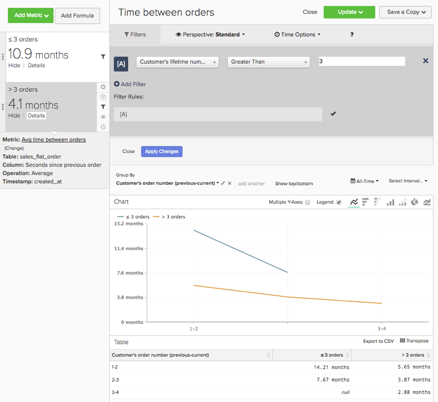

# 기본 분석

를 잘 알고 있으면 [!DNL Adobe Commerce Intelligence] 플랫폼을 사용하고 도구에 대한 기본 사항을 알고 있으면 보고서 작성을 시작할 수 있습니다. 가장 일반적인 질문 중 하나는 &quot;무엇을 봐야 합니까?&quot;입니다.

아래 정보에서는 유용한 정보를 찾을 수 있는 몇 가지 일반적인 지표와 보고서에 대해 간략히 설명합니다. 이러한 보고서 중 일부는 계정 내에 있으므로, 중복을 만들지 않도록 계정 내에 있는 지표 및 보고서를 검토해야 합니다.

## 이해할 테이블 및 열

지표를 작성할 때 다음 네 가지 정보를 알고 있어야 합니다.

1. 데이터가 있는 테이블,
1. 수행할 특정 작업
1. 해당 작업을 수행할 열입니다.
1. 해당 데이터를 추적하는 데 사용할 타임스탬프입니다.

이러한 예제에서 사용되는 테이블 이름은 각 데이터베이스가 고유하기 때문에 데이터베이스의 열 및 테이블 이름과 약간 다를 수 있습니다. 데이터베이스에서 해당 테이블이나 열을 식별하는 데 도움이 필요한 경우 아래 정의를 참조하십시오.

## Customers 테이블

이 표에는 고유한 고객 ID, 이메일 주소 등과 같은 각 고객에 대한 주요 정보가 포함되어 있습니다. 아래 예제는 **[!UICONTROL customer_entity]** 를 샘플 고객 테이블의 이름으로 사용하십시오.

이러한 계산 중 일부가 현재 데이터베이스에 없는 경우 계정의 모든 관리자가 만들 수 있습니다. 또한 적용 가능한 모든 지표에 대해 이러한 차원을 그룹화할 수 있는지 확인해야 합니다.

**Dimension**

* **[!UICONTROL Entity_id]**: 각 고객에 대한 고유 식별자. 이는 고유 고객 번호 또는 고객 이메일 주소일 수도 있으며 주문 테이블에 대한 참조 키로 작동해야 합니다.
* **[!UICONTROL Created_at]**: 고객 계정이 생성되어 데이터베이스에 추가된 날짜입니다.
* **[!UICONTROL Customer's lifetime revenue]**: 고객이 생성한 총 라이프타임 매출입니다.
* **[!UICONTROL Customer's first 30-day revenue]**: 고객이 처음 30일 동안 생성한 총 매출액.
* **[!UICONTROL Customer's lifetime number of orders]**: 고객이 라이프타임 동안 수행한 주문 수
* **[!UICONTROL Customer's lifetime number of coupons]**: 고객이 라이프타임 동안 사용한 총 쿠폰 수입니다.
* **[!UICONTROL Customer's first order date]**: 고객의 첫 번째 주문 날짜입니다. 고객이 생성 시 주문을 하지 않은 경우 이는 created_at 날짜와 다를 수 있습니다.

**손님 주문도 받으시나요?**

*이 경우 이 테이블에 모든 고객이 포함되지 않을 수 있습니다. 다음으로 문의: [지원 팀](https://experienceleague.adobe.com/docs/commerce-knowledge-base/kb/troubleshooting/miscellaneous/mbi-service-policies.html) 고객 분석에 모든 고객이 포함되도록 합니다.*

*손님 주문을 수락하는지 확실하지 않으세요? 을(를) 참조하십시오 [이 항목](../data-warehouse-mgr/guest-orders.md) 자세히 알아보기!*

## 주문 테이블

이 표에서 각 행은 하나의 순서를 나타냅니다. 이 테이블의 열에는 주문 ID, 생성 날짜, 상태, 주문한 고객의 ID 등과 같은 각 주문에 대한 기본 정보가 포함되어 있습니다. 아래 예제는 **[!UICONTROL sales_flat_order]** 를 샘플 orders 테이블의 이름으로 사용합니다.

**Dimension**

* **[!UICONTROL Customer_id]**: 주문한 고객의 고유 식별자입니다. 이 메서드는 종종 고객과 주문 테이블 간에 정보를 이동하는 데 사용됩니다. 이 예제에서는에 customer_id를 예상합니다. **[!UICONTROL sales_flat_order]** 표 정렬하기 **[!UICONTROL entitiy_id]** 다음에 있음 **[!UICONTROL customer_entity]** 테이블.
* **[!UICONTROL Created_at]**: 주문이 생성되거나 주문된 날짜입니다.
* **[!UICONTROL Customer_email]**: 주문한 고객의 이메일 주소입니다. 고객의 고유 식별자일 수도 있습니다.
* **[!UICONTROL Customer's lifetime number of orders]**: 다음에 대한 동일한 이름을 가진 열의 사본 `Customers` 테이블.
* **[!UICONTROL Customer's order number]**: 주문과 연결된 고객의 순차적 주문 번호입니다. 예를 들어 표시되는 행이 고객의 첫 번째 주문인 경우 이 열은 &quot;1&quot;이지만, 고객의 15번째 주문인 경우 이 열에는 이 주문에 대한 &quot;15&quot;가 표시됩니다. 이 차원이 다음에 없는 경우 `Customers` 테이블, [지원 팀](https://experienceleague.adobe.com/docs/commerce-knowledge-base/kb/troubleshooting/miscellaneous/mbi-service-policies.html) 제작에 도움이 될 것입니다.
* **[!UICONTROL Customer's order number (previous-current)]**: 의 두 값 연결 **[!UICONTROL Customer's order number]** 열. 이 메서드는 아래 샘플 보고서에서 두 주문 간의 경과 시간을 표시하는 데 사용됩니다. 예를 들어, 고객의 첫 번째 주문 일자와 두 번째 주문 일자 사이의 시간은 이 계산과 함께 &quot;1-2&quot;로 표시됩니다.
* **[!UICONTROL Coupon_code]**: 각 주문에 사용된 쿠폰을 표시합니다.
* **[!UICONTROL Seconds since previous order]**: 고객 주문 사이의 시간(초)입니다.

## 주문 항목 테이블

이 테이블에서 각 행은 판매된 하나의 품목을 나타냅니다. 이 표에는 주문 참조 번호, 제품 번호, 수량 등과 같이 각 주문에서 판매된 품목에 대한 정보가 포함되어 있습니다. 아래 예제는 `sales_flat_order_item` 샘플 주문 항목 테이블의 이름으로 사용됩니다.

**Dimension**

* **[!UICONTROL Item_id]**: 테이블의 각 행에 대한 고유 식별자입니다.
* **[!UICONTROL Order_id]**: 의 참조 키 `Orders` 동일한 순서로 구매한 항목을 보여 주는 테이블입니다. 주문에 여러 항목이 포함되어 있는 경우 이 값이 반복됩니다.
* **[!UICONTROL Product_id]**: 구매한 특정 제품에 대한 정보(색상, 크기 등)가 필요한 경우 이 열을 사용하여 제품 테이블에서 해당 정보를 가져옵니다.
* **[!UICONTROL Order's created_at]**: 주문이 배치된 타임스탬프(일반적으로 )를 `order line items` 의 테이블 `Orders` 테이블.
* **[!UICONTROL Order's coupon_code]**: 와 유사합니다. `Order's created_at` dimension인 경우 이 열은 orders 테이블에서 복사됩니다.

## 구독 테이블

이 테이블은 구독 ID, 구독자의 이메일 주소, 구독 시작 날짜 등 구독 정보를 관리하는 데 사용됩니다.

**Dimension**

* **[!UICONTROL Customer_id]**: 주문한 고객의 고유 식별자입니다. 다음은 Customers 테이블과 Orders 테이블 간의 경로를 만드는 일반적인 방법입니다. 이 예제에서는에 customer_id를 예상합니다. **sales_flat_order** 표 정렬하기 `entitiy_id` 다음에 있음 `customer_entity` 테이블.
* **[!UICONTROL Start date]**: 고객의 구독이 시작된 날짜입니다.

## 마케팅 지출 테이블

마케팅 지출을 분석할 때 다음을 포함할 수 있습니다. [!DNL Facebook], [!DNL Google AdWords], 또는 분석의 다른 소스. 마케팅 지출 소스가 여러 개 있는 경우 [Managed Services 팀](https://business.adobe.com/products/magento/fully-managed-service.html) 마케팅 캠페인에 대한 통합 테이블 설정에 대한 도움말입니다.

**Dimension**

* **[!UICONTROL Spend]**: 총 광고 지출입니다. 위치 [!DNL Facebook], 이는 의 지출 열이 됩니다. `facebook_ads_insights_####` 테이블. 대상 [!DNL Google AdWords], 다음과 같습니다. `adCost` 열의 `campaigns####` 테이블.
* 다음 `####` 이러한 각 테이블에 추가되는 는 의 특정 계정 ID와 관련되어 있습니다 [!DNL Facebook] 또는 [!DNL Google AdWords] 계정입니다.
* **[!UICONTROL Clicks]**: 총 클릭 수입니다. 위치 [!DNL Facebook], 이는 의 클릭 수 열입니다 `facebook_ads_insights_####` 테이블. 위치 [!DNL Google AdWords], 이는 의 adClicks 열이 됩니다. `campaigns####` 테이블.
* **[!UICONTROL Impressions]**: 총 노출 횟수. 위치 [!DNL Facebook], 이는 의 노출 횟수입니다. `facebook_ads_insights_####` 테이블. 위치 [!DNL Google AdWords], 이는 다음과 같은 노출 횟수입니다. `campaigns####` 테이블.
* **[!UICONTROL Campaign]**: 총 클릭 수입니다. 위치 [!DNL Facebook], 이는 의 campaign_name 열입니다. `facebook_ads_insights_####` 테이블. 위치 [!DNL Google AdWords], 이는 의 캠페인 열입니다. `campaigns####` 테이블.
* **[!UICONTROL Date]**: 특정 캠페인에 대해 활동(지출, 클릭 수 또는 노출 수)이 발생한 시간 및 날짜입니다. 위치 [!DNL Facebook], 다음과 같습니다. `date_start` 열의 `facebook_ads_insights_####` 테이블. 위치 [!DNL Google AdWords], 이는 의 날짜 열입니다. `campaigns####` 테이블.
* **[!UICONTROL Customer's first order's source]**: 고객의 첫 번째 주문에서 발생한 주문의 출처입니다. 먼저 이름이 인 열이 있는지 확인합니다. `customer's first order's source` 계정에서. 이 열이 표시되지 않는 경우 다음 지침을 사용하여 원하는 열을 만들 수 있습니다.
* **[!UICONTROL Customer's first order's medium]**: 고객의 첫 번째 주문에서 중간 정도의 주문입니다. 먼저 이름이 인 열이 있는지 확인합니다. `customer's first order's source` 계정에서. 이 열이 표시되지 않는 경우 다음 지침을 사용하여 원하는 열을 만들 수 있습니다.
* **[!UICONTROL Customer's first order's campaign]**: 고객의 첫 번째 주문에서 발생한 주문의 캠페인입니다. 먼저 이름이 인 열이 있는지 확인합니다. `customer's first order's source` 계정에서. 이 열이 표시되지 않는 경우 다음 지침을 사용하여 원하는 열을 만들 수 있습니다.

## 일반적인 보고서 및 지표

다음은 유용하다고 판단될 수 있는 보고서 및 지표의 몇 가지 일반적인 예입니다.

* [고객 분석](#customeranalytics)
* [주문 분석](#orderanalytics)
* [마케팅 지출 분석](#mktgspendanalytics)

## 고객 분석 {#customeranalytics}

### 새 사용자

* **설명**: 주어진 기간 동안 새로 획득한 총 사용자 수 카운트입니다. `New Users` 다음과다름: `Unique Customers`, 이유 `New Users` 은 서비스와 함께 계정이 생성된 타임스탬프를 갖습니다(고객이 반드시 주문을 했다는 의미는 아님). `Unique Customers` 최소 한 개 이상 주문했습니다.
* **지표 정의**: 이 지표는 다음을 수행합니다. **카운트** / `entity_id` 출처: `customer_entity` 테이블 정렬 기준 `created_at`.
* **보고서 예**: 지난 달에 생성된 새 사용자 수
   * **[!UICONTROL Metric]**: `New Users`
   * **[!UICONTROL Time Range]**: `Last Month`
   * **[!UICONTROL Time Interval]**: `By Day`

<!--{: width="929"}-->

### 고유 고객 수

* **설명**: 주어진 기간 동안 총 고유 고객 수 카운트입니다. 이 은(는) 과(와) 다릅니다. `New Users`최소 하나의 주문을 한 고객만 추적하기 때문입니다. 개별 고객의 보고서는 주어진 시간 간격에서 고객을 한 번만 추적합니다. 시간 간격을 로 설정하면 `By Day` 그리고 고객은 해당 날짜에 두 번 이상 구매하므로 고객은 한 번만 카운트됩니다. 일반적으로 총 구매 횟수를 보려면 다음을 살펴보십시오. `Number of Orders`.
* **지표 정의**: 이 지표는 다음을 수행합니다. **고유 개수** / `customer_id` 출처: `sales_flat_order` 테이블 정렬 기준 `created_at`.
* **보고서 예**: 지난 90일 동안의 주별 고유 고객
   * **[!UICONTROL Metric]**: `Distinct Customers`
   * **[!UICONTROL Time Range]**: `Moving range > Last 90 Days`
   * **[!UICONTROL Time Interval]**: `By Day`

<!--{: width="929"}-->

### 새 구독자

* **설명**: 주어진 기간 동안 획득한 총 신규 가입자 수 카운트입니다.
* **지표 정의**: 이 지표는 다음을 수행합니다. **고유 개수** / `customer_id` 출처: `subscriptions` 테이블 정렬 기준 `start_date`.
* **보고서 예**: 올해 월별 신규 가입자
   * **[!UICONTROL Metric]**: `New Subscribers`
   * **[!UICONTROL Time Range]**: `1 Year Ago to 0 Days Ago`
   * **[!UICONTROL Time Interval]**: `By Month`

<!--{: width="929"}-->

### 반복 고객

* **설명**: 일정 기간 동안 두 개 이상의 주문을 한 총 고객 수 반복 고객 보고서에서 `Distinct Customers` 지표 및 `Customer's Order Number` 차원 출처: `orders` 테이블.
* **사용된 지표**: `Distinct Customers`
* **보고서 예**: 지난해 2차 및 3차 구매 횟수
   * **[!UICONTROL Metric]**: `Distinct Customers`
   * **[!UICONTROL Time Range]**: `Moving Range > Last Year`
   * **[!UICONTROL Time Interval]**: `By Month`
   * **[!UICONTROL Group By]**: `Customer's Order Number`을 선택한 다음 을 선택합니다. `2` 및 `3`

   

* **보고서 예 2**: 지난 해 반복 고객 수
   * **[!UICONTROL Metric]**: `Distinct Customers`
   * **[!UICONTROL Filters]**: `Customer's Order Number Greater Than 1`
   * **[!UICONTROL Time Range]**: `Moving range > Last Year`
   * **[!UICONTROL Time Interval]**: `By Month`

   <!--{: width="929"}-->

### 라이프타임 주문 수별 상위 고객

* **설명**: 총 주문 수를 기반으로 한 상위 고객 목록입니다. 이렇게 하면 가장 자주 찾는 쇼핑객 목록을 직접 확인할 수 있습니다.
* **사용된 지표**: `Orders`
* **보고서 예**: 라이프타임 주문 수별 상위 25개 고객
   * **[!UICONTROL Metric]**: `Orders`
   * **[!UICONTROL Time Range]**: `All Time`
   * **[!UICONTROL Time Interval]**: `None`
   * **[!UICONTROL Group By]**: `customer_email`
   * **[!UICONTROL Show Top/Bottom]**: 주문별로 정렬된 상위 25개

   <!--{: width="929"}-->

### 라이프타임 매출별 상위 고객

* **설명**: 라이프타임 매출을 기반으로 하는 상위 고객 목록입니다.
* **사용된 지표**: `Average Lifetime Revenue`
* **보고서 예**: 라이프타임 수입별 상위 25개 고객
   * **[!UICONTROL Metric]**: `Average Lifetime Revenue`
   * **[!UICONTROL Time Range]**: `All time`
   * **[!UICONTROL Time Interval]**: `None`
   * **[!UICONTROL Group By]**: `customer_email`
   * **[!UICONTROL Show Top Bottom]**: 라이프타임 수입별로 정렬된 상위 25개

   <!--{: width="929"}-->

### 집단별 평균 라이프타임 수익

* **설명**: 추적 [개별 집단의 평균 라이프타임 수익](../dev-reports/lifetime-rev-cohort-analysis.md) 최고 성과 집단을 식별하기 위한 시간 경과에 따른 사용자 수 집단은 첫 번째 주문 날짜 또는 생성 날짜와 같은 공통 날짜로 그룹화됩니다.
* **사용된 지표**: `Revenue`
* **보고서 예**: 집단별 평균 고객 생애 수익
   * **[!UICONTROL Metric]**: `Revenue`
   * **[!UICONTROL Cohort Date]**: `Customer's first order date`
   * **[!UICONTROL Time Interval]**: `Month`
   * **[!UICONTROL Time Period]**: 최소 4개월 이상의 데이터를 가진 가장 최근 8개 집단의 이동 집단
   * **[!UICONTROL Duration]**: `12 Month(s)`
   * **[!UICONTROL Table]**: `Customer_entity`
   * **[!UICONTROL Perspective]**: 집단 멤버당 누적 평균 값

   <!--{: width="929"}-->

### 쿠폰 사용별 고객

* **설명**: 쿠폰/할인 코드를 사용한 고객 수 카운트입니다. 이렇게 하면 할인 구매자와 정가 구매자를 명확하게 볼 수 있습니다.
* **사용된 지표**: `New Users`
* **보고서 예**: 월별 쿠폰 및 비쿠폰 고객
   * **[!UICONTROL Metric A]**: `Non coupon customers`
   * **[!UICONTROL Metric]**: `New Users`
   * **[!UICONTROL Filters]**: 고객 라이프타임 주문 수가 0보다 크고 고객 라이프타임 쿠폰 수가 0과 같음
   * **[!UICONTROL Metric B]**: `Coupon customers`
   * **[!UICONTROL Metric]**: `New Users`
   * **[!UICONTROL Filters]**: 고객 라이프타임 주문 수가 0보다 크고 고객 라이프타임 쿠폰 수가 0보다 큼
   * **[!UICONTROL Time range]**: `All Time`
   * **[!UICONTROL Time interval]**: `By Month`

   <!--{: width="929"}-->

* **보고서 예 2**: 월별 쿠폰 및 비쿠폰 고객의 퍼센트
   * **[!UICONTROL Metric A]**: `Non coupon customers` (지표 숨기기)
      * **[!UICONTROL Metric]**: `New Users`
      * **[!UICONTROL Filters]**: `Customer's Lifetime Number of Orders Greater Than 0` 및 `Customer's Lifetime Number of Coupons Equal to 0`
   * **[!UICONTROL Metric B]**: `Coupon customers`
      * **[!UICONTROL Metric]**: `New Users`
      * **[!UICONTROL Filters]**: `Customers Lifetime Number of Orders Greater Than 0` 및 `Customer's Lifetime Number of Coupons Greater Than 0`
   * **[!UICONTROL Time Range]**: `All Time`
   * **[!UICONTROL Time Interval]**: `By Month`
   * **[!UICONTROL Formula]**: `B/(A+B)`

>[!NOTE]
>
> **모든 지표 숨기기**

<!--{: width="929"}-->

### 평균 처음 30일 매출

* **설명**: 고객으로서 첫 30일 이내에 고객이 생성한 수입의 평균 금액입니다.
* **지표 설명**: 이 지표는 다음을 수행합니다 **평균** / `Customer's First 30 Day Revenue` 출처: `customer_entity` 테이블 정렬 기준 `created_at`.
* **보고서 설명**: 고객 첫 30일 매출의 전체 평균
* **[!UICONTROL Metric]**: `Average First 30 Day Revenue`
* **[!UICONTROL Time Range]**: `All Time`
* **[!UICONTROL Time Interval]**: `None`

<!--{: width="929"}-->

### 평균 고객 생애 수익

* **설명**: 고객이 라이프타임 동안 창출한 평균 매출액입니다.
* **지표 설명**: 이 지표는 다음을 수행합니다 **평균** / `Customer's Lifetime Revenue` 의 열 `customer_entity` 를 기반으로 한 테이블 `created_at`.
* **보고서 설명**: 고객 생애 수익의 전체 평균
   * **[!UICONTROL Metric]**: `Average Customer Lifetime Revenue`
   * **[!UICONTROL Time Range]**: `All Time`
   * **[!UICONTROL Time Interval]**: `None`

<!--{: width="929"}-->

## Order analytics {#orderanalytics}

### 매출

* **설명**: 수익 지표는 선택한 기간 동안 얻은 총 수익을 표시합니다.
* 이 지표는 다음을 수행합니다. **sum** / `grand_total` 출처: `sales_flat_order` 테이블 정렬 기준 `created_at`.
* **보고서 예**: 월별 수입, 연간
   * **[!UICONTROL Metric]**: `Revenue`
   * **[!UICONTROL Time Range]**: `1 Year Ago to 1 Month Ago`
   * **시간 간격**: `By Month`

>[!TIP]
>
>매출 지표의 계산이 내부적으로 논의하는 정의와 일치하는지 확인하십시오. 예를 들어 배송된 주문의 매출을 계산하거나 다른 지역의 통화를 변환하거나 세금을 제외할 수 있습니다. 또한 다음을 사용할 수 있습니다 [필터 세트](../../data-user/reports/ess-manage-data-filters.md) 동일한 표에 구축된 모든 지표에서 일관성을 보장합니다.

<!--{: width="929"}-->

### 주문 수

* **설명**: 주어진 기간 동안의 총 주문 수 카운트입니다. 주문 보고서는 새로운 제품 제공, 프로모션 또는 트랜잭션 량이 증가(또는 감소)할 수 있는 기타 모든 것에 의해 발생하는 주문 거래량의 변경 사항을 추적합니다. 질문에 답변하기 위해 종종 일부 변수로 이 지표를 세그먼트화할 수 있습니다.
* **지표 정의**: 이 지표는 다음을 수행합니다. **카운트** / `entity_id` 출처: `sales_flat_order` 테이블 정렬 기준 `created_at`.
* **보고서 예**: 월별 주문, 연간
   * **[!UICONTROL Metric]**: `number of orders`
   * **[!UICONTROL Time Range]**: `1 Year Ago to 1 Month Ago`
   * **[!UICONTROL Time Interval]**: `By Month`

>[!TIP]
>
>매출 지표와 마찬가지로 다음과 같은 작업을 수행해야 합니다. [필터 세트](../../data-user/reports/ess-manage-data-filters.md) 미완료, 테스트 또는 반환된 주문을 제외하기 위한 적절한 위치에 있습니다.

<!--{: width="929"}-->

### 주문한 제품

* **설명**: 제품 주문 지표는 특정 기간 동안 판매된 항목의 수량을 알려줍니다.
* **지표 정의**: 이 지표는 다음을 수행합니다. **sum** / `qty_ordered` 출처: `sales_flat_order_item` 테이블 정렬 기준 `created_at`.
* **보고서 예**: 월별로 판매된 품목, 연간
   * **[!UICONTROL Metric]**: `Products ordered`
   * **[!UICONTROL Time Range]**: `1 Year Ago to 1 Month Ago`
   * **[!UICONTROL Time Interval]**: `By Month`

   <!--{: width="929"}-->

* 이 지표를 주문 수 지표와 결합하여 주문당 항목 수를 계산합니다. 그런 다음 보고서에 쿠폰 코드를 추가하여 판촉 행사가 장바구니 크기에 미치는 영향을 확인하거나, 신규 및 반복 주문별로 분류하여 고객 행동을 더 잘 이해할 수 있습니다.
* **보고서 예**: 주문당 제품 수: 첫 번째 주문과 반복 주문
   * **[!UICONTROL Metric A]**: 주문한 제품: 첫 번째 주문
      * **[!UICONTROL Metric]**: `Products ordered`
      * **[!UICONTROL Filter]**: `Customer's order number = 1`
   * **[!UICONTROL Metric B]**: 주문: 첫 번째 주문
      * **[!UICONTROL Metric]**: `Orders`
      * **[!UICONTROL Filter]**: `Customer's order number = 1`
   * **[!UICONTROL Metric C]**: 주문한 제품: 반복 주문
      * **[!UICONTROL Metric]**: `Products ordered`
      * **[!UICONTROL Filter]**: `Customer's order number > 1`
   * **[!UICONTROL Metric D]**: 주문: 반복 주문
      * **[!UICONTROL Metric]**: `Orders`
      * **[!UICONTROL Filter]**: `Customer's order number > 1`
   * **[!UICONTROL Time Range]**: `1 Year Ago to 1 Month Ago`
   * **[!UICONTROL Time Interval]**: `By Week`
   * **[!UICONTROL Formula 1]**: `A/B`
   * **[!UICONTROL Formula 2]**: `C/D`

>[!NOTE]
>
>선택 취소 `Multiple Y-Axes box` 및 `Hide` 모든 지표

<!--{: width="929"}-->

### 평균 주문 가격

* **설명**: 일정 기간 동안 수행한 주문의 평균 값을 추적합니다. 이 지표를 사용하여 마케팅, 제품 제공 및/또는 비즈니스의 기타 변경 사항의 결과로 평균 주문 가격(AOV)이 변동하는 방식을 신속하게 파악할 수 있습니다.
* **지표 정의**: 이 지표는 다음을 수행합니다 **평균** / `grand_total` 출처: `sales_flat_order` 테이블 정렬 기준 `created_at`.
* **보고서 예**: AOV와 이전 연도 비교, YTD
   * **[!UICONTROL Metric]**: `Average order value`
   * **[!UICONTROL Time Range]**: `1 Year Ago to 1 Month Ago`
   * **[!UICONTROL Time Interval]**: `By Month`
   * **[!UICONTROL Perspective]**: `Amount Change vs Previous Year`

   <!--{: width="929"}-->

### 쿠폰으로 가장 많이 구매한 제품

* **설명**: 이 보고서는 프로모션 또는 쿠폰을 제공할 때 판매되는 제품에 대한 통찰력을 제공합니다.
* **사용된 지표**: 주문한 제품
* **보고서 예**: 쿠폰과 함께 가장 많이 구매한 제품
   * **[!UICONTROL Metric]**: `Products ordered`
   * **[!UICONTROL Filter]**: `Order's coupon_code Is Not \[NULL\]`
   * **[!UICONTROL Time Range]**: `All-Time`
   * **[!UICONTROL Time Interval]**: `None`
   * **[!UICONTROL Group By**]: `name` (또는 `SKU`또는 기타 제품 식별자)
   * **[!UICONTROL Show top/bottom]**: 주문한 제품별로 정렬된 상위 25개

   <!--{: width="929"}-->

### 주문 사이의 시간

* **설명**: 를 사용하여 고객의 구매 주기에 대한 가정과 기대를 테스트합니다. **주문 사이의 시간** 평균(또는 중간값!)을 보는 분석 구매 간격. 아래 차트에서는 가장 좋은 고객(3개 이상 주문한 고객)이 6개월 이내에 두 번째 구매를 수행하는 것을 볼 수 있습니다. 네 번째 주문을 하지 않은 고객은 14개월 후에 두 번째 구매를 합니다.
* **지표 정의**: 이 지표는 다음을 수행합니다 **평균** / `Time since previous order` 출처: `sales_flat_order` 정렬 기준: `created_at`.
* **보고서 예**:
   * **지표 1**: ≤ 3개 주문
      * **[!UICONTROL Metric]**: `Average time between orders`
      * **[!UICONTROL Filter]**: `Customer's lifetime number of orders ≤ 3`
   * **지표 2**: 3개 이상
      * **[!UICONTROL Metric]**: `Average time between orders`
      * **[!UICONTROL Filter]**: `Customer's lifetime number of orders > 3`
   * **[!UICONTROL Time Range]**: `All-Time`
   * **[!UICONTROL Time Interval]**: `None`
   * **[!UICONTROL Group By]**:` Customer's order number (previous-current)`

>[!NOTE]
>
>선택 취소 `Multiple Y-Axes` 상자.

<!--{: width="929"}-->

## 마케팅 지출 분석 {#mktgspendanalytics}

### 광고 지출

* **설명**: 캠페인 또는 광고 세트 또는 기타 세분화를 통해 다양한 기간 및 간격에 대한 마케팅 지출을 분석할 수 있습니다.
* **지표 정의**: 이 지표는 의 지출 열에 대한 합계를 수행합니다. `Marketing Spend` 테이블 정렬 기준: `date` 열.
* **보고서 예**: 캠페인별 광고 지출
   * **[!UICONTROL Metric]**: `Ad spend`
   * **[!UICONTROL Time Range]**: `All-Time`
   * **[!UICONTROL Time Interval]**: `None`
   * **[!UICONTROL Group By]**: `campaign`

<!--{: width="929"}-->

### 광고 노출 횟수 및 광고 클릭 수

* **설명**: 광고 지출 분석 외에도 광고 노출 횟수 및 광고 클릭을 분석할 수 있습니다.
* **지표 정의**: 이 지표는 의 노출 횟수(또는 클릭 수) 열에 대한 합계를 수행합니다. `Marketing Spend` 날짜 열을 기준으로 정렬된 테이블.
* **보고서 예**: 일별 노출 횟수 및 광고 클릭 수 추가
   * **[!UICONTROL Metric A]**: `Ad impressions`
   * **[!UICONTROL Metric B]**: `Ad clicks`
   * **[!UICONTROL Time Range]**: `1 Year Ago to 3 Months Ago`
   * **[!UICONTROL Time Interval]**: `By Day`

   <!--{: width="929"}-->

### 클릭스루 비율(CTR)

* **설명**: 위에서 만든 광고 노출 횟수 및 광고 클릭 수 지표를 사용하여 시간에 따른 다양한 캠페인별로 클릭스루 비율을 분석할 수 있습니다.
* **보고서 예**: 캠페인별 CTR
   * **[!UICONTROL Metric A]**: `Ad impressions`
   * **[!UICONTROL Metric B]**: `Ad clicks`
   * **[!UICONTROL Time Range]**:`All-Time`
   * **[!UICONTROL Time Interval]**: `None`
   * **[!UICONTROL Formula]**: `B/A`
   * 다음 항목 선택 `%` 옵션을 선택합니다.
   * **[!UICONTROL Group By]**: `campaign`

>[!NOTE]
>
>다음을 수행할 수 있습니다. **제목** 공식 `CTR`, 및 **숨기기** 모든 지표.

<!--{: width="929"}-->

### 클릭당 비용(CPC)

* **설명**: 위에서 만든 광고 지출 및 광고 클릭 수 지표를 사용하여 시간에 따른 다양한 캠페인으로 클릭당 비용을 분석할 수 있습니다.
* **보고서 예**: 캠페인별 CPC
   * **[!UICONTROL Metric A]**: `Ad spend`
   * **[!UICONTROL Metric B]**: `Ad clicks`
   * **[!UICONTROL Time Range]**: `All-Time`
   * **[!UICONTROL Time Interval]**: `None`
   * **[!UICONTROL Formula]**: `A/B`
   * 다음 항목 선택 `currency` 옵션
   * **[!UICONTROL Group By]**: `campaign`

>[!NOTE]
>
>다음을 수행할 수 있습니다. **제목** 공식 `CPC`, 및 **숨기기** 모든 지표.

<!--{: width="929"}-->

### 고객 확보 소스별 고객

* **설명**: 를 사용하여 주문의 소스, 중간 및 캠페인을 추적하는 경우 [!DNL Google eCommerce], 고객 확보 소스별로 고객을 분석할 수 있습니다. 이렇게 하면 고객을 확보하는 마케팅 소스를 식별하고 &quot;대부분의 고객이 다음을 통해 첫 번째 주문을 합니까?&quot;와 같은 질문에 답변하는 데 도움이 됩니다. [!DNL Google], [!DNL Facebook]아니면 다른 정보원인가?&quot;
* **보고서 예**: 획득 소스별 고객
   * **[!UICONTROL Metric Used]**: `New Customers`
   * **[!UICONTROL Time Range]**: `All-Time`
   * **[!UICONTROL Time Interval]**: `By Month`
   * **[!UICONTROL Group By]**: `Customer's first order's source`

>[!NOTE]
>
>체크아웃 [이 문서](../analysis/most-value-source-channel.md) 획득 소스를 사용하는 보고서의 더 많은 예를 보려면.

<!--{: width="929"}-->

### 고객 확보 매체 및 확보 캠페인별 고객

* **설명**: 고객 확보 소스별 고객 분석과 마찬가지로 첫 번째 주문의 매체 및 캠페인별로 고객을 분석할 수도 있습니다. 이렇게 하면 &quot;어떤 캠페인이 신규 고객을 유치합니까?&quot;와 같은 질문에 답변하는 데 도움이 될 수 있습니다.
* **보고서 예**: 유료 매체를 사용한 획득 캠페인별 고객
   * **[!UICONTROL Metric Used]**: `New customers`
   * **[!UICONTROL Filter]**: `Customer's first order's medium IN ppc`
   * **[!UICONTROL Time Range]**: `All-Time`
   * **[!UICONTROL Time Interval]**: `None`
   * **[!UICONTROL Group By]**: `Customer's first order's campaign`

>[!NOTE]
>
>의 필터용 `New Customers` 지표 cpc 또는 유료 검색과 같이 비즈니스에 &quot;유료&quot; 매체로 간주되는 다른 매체를 추가할 수 있습니다.

<!--{: width="929"}-->

### 고객 확보 비용(CAC) 또는 취득당 비용(CPA)

* **설명**: 캠페인 비용을 분석하는 한 가지 방법은 모든 비용을 캠페인을 통해 획득한 고객에게만 적용하는 것입니다.
* **보고서 예**: 캠페인별 CAC
   * **[!UICONTROL Metric A]**: `New customers`
   * **[!UICONTROL Filter]**: `Customer's first order's medium IN ppc`
   * **[!UICONTROL Metric B]**: `Ad Spend`
   * **[!UICONTROL Time Range]**: `All-Time`
   * **[!UICONTROL Time Interval]**: `None`
   * **[!UICONTROL Formula]**: `B/A`
   * 다음 항목 선택 `currency` 옵션
   * **[!UICONTROL Group By]**:
      * 지표의 경우 `A`, 선택 `Customer's first order's campaign`
      * 지표의 경우 `B`, 선택 `campaign`

   

>[!NOTE]
>
>다음을 수행할 수 있습니다. **제목** 공식 `CTR`, 및 **숨기기** 모든 지표. 또한, 체크아웃 [이 문서](../analysis/roi-ad-camp.md) 추가 정보.

### 획득 소스, 매체 및 캠페인별 라이프타임 값

* **설명**: 각 캠페인으로 획득한 고객 수를 분석하는 것과 함께 이러한 고객의 평균 라이프타임 수익을 분석할 수 있습니다. 이를 통해 다음을 식별할 수 있습니다.
   * 특정 캠페인이 많은 고객을 유도하지만 해당 고객은 라이프타임 가치가 낮습니다.
   * 특정 캠페인이 적은 양의 고객을 유치하지만 해당 고객은 높은 라이프타임 값을 갖습니다.
* **보고서 예**: 먼저 를 추가합니다. `New customers` 지표. 그런 다음 를 추가합니다. `Average lifetime revenue` 지표. 원하는 시간대를 선택하고 `interval` 다음으로: `None`. 마지막으로 `group by` 옵션 as`Customer's first order's campaign`.
   * **[!UICONTROL Metric A]**: `New Customers`
   * **[!UICONTROL Filter A]**: `Customer's first order's source` &#39;%google%&#39;과(와) 유사
   * **[!UICONTROL Filter B]**: `Customer's first order's medium IN ppc`
   * **[!UICONTROL Metric B]**: `Average lifetime revenue`
   * **[!UICONTROL Filter A]**: `Customer's first order's source` &#39;%google%&#39;과(와) 유사
   * **[!UICONTROL Filter B]**: `Customer's first order's medium IN ppc`
   * **[!UICONTROL Time Range]**: `All-Time`
   * **[!UICONTROL Time Interval]**: `None`
   * **[!UICONTROL Group By]**: `Customer's first order's campaign`

>[!NOTE]
>
>두 필터의 경우 비즈니스용 &quot;유료&quot; 매체로 간주되는 다른 모든 매체(예: cpc 또는 유료 검색)를 추가할 수 있습니다. facebook과 같이 분석하려는 다른 소스를 추가할 수도 있습니다. 체크아웃 [이 문서](../analysis/roi-ad-camp.md) cac, LTV 및 ROI에 대한 자세한 내용은 을 참조하십시오.

<!--{: width="929"}-->

### 투자 수익률(ROI)

* **설명**: 캠페인별로 ROI를 계산하는 한 가지 방법은 캠페인을 통해 수행한 모든 주문을 분석하는 것입니다. 그러나 대체 방법은 캠페인을 통해 획득한 고객의 라이프타임 값을 분석하는 것입니다. ROI를 분석하려면 지출 데이터와 트랜잭션 데이터에서 캠페인 이름이 일관되게 유지되어야 합니다. 다음 보고서를 만들고 캠페인 이름이 일치하지 않아 ROI 값이 없는 경우 [UTM 태깅](../../best-practices/utm-tagging-google.md) 을 구현했습니다.
* **보고서 예**: 캠페인별 ROI
   * **[!UICONTROL Metric A]**: `New Customers`
   * **[!UICONTROL Filter A]**: `Customer's first order's source` &#39;%google%&#39;과(와) 유사
   * **[!UICONTROL Filter B]**: `Customer's first order's medium IN ppc`
   * **[!UICONTROL Metric B]**: `Average lifetime revenue`
   * **[!UICONTROL Filter A]**: `Customer's first order's source` &#39;%google%&#39;과(와) 유사
   * **[!UICONTROL Filter B]**: `Customer's first order's medium IN ppc`
   * **[!UICONTROL Metric C]**: `Ad spend`
   * **[!UICONTROL Time Range]**: `All-Time`
   * **[!UICONTROL Time Interval]**: `None`
   * **[!UICONTROL Formula]**: `(B-(C/A))/(C/A)`
   * 다음 항목 선택 `% `옵션
   * **[!UICONTROL Group By]**:
      * 지표의 경우 `A` 및 `B`, 선택 `Customer's first order's campaign`
      * 지표의 경우 `C`, 선택 `campaign`

>[!NOTE]
>
>공식의 제목을 &quot;ROI&quot;로 지정하고 모든 지표를 숨길 수 있습니다. 또한 지표에서 필터를 조정하여 대체 소스 및 매체를 분석할 수 있습니다. 또한, 체크아웃 [이 항목](../analysis/roi-ad-camp.md) cac, LTV 및 ROI에 대한 자세한 내용은 을 참조하십시오.

<!--{: width="929"}-->

<!--{: width="929"}-->
