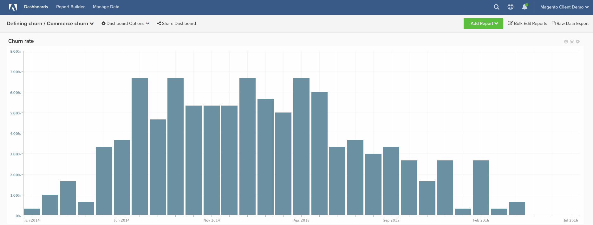

# 이탈률

이 항목에서는 **상거래 고객**&#x200B;의 **이탈률**&#x200B;을 계산하는 방법을 보여 줍니다. SaaS 또는 기존 구독 회사와 달리, 상거래 고객은 일반적으로 더 이상 활성 고객에 포함해서는 안 된다는 것을 보여주는 구체적인 **&quot;이탈 이벤트&quot;**&#x200B;를 가지고 있지 않습니다. 이러한 이유로 아래 지침을 사용하면 마지막 주문 이후 경과된 결정된 시간을 기준으로 고객을 &quot;이탈됨&quot;으로 정의할 수 있습니다.

많은 고객이 데이터를 기반으로 사용해야 하는 **일정**&#x200B;을(를) 개념화하기 시작하는 데 도움을 원합니다. 이전 고객 행동을 사용하여 이 **이탈 일정**&#x200B;을(를) 정의하려면 [이탈 정의](../analysis/define-cust-churn.md) 항목을 숙지해야 합니다. 그런 다음 아래 지침의 이탈률 공식에 있는 결과를 사용할 수 있습니다.

## 계산된 열

생성할 열

* **`customer_entity`** 테이블
* **`Customer's last order date`**
   * [!UICONTROL definition] 선택: `Max`
   * [!UICONTROL table] 선택: `sales_flat_order`
   * [!UICONTROL column] 선택: `created_at`
   * `sales_flat_order.customer_id = customer_entity.entity_id`
   * [!UICONTROL Filter]: `Orders we count`

* **`Seconds since customer's last order date`**
   * [!UICONTROL definition] 선택: `Age`
   * [!UICONTROL column] 선택: `Customer's last order date`

>[!NOTE]
>
>새 보고서를 작성하기 전에 [모든 새 열을 지표에 차원으로 추가](../data-warehouse-mgr/manage-data-dimensions-metrics.md)하십시오.

## 지표

* **새 고객(첫 주문 날짜별)**
   * 카운트된 고객

>[!NOTE]
>
>이 지표는 사용자 계정에 있을 수 있습니다.

* **`customer_entity`** 테이블에서
* 이 지표는 **Count**&#x200B;을 수행합니다.
* **`entity_id`** 열에서
* **`Customer's first order date`** 타임스탬프로 정렬됨
* [!UICONTROL Filter]:

* **새 고객(마지막 주문 날짜까지)**
   * 카운트된 고객

  >[!NOTE]
  >
  >이 지표는 사용자 계정에 있을 수 있습니다.

* **`customer_entity`** 테이블에서
* 이 지표는 **Count**&#x200B;을 수행합니다.
* **`entity_id`** 열에서
* **`Customer's last order date`** 타임스탬프로 정렬됨
* [!UICONTROL Filter]:

>[!NOTE]
>
>새 보고서를 작성하기 전에 [모든 새 열을 지표에 차원으로 추가](../data-warehouse-mgr/manage-data-dimensions-metrics.md)하십시오.

## 보고서

* **이탈률**
   * [!UICONTROL Metric]: 새 고객(첫 번째 주문 날짜별)
   * [!UICONTROL Filter]: `Lifetime number of orders Greater Than 0`
   * &#x200B;

     [!UICONTROL Perspective]: `Cumulative`
   * [!UICONTROL Metric]: `New customers (by last order date)`
   * [!UICONTROL Filter]:
   * 고객의 마지막 주문 날짜 이후 시간(초) >= [이탈된 고객에 대한 자체 정의된 컷오프&#x200B;]&#x200B;**`^`**
   * `Lifetime number of orders Greater Than 0`

   * [!UICONTROL Metric]: `New customers (by last order date)`
   * [!UICONTROL Filter]: `Lifetime number of orders Greater Than 0`
   * &#x200B;

     [!UICONTROL Perspective]: Cumulative
   * [!UICONTROL Formula]: `(B / ((A + B) - C)`
   * &#x200B;

     [!UICONTROL Format]: Percentage

* *지표 `A`:`New customers cumulative`*
* *지표 `B`:`Churned customers by last order date`*
* *지표 `C`:`Customers by last order date cumulative`*
* *`Formula`:`Repeat order probability`*
* *`Time period`:`All time (or custom range)`*
* *`Group by`:`Customer's order number`*
* *`Chart Type`:`Column`*

다음은 몇 가지 일반적인 월 > 초 전환이지만 google은 찾고 있는 모든 사용자 지정 값에 대한 주 > 초 전환을 포함한 다른 값을 제공합니다.

| **개월** | **초** |
|---|---|
| 3 | 7,776,000 |
| 6 | 15,552,000 |
| 9 | 23,328,000 |
| 12 | 31,104,000 |

모든 보고서를 컴파일한 후 원하는 대로 대시보드에서 구성할 수 있습니다. 결과는 위의 샘플 대시보드와 비슷할 수 있습니다.
