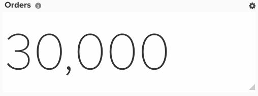

# RFM 분석

이 항목에서는 최신성, 빈도 및 통화 순위별로 고객을 세그먼트화할 수 있는 대시보드를 설정하는 방법을 보여 줍니다. RFM 분석은 고객 행동을 고려한 마케팅 기법으로서, 전달을 위한 세그멘테이션을 결정하는 데 도움이 됩니다. 이는 다음 세 가지 측면을 설명합니다.

1. 최근 고객이 스토어에서 구매한 시간의 최신성
1. 고객으로부터 구매하는 빈도
1. 고객이 지출하는 금액의 통화

새 아키텍처에 [!DNL Adobe Commerce Intelligence] Pro 플랜이 있는 경우(예: `Data Warehouse Views` 메뉴 아래에 `Manage Data` 옵션이 있는 경우)에만 RFM 분석을 구성할 수 있습니다. 이러한 열은 **[!DNL Manage Data > Data Warehouse]** 페이지에서 만들 수 있습니다. 자세한 지침은 아래에 나와 있습니다.

## 시작

먼저 값이 1인 기본 키만 포함된 파일을 업로드해야 합니다. 이를 통해 분석에 필요한 몇 가지 계산된 열을 만들 수 있습니다.

이 [article](../importing-data/connecting-data/using-file-uploader.md) 및 아래 이미지를 사용하여 파일 형식을 지정할 수 있습니다.

## 계산된 열

귀사에서 고객 주문을 허용한다면 더욱 차별화됩니다. 이 경우 `customer_entity` 테이블의 모든 단계를 무시할 수 있습니다. 게스트 주문이 허용되지 않으면 `sales_flat_order` 테이블에 대한 모든 단계를 무시하십시오.

생성할 열

* **`Sales_flat_order/customer_entity`** 테이블
* `Customer's last order date`
* [!UICONTROL Column type]: `Many to one > Max`
* [!UICONTROL Pat]: `sales_flat_order.customer_id > customer_entity.entity_id`
* 선택된 [!UICONTROL column]: `created_at`
* [!UICONTROL Filter]: `Orders we count`

* 
  고객의 마지막 주문 날짜 이후     초
  * [!UICONTROL Column type]: -     &quot;같은 표 > 나이
* 선택된 [!UICONTROL column]: `Customer's last order date`

* (입력) 카운트 참조
* [!UICONTROL Column type]: `Same table > Calculation`
* 
  [!UICONTROL 입력]: `entity_id`
* [!UICONTROL Calculation]: `**case when A is null then null else 1 end**`
* 
  [!UICONTROL 데이터 유형]: `Integer`

* **참조 개수** 테이블(번호가 &quot;1&quot;인 업로드한 파일)
* 고객 수
* [!UICONTROL Column type]: `Many to One > Count Distinct`
* [!UICONTROL Path]: `ales_flat_order.(input) reference > Count reference.Primary Key` 또는 `customer_entity.(input)reference > Count Reference`. `Primary Key`
* 선택한 [!UICONTROL column]: `sales_flat_order.customer_email` 또는 `customer_entity.entity_id`

* **Customer_entity** 테이블
* 고객 수
* [!UICONTROL Column type]: `One to Many > JOINED_COLUMN`
* [!UICONTROL Path]: `customer_entity`.(입력) 참조 > 고객 집중. `Primary Key`
* 선택된 [!UICONTROL column]: `Number of customers`

* (입력) `Ranking by customer lifetime revenue`
* [!UICONTROL Column type]: `Same table > Event Number`
* [!UICONTROL Event owner]: `(input) reference for count`
* [!UICONTROL Event rank]: `Customer's lifetime revenue`

* 고객 생애 수익별 순위
* [!UICONTROL Column type]: `Same table > Calculation`
* [!UICONTROL Inputs]: `(input) Ranking by customer lifetime revenue`, `Number of customers`
* [!UICONTROL Calculation]: `case when A is null then null else (B-(A-1)) end`
* 
  [!UICONTROL 데이터 유형]: `Integer`

* 고객 통화 점수(백분위수)
* [!UICONTROL Column type]: `Same table > Calculation`
* [!UICONTROL Inputs]: `(input) Ranking by customer lifetime revenue`, `Number of customers`
* [!UICONTROL Calculation]: `Case when round((B-A+1)*100/B,0) <= 20 then 5 when round((B-A+1)*100/B,0) <= 40 then 4 when round((B-A+1)*100/B,0) <= 60 then 3 when round((B-A+1)*100/B,0) <= 80 then 2 when round((B-A+1)*100/B,0) <= 100 then 1 else 0 end`
* 
  [!UICONTROL 데이터 유형]: `Integer`

* (입력) 고객 생애 주문 수별 순위
* [!UICONTROL Column type]: `Same table > Event Number`
* [!UICONTROL Event owner]: `(input) reference for count`
* [!UICONTROL Event rank]: `Customer's lifetime number of orders`

* 고객 생애 주문 수별 순위
* 
  [!UICONTROL 열 유형]: – "Same table > 계산"
* [!UICONTROL Inputs]: - **(입력) 고객 생애 주문 수별 순위**, **고객 수**
* [!UICONTROL Calculation]: - **A가 null이고 Null인 경우 기타(B-(A-1)) 끝**
* [!UICONTROL Datatype]: - 정수

* 고객의 빈도 점수(백분위수)
* [!UICONTROL Column type]: `Same table > Calculation`
* [!UICONTROL Inputs]: `(input) Ranking by customer lifetime number of orders`, `Number of customers`
* [!UICONTROL Calculation]: `Case when round((B-A+1)*100/B,0) <= 20 then 5 when round((B-A+1)*100/B,0) <= 40 then 4 when round((B-A+1)*100/B,0) <= 60 then 3 when round((B-A+1)*100/B,0) <= 80 then 2 when round((B-A+1)*100/B,0) <= 100 then 1 else 0 end`
* 
  [!UICONTROL 데이터 유형]: `Integer`

* 고객의 마지막 주문 날짜 이후 몇 초씩 순위 지정
* [!UICONTROL Column type]: `Same table > Event Number`
* [!UICONTROL Event owner]: `(input) reference for count`
* [!UICONTROL Event rank]: `Seconds since customer's last order date`

* 고객의 최신성 점수(백분위수)
* [!UICONTROL Column type]: `Same table > Calculation`
* [!UICONTROL Inputs]: `(input) Ranking by customer lifetime number of orders`, `Number of customers`
* [!UICONTROL Calculation]: `Case when (A * 100/B,0) <= 20 then 5 when (A * 100/B,0) <= 40 then 4 when (A * 100/B,0) <= 60 then 3 when (A * 100/B,0) <= 80 then 2 when (A * 100/B,0) <= 100 then 1 else 0 end`
* 
  [!UICONTROL 데이터 유형]: `Integer`

* 고객의 최신성 점수(백분위수)
* [!UICONTROL Column type]: `Same table > Calculation`
* [!UICONTROL Inputs]: `Customer's recency score (by percentiles)`, `Customer's frequency score (by percentiles)`, `Customer's monetary score (by percentiles)`
* [!UICONTROL Calculation]: `case when (A IS NULL or B IS NULL or C IS NULL) then null else concat(A,B,C) end`
* 
  [!UICONTROL 데이터 유형]: String

* **Count 참조** 테이블
* [!UICONTROL Number of customers]: `(RFM > 0)`
* [!UICONTROL Column type]: `Many to One > Count Distinct`
* [!UICONTROL Path]: `sales_flat_order.(input) reference > Customer Concentration. Primary Key` 또는 `customer_entity.(input)reference > Customer Concentration.Primary Key`
* 선택한 [!UICONTROL column]: `sales_flat_order.customer_email` 또는 `customer_entity.entity_id`
* [!UICONTROL Filter]: `Customer's RFM score (by percentile)`이(가) 000과 같지 않음

* **Customer_entity** 테이블
* [!UICONTROL Number of customers]: `(RFM > 0)`
* [!UICONTROL Column type]: `One to Many > JOINED_COLUMN`
* [!UICONTROL Path]: `customer_entity.(input) reference > Customer Concentration.Primary Key`
* 선택된 [!UICONTROL column]: - `Number of customers`

* 고객의 최신성 점수 `(R+F+M)`
* [!UICONTROL Column type]: `Same table > Calculation`
* [!UICONTROL Inputs]: - `Customer's recency score (by percentiles)`, `Customer's frequency score (by percentiles)`, `Customer's monetary score (by percentiles)`
* [!UICONTROL Calculation]: `case when (A IS NULL or B IS NULL or C IS NULL) then null else A+B+C end`
* 
  [!UICONTROL 데이터 유형]: `Integer`

* (입력) 고객의 전체 RFM 점수별 순위
* [!UICONTROL Column type]: `Same table > Event Number`
* [!UICONTROL Event owner]: `(input) reference for count`
* [!UICONTROL Event rank]: `Customer's recency score (R+F+M)`
* [!UICONTROL Filter]: `Customer's RFM score (by percentile)`이(가) 000과 같지 않음

* 고객의 전체 RFM 점수로 순위 지정
* [!UICONTROL Column type]: `Same table > Calculation`
* [!UICONTROL Inputs]: `(input) Ranking by customer's overall RFM score`, `Number of customers (RFM > 0)`
* [!UICONTROL Calculation]: `case when A is null then null else (B-(A-1)) end`
* 
  [!UICONTROL 데이터 유형]: `Integer`

* 고객의 RFM 그룹
* [!UICONTROL Column type]: `Same table > Calculation`
* [!UICONTROL Inputs]: `(input) Ranking by customer lifetime revenue`, `Number of customers`
* [!UICONTROL Calculation]: `Case when round(A * 100/B,0) <= 20 then '5. copper' when round(A * 100/B,0) <= 40 then '4. bronze' when round(A * 100/B,0) <= 60 then '3. silver' when round(A * 100/B,0)<= 80 then '2. gold' else '1. Platinum' end`
* 
  [!UICONTROL 데이터 유형]: `Integer`

>[!NOTE]
>
>사용된 백분위수는 고객의 분할입니다(예: 20% 버킷이 1~5를 반환). 당신이 당신이 무게를 달고 싶은 맞춤 방법이 있다면, 당신이 티켓을 제출할 때 분석가에게 알리세요.

## 지표

새 지표가 없습니다!

>[!NOTE]
>
>새 보고서를 작성하기 전에 [모든 새 열을 지표에 차원으로 추가](../data-warehouse-mgr/manage-data-dimensions-metrics.md)하십시오.

## 보고서

* RFM 그룹별 **고객**
* 지표 `A`: `New customers`
* [!UICONTROL Metric]: `New customers`
* [!UICONTROL Filter]: `Customer's RFM score (by percentiles) Not Equal to 000`

* [!UICONTROL Time period]: `All time`
* 
  [!UICONTROL Interval]: `None`
* 차트 숨기기
* [!UICONTROL Group by]: `Customer's RFM group`
* 
  [!UICONTROL 그룹 기준]: `Email`
* 
  [!UICONTROL Chart type]: `Table`

* **최근 점수가 5개인 고객**
* 지표 `A`: `New customers`
* [!UICONTROL Metric]: `New customers`
* [!UICONTROL Filter]: `Customer's recency score (by percentiles) Equal to 5`

* [!UICONTROL Time period]: `All time`
* 
  [!UICONTROL Interval]: `None`
* 
  [!UICONTROL Chart Type]: `Scalar`
* 차트 숨기기
* 
  [!UICONTROL 그룹 기준]: `Email`
* [!UICONTROL Group by]: `Customer's RFM score (R+F+M)`
* 
  [!UICONTROL Chart type]: `Table`

* **최신성 점수가 하나인 고객**
* 지표 `A`: `New customers`
* [!UICONTROL Metric]: `New customers`
* [!UICONTROL Filter]: `Customer's recency score (by percentiles) Equal to 1`

* [!UICONTROL Time period]: `All time`
* 
  [!UICONTROL Interval]: `None`
* 
  [!UICONTROL Chart Type]: `Scalar`
* 차트 숨기기
* 
  [!UICONTROL 그룹 기준]: `Email`
* [!UICONTROL Group by]: `Customer's RFM score (R+F+M)`
* 
  [!UICONTROL Chart type]: `Table`

모든 보고서를 컴파일한 후 원하는 대로 대시보드에서 구성할 수 있습니다. 결과는 위의 샘플 대시보드와 비슷할 수 있지만, 생성된 세 테이블은 수행할 수 있는 고객 세분화 유형의 예입니다.
