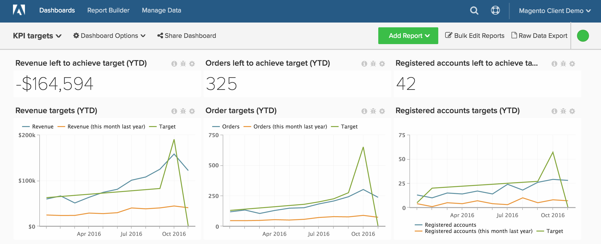

# 성능 지표에 대한 목표 추적

우리 고객의 대부분은 그들의 정보를 추적하고 싶어합니다 **비즈니스 목표**&#x200B;하지만 이 방법이 [!DNL MBI]. 이 문서에서는 시간에 따른 매출, 신규 등록된 사용자 및 주문을 포함하여 실제 데이터에 대해 비즈니스 목표를 추적하는 데 도움이 되는 대시보드를 설정하는 방법을 보여줍니다. 또한 다음과 같은 대시보드에서 연도별 성과를 비교하는 방법을 보여줍니다.

시작하기 전에, Adobe에 대해 숙지하고 싶습니다 [파일 업로더](../importing-data/connecting-data/using-file-uploader.md) 그리고 지정된 기간 동안 비즈니스 목표를 정의했는지 확인하십시오.

## 시작하기

먼저 비즈니스에 대한 특정 일별/월별/분기별 타겟이 포함된 파일을 업로드해야 합니다.

를 사용할 수 있습니다 [파일 업로더](../importing-data/connecting-data/using-file-uploader.md) 및 아래 이미지를 사용하여 파일의 형식을 지정합니다. 고객이 추적하는 가장 일반적인 타겟 [!DNL MBI] 주문, 수익 및 신규 등록 계정을 포함합니다.

## 지표

각 대상에 대해 하나의 새 지표를 만들어야 합니다. 예를 들어 월별 매출 및 주문 타겟을 업로드하는 경우 두 개의 새 지표를 만들어야 합니다.

* **월별 수입 타겟**
* 에서 **`Monthly goals`** 표
* 이 지표는 다음을 수행합니다 **합계**
* 설정 **`Revenue target`** 열
* 정렬 기준 **`Month`** timestamp

* **월별 주문 대상**
* 에서 **`Monthly goals`** 표
* 이 지표는 다음을 수행합니다 **합계**
* 설정 **`Orders target`** 열
* 정렬 기준 **`Month`** timestamp

* **월별 신규 등록 계정 대상**
* 에서 **`Monthly goals`** 표
* 이 지표는 다음을 수행합니다 **합계**
* 설정 **`New registered accounts target`** 열
* 정렬 기준 **`Month`** timestamp

## 보고서

항상 그렇듯이 대상을 분석할 때 정적 값과 시각적 차트를 혼합하는 것이 유용합니다. 다음은 매출 성과 추적을 시작할 수 있는 세 가지 예제 보고서입니다.

* **목표를 달성하기 위해 남은 매출**
* 지표 `A`: `Revenue`
* 

   [[!UICONTROL 지표]: `Revenue`

* 지표 `B`: `Target Revenue`
* [!UICONTROL Metric]: `Monthly Revenue Target`

* [!UICONTROL Formula]: `Revenue left to achieve target`
* 
   [[!UICONTROL 공식]: `(B-A)`
* 

   [!UICONTROL Format]: `Number`

* [!UICONTROL Time period]: (원하는 관련 기간)
* 
   [!UICONTROL Interval]: `Month`
* 

   [!UICONTROL 차트 유형]: `Scalar`

* **매출 타겟**
* 지표 `A`: `Revenue`
* 

   [[!UICONTROL 지표]: `Revenue`

* 지표 `B`: `Target Revenue`
* [!UICONTROL Metric]: `Monthly Revenue Target`

* 지표 `C`: `Revenue (amount change since previous year)` (숨기기)
* 
   [[!UICONTROL 지표]: `Revenue`
* [!UICONTROL Perspective]: `Amount change vs. Previous year`

* [!UICONTROL Formula]: (지난해 이번 달)
* 
   [[!UICONTROL 공식]: `(A-C)`
* 

   [!UICONTROL Format]: `Currency`

* 끄기 `Multiple Y-Axes`
* [!UICONTROL Time period]: (원하는 관련 기간)*
* 
   [!UICONTROL Interval]: `Month`
* [!UICONTROL Chart Type]: `Line Chart`

매출 타겟에 대한 위의 보고서를 완료한 후에는 주문, 등록된 계정 또는 목표 파일 업로드에 포함한 기타 모든 값에 대한 동일한 보고서를 만들 수 있습니다.

모든 보고서를 컴파일한 후 대시보드에서 원하는 대로 구성할 수 있습니다. 최종 결과는 이 페이지의 맨 위에 있는 이미지와 같을 수 있습니다.
