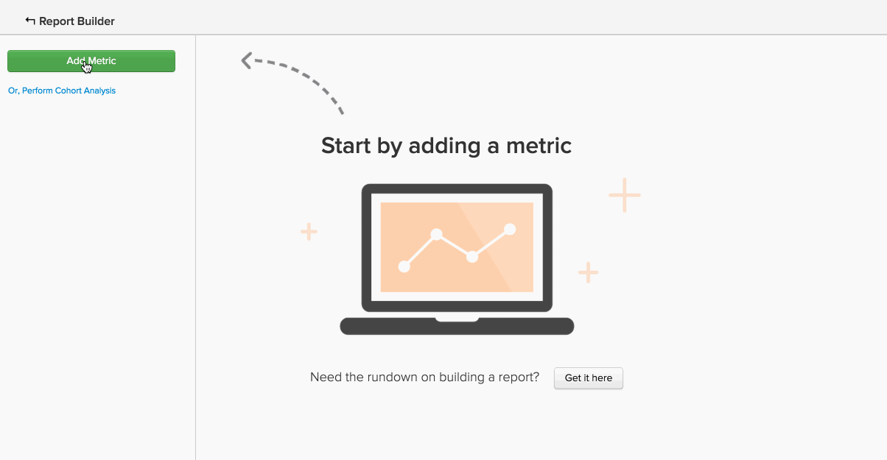

# 고급 계산 열 유형

여러 분석을 통해 다음을 수행할 수 있습니다 **새 열** 당신이 원하는 `group by` 또는 `filter by`. 다음 [계산된 열 만들기](../data-warehouse-mgr/creating-calculated-columns.md) 자습서에서는 대부분의 사용 사례에 대한 기본 사항을 다룹니다. 그러나 Data Warehouse 관리자가 만들 수 있는 것보다 더 복잡한 계산된 열을 원할 수 있습니다.
{: #top}

이러한 유형의 열은 Data Warehouse 분석 팀이 만들 수 있습니다. 새 계산된 열을 정의하려면 다음 정보를 제공합니다.

1. 다음 **`definition`** 이 열(입력, 공식 또는 서식 포함)
1. 다음 **`table`** 열 생성
1. 임의 **`example data points`** 열에 포함해야 하는 항목을 설명합니다.

다음은 사용자가 종종 유용한 고급 계산된 열의 일반적인 예입니다.

* [순차적으로 이벤트 순서 지정(또는 등급)](#compareevents)
* [두 이벤트 사이의 시간 찾기](#twoevents)
* [순차적 이벤트 값 비교](#sequence)
* [통화 변환](#currency)
* [시간대 변환](#timezone)
* [다른 것](#else)

## 이벤트를 순차적으로 주문하려고 합니다 {#compareevents}

우리는 이것을 **이벤트 번호** 계산된 열입니다. 즉, 고객 또는 사용자와 같은 특정 이벤트 소유자에 대해 이벤트가 발생한 시퀀스를 찾으려고 합니다.

다음은 한 예입니다.

| **`event\_id`** | **`owner\_id`** | **`timestamp`** | **`Owner's event number`** |
|-----|-----|-----|-----|
| 1 | `A` | 2015-01-01 00:00:00 | 1 |
| 2 | `B` | 2015-01-01 00:30:00 | 1 |
| 3 | `A` | 2015-01-01 02:00:00 | 2 |
| 4 | `A` | 2015-01-02 13:00:00 | 3 |
| 5 | `B` | 2015-01-03 13:00:00 | 2 |

{style=&quot;table-layout:auto&quot;}

이벤트 번호 계산된 열을 사용하여 첫 번째 이벤트, 반복 이벤트 또는 n번째 이벤트 간의 동작 차이를 관찰할 수 있습니다.

고객의 주문 번호 열이 작동하는지 확인하시겠습니까? 보고서에서 그룹 기준 차원으로 사용된 이미지를 보려면 이미지를 클릭합니다.

<!--{: style="max-width: 500px;"}-->

이러한 유형의 계산된 열을 만들려면 다음을 알아야 합니다.

* 이 열을 만들 테이블
* 이벤트의 소유자를 식별하는 필드입니다(`owner\_id` 이 예에서 )
* 이벤트를 정렬할 필드(`timestamp` 이 예에서 )

[맨 위로](#top)

## 나는 두 사건 사이의 시간을 찾고 있다. {#twoevents}

우리는 이것을 `date difference` 계산된 열입니다. 즉, 이벤트 타임스탬프를 기반으로 단일 레코드에 속하는 두 이벤트 간의 시간을 찾으려고 합니다.

다음은 한 예입니다.

| `id` | `timestamp\_1` | `timestamp\_2` | `Seconds between timestamp\_2 and timestamp\_1` |
|-----|-----|-----|-----|
| `A` | 2015-01-01 00:00:00 | 2015-01-01 12:30:00 | 45000 |
| `B` | 2015-01-01 08:00:00 | 2015-01-01 10:00:00 | 7200 |

{style=&quot;table-layout:auto&quot;}

날짜 차이 계산 열을 사용하여 두 이벤트 간의 평균 또는 중간값을 계산하는 지표를 만들 수 있습니다. 아래 이미지를 클릭하여 `Average time to first order` 지표는 보고서에 사용됩니다.

<!--{: style="max-width: 500px;"}-->

이러한 유형의 계산된 열을 만들려면 다음을 알아야 합니다.

* 이 열을 만들 테이블
* 차이를 알고 싶은 두 타임스탬프

[맨 위로](#top)

## 순차적 이벤트 값을 비교하려고 합니다. {#sequence}

우리는 이것을 **순차적 이벤트 비교**. 즉, 값(통화, 숫자, 타임스탬프)과 소유자의 이전 이벤트에 대한 해당 값 간의 델타를 찾고 있습니다.

다음은 한 예입니다.

| **`event\_id`** | **`owner\_id`** | **`timestamp`** | **`Seconds since owner's previous event`** |
|-----|-----|-----|-----|
| 1 | `A` | 2015-01-01 00:00:00 | NULL |
| 2 | `B` | 2015-01-01 00:30:00 | NULL |
| 3 | `A` | 2015-01-01 02:00:00 | 7720 |
| 4 | `A` | 2015-01-02 13:00:00 | 126000 |
| 5 | `B` | 2015-01-03 13:00:00 | 217800 |

{style=&quot;table-layout:auto&quot;}

순차적 이벤트 비교를 사용하여 각 순차적 이벤트 간의 평균 또는 중간값을 찾을 수 있습니다. 아래 이미지를 클릭하여 **주문 간 평균 및 중간값 시간** 지표 실행.

=<!--{: style="max-width: 500px;"}-->

이러한 유형의 계산된 열을 만들려면 다음을 알아야 합니다.

* 이 열을 만들 테이블
* 이벤트의 소유자를 식별하는 필드입니다(`owner\_id` 예)
* 각 순차적 이벤트에 대한 차이를 보려는 값 필드(`timestamp` 이 예에서 )

[맨 위로](#top)

## 통화를 변환하려고 합니다. {#currency}

A **통화 전환** 계산된 열은 트랜잭션 금액을 이벤트 시간의 환율을 기준으로 기록된 통화에서 보고 통화로 변환합니다.

다음은 한 예입니다.

| **`id`** | **`timestamp`** | **`transaction\_value\_EUR`** | **`transaction\_value\_USD`** |
|-----|-----|-----|-----|
| `1` | 2015-01-01 00:00:00 | 30 | 33.57 |
| `2` | 2015-01-02 00:00:00 | 50 | 55.93 |

{style=&quot;table-layout:auto&quot;}

이러한 유형의 계산된 열을 만들려면 다음을 알아야 합니다.

* 이 열을 만들 테이블
* 변환할 트랜잭션 금액 열
* 데이터가 기록된 통화(일반적으로 ISO 코드)를 나타내는 열입니다
* 기본 보고 통화

[맨 위로](#top)

## 시간대를 변환하려고 합니다. {#timezone}

A **시간대 전환** 계산된 열은 기록된 시간대에서 특정 데이터 소스에 대한 타임스탬프를 보고 시간대로 변환합니다.

다음은 한 예입니다.

| **`id`** | **`timestamp\_UTC`** | **`timestamp\_ET`** |
|-----|-----|-----|
| `1` | 2015-01-01 00:00:00 | 2014-12-31 19:00:00 |
| `2` | 2015-01-01 12:00:00 | 2015-01-01 07:00:00 |

{style=&quot;table-layout:auto&quot;}

이러한 유형의 계산된 열을 만들려면 다음을 알아야 합니다.

* 이 열을 만들 테이블
* 변환할 타임스탬프 열
* 데이터가 기록된 시간대
* 기본 설정 보고 시간대

[맨 위로](#top)

## 여기에 나열되지 않은 것을 하려고 합니다. {#else}

걱정 마 여기에 나열되지 않았다고 불가능한 것은 아닙니다. 저희 Data Warehouse 애널리틱스 팀은 당신이 해결했습니다.

새 계산된 열을 정의하려면 [지원 티켓 제출](https://experienceleague.adobe.com/docs/commerce-knowledge-base/kb/troubleshooting/miscellaneous/mbi-service-policies.html?lang=en) 빌드할 내용에 대한 세부 사항을 제공합니다.

## 관련 설명서

* [계산된 열 만들기](../data-warehouse-mgr/creating-calculated-columns.md)
* [계산된 열 유형](../data-warehouse-mgr/calc-column-types.md)
* [빌딩 [!DNL Google ECommerce] 주문 및 고객 데이터를 사용한 차원](../data-warehouse-mgr/bldg-google-ecomm-dim.md)
