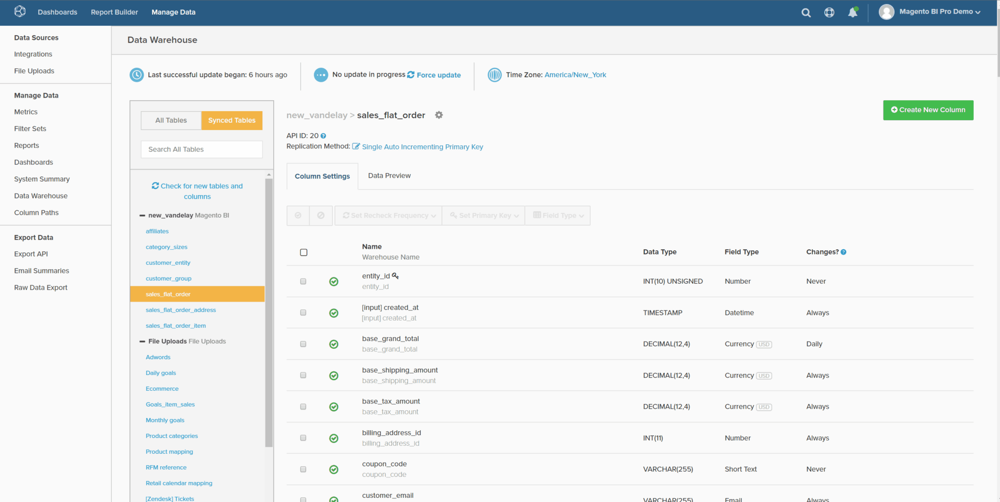

# 계산된 열 유형

* [동일한 테이블 계산](#sametable)
* [일대다 계산](#onetomany)
* [다대일 계산](#manytoone)
* [핸디 참조 맵](#map)
* [고급 계산 열](#advanced)

[Data Warehouse 관리자](../data-warehouse-mgr/tour-dwm.md) 내에서 열을 만들어 분석을 위해 데이터를 보강하고 최적화할 수 있습니다. [이 기능](../data-warehouse-mgr/creating-calculated-columns.md)은(는) Data Warehouse 관리자에서 테이블을 선택하고 **[!UICONTROL Create New Column]**&#x200B;을(를) 클릭하여 액세스할 수 있습니다.

이 항목에서는 Data Warehouse Manager로 만들 수 있는 열 유형에 대해 설명합니다. 또한 설명, 해당 열의 시각적 설명, 열을 만드는 데 필요한 모든 입력의 [참조 맵](#map)도 다룹니다. 다음 세 가지 방법으로 계산된 열을 만들 수 있습니다.

1. [동일한 테이블 계산 열](#sametable)
1. [일대다 계산된 열](#onetomany)
1. [다대일 계산 열](#manytoone)

## 동일한 테이블 계산 열 {#sametable}

이러한 열은 동일한 테이블의 입력 열을 사용하여 작성됩니다.

### 나이 {#age}

나이 계산 열은 현재 시간과 일부 입력 시간 사이의 초 수를 반환합니다.

아래 예제에서는 `Seconds since customer's most recent order` 테이블에 `customers`을(를) 만듭니다. `X days` 내에서 구매(때로는 이탈이라고도 함)하지 않은 고객의 사용자 목록을 만드는 데 사용할 수 있습니다.

### 통화 변환기

통화 변환기 계산된 열은 열의 기본 통화를 원하는 새 통화로 변환합니다.

아래 예제에서는 `base\_grand\_total In AED`을(를) 만들어 `base\_grand\_total`을(를) 기본 통화에서 `sales\_flat\_order` 테이블의 AED로 변환합니다. 이 열은 현지 통화로 보고하려는 여러 통화가 있는 스토어에 적합합니다.

Commerce 클라이언트의 경우 `base\_currency\_code` 필드는 일반적으로 기본 통화를 저장합니다. `Spot Time` 필드는 지표에 사용된 날짜와 일치해야 합니다.

## 일대다 계산된 열 {#onetomany}

`One-to-Many` 열 [두 테이블 간의 경로를 사용합니다](../../data-analyst/data-warehouse-mgr/create-paths-calc-columns.md). 이 경로는 항상 속성이 있는 하나의 테이블과 해당 속성이 &quot;재배치&quot;되는 많은 테이블을 의미합니다. 경로는 `foreign key--primary key` 관계로 설명할 수 있습니다.

### 조인된 열 {#joined}

조인된 열이 한 테이블의 특성을 *to* 다목적 테이블로 재배치합니다. 일중/다의 고전적인 예는 고객(일중) 및 주문(다수)입니다.

아래 예제에서 `Customer's group\_id` 차원은 `orders` 테이블에 결합됩니다.

## 다대일 계산 열 {#manytoone}

이러한 열은 일대다 열과 동일한 경로를 사용하지만 데이터를 반대 방향으로 지정합니다. 열은 패스의 한 쪽에 만들어집니다(많은 쪽이 아니라). 이러한 관계 때문에 열의 값은 집계, 즉 다변도의 데이터 포인트에서 수행되는 수학적 연산이 되어야 합니다. 이에 대한 많은 사용 사례가 있으며 몇 가지 예가 아래에 나와 있습니다.

### 계수 {#count}

이 유형의 계산된 열은 많은 테이블의 값 개수를 반환합니다. *한 테이블부터*.

아래 예제에서는 `Customer's lifetime number of canceled orders`에 대한 필터를 사용하여 `customers` 테이블에 `orders.status` 차원이 만들어집니다.

{: width="699" height="351"}

### 합계 {#sum}

Sum calculated 열은 `many` 테이블에 있는 값의 합계입니다.

`Customer's lifetime revenue`과(와) 같은 고객 수준 차원을 만드는 데 사용할 수 있습니다.

### 최소 또는 최대 {#minmax}

최소 또는 최대 계산 열은 다방면에 존재하는 가장 작거나 가장 큰 레코드를 반환합니다.

`Customer's first order date`과(와) 같은 고객 수준 차원을 만드는 데 사용할 수 있습니다.

### 존재함 {#exists}

계산된 열은 다변에서 레코드의 존재를 결정하는 이진 테스트입니다. 즉, 경로가 각 테이블의 행을 하나 이상 연결하는 경우 새 열은 `1`을(를) 반환하고 연결을 만들 수 없는 경우 `0`을(를) 반환합니다.

이 유형의 차원은 예를 들어 고객이 특정 제품을 구매한 적이 있는지 여부를 결정할 수 있습니다. `customers` 테이블과 `orders` 테이블 간의 조인, 특정 제품에 대한 필터, `Customer has purchased Product X?` 차원을 빌드할 수 있습니다.

## 핸디 참조 맵 {#map}

계산된 열을 생성할 때 모든 입력을 기억하는 데 문제가 있는 경우, 작성 시 이 참조 맵을 근처에 보관하십시오.

## 고급 계산 열 {#advanced}

비즈니스에 대한 질문을 분석하고 답변하는 퀘스트에서 원하는 정확한 열을 작성할 수 없는 상황이 발생할 수 있습니다.

Adobe에서는 신속한 전환을 위해 [고급 계산 열 유형](../../data-analyst/data-warehouse-mgr/adv-calc-columns.md) 안내서를 확인하여 Adobe 지원 팀에서 작성할 수 있는 열 종류를 확인하는 것이 좋습니다. 이 항목에서는 열을 만드는 데 필요한 정보(요청에 포함)도 다룹니다.

## 관련 설명서

* [계산된 열 만들기](../../data-analyst/data-warehouse-mgr/creating-calculated-columns.md)
* [계산된 열에 대한 경로 생성/삭제](../../data-analyst/data-warehouse-mgr/create-paths-calc-columns.md)
* [테이블 관계 이해 및 평가](../../data-analyst/data-warehouse-mgr/table-relationships.md)
