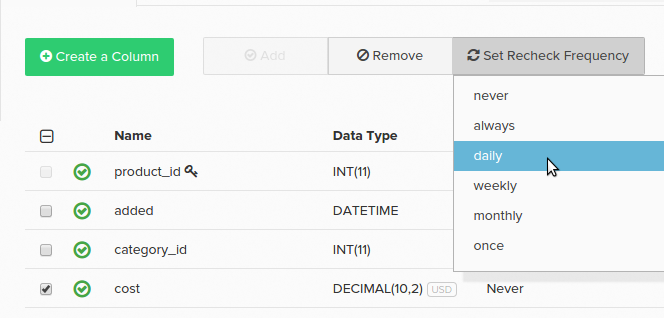

# 데이터 검사 구성

데이터베이스 테이블에는 변경 가능한 값이 있는 데이터 열이 있을 수 있습니다. 예를 들어 `orders` 테이블에 `status` 열이 있을 수 있습니다. 주문이 데이터베이스에 처음 기록되면 상태 열에 _보류 중_ 값이 포함될 수 있습니다. 이 [ 값으로 ](../data-warehouse-mgr/tour-dwm.md)Data Warehouse`pending`에서 순서가 복제됩니다.

주문 상태가 항상 `pending` 상태는 아니지만 변경될 수 있습니다. 결국 `complete` 또는 `cancelled`이(가) 될 수 있습니다. Data Warehouse에서 이 변경 사항을 동기화하려면 열에 새 값을 다시 선택해야 합니다.

이 방법이 논의된 [복제 메서드](../data-warehouse-mgr/cfg-replication-methods.md)와(과) 어떻게 일치합니까? 재검사 처리는 선택한 복제 방법에 따라 달라집니다. `Modified\_At` 복제 메서드는 값 변경을 처리하는 데 가장 적합한 선택입니다. 다시 확인을 구성할 필요가 없기 때문입니다. `Auto-Incrementing Primary Key` 및 `Primary Key Batch Monitoring` 메서드를 사용하려면 구성을 다시 확인해야 합니다.

이러한 방법 중 하나를 사용하는 경우 변경 가능한 열에 다시 확인하도록 플래그를 지정해야 합니다. 세 가지 방법으로 이 작업을 수행할 수 있습니다.

1. 다시 검사할 업데이트 플래그 열의 일부로 실행되는 감사 프로세스입니다.

   >[!NOTE]
   >
   >Auditor는 샘플링 프로세스에 의존하며 변화하는 열을 즉시 포착하지 못할 수 있습니다.

1. Data Warehouse 관리자의 열 옆에 있는 확인란을 선택하고 **[!UICONTROL Set Recheck Frequency]**&#x200B;을(를) 클릭한 다음 변경 내용을 확인해야 하는 시기에 적절한 시간 간격을 선택하여 직접 설정할 수 있습니다.

1. [!DNL Adobe Commerce Intelligence] Data Warehouse 팀의 구성원은 Data Warehouse에서 다시 확인할 열을 수동으로 표시할 수 있습니다. 변경할 수 있는 열이 있는 경우 팀에 문의하여 재검사를 요청하십시오. 요청에 빈도와 함께 열 목록을 포함하십시오.

## 빈도 다시 확인 {#frequency}

**알고 계십니까?**
`primary key` 열에 대해 다시 검사를 설정해도 변경된 값에 대한 열은 검사하지 않습니다. 테이블에서 삭제된 행이 확인되고 삭제된 모든 항목은 Data Warehouse에서 삭제됩니다.

열에 다시 확인 표시가 있으면 다시 확인하는 빈도를 설정할 수도 있습니다. 특정 열이 자주 변경되지 않는 경우 재검사를 덜 자주 선택하면 [업데이트 주기를 최적화](../../best-practices/reduce-update-cycle-time.md)할 수 있습니다.

빈도 옵션은 다음과 같습니다.

* `always` - 업데이트할 때마다 다시 확인
* `daily` - 다시 확인은 선언된 시간대에 대해 자정 이후에 처음 업데이트됩니다.
* `weekly` - 재확인은 매주 금요일 오후 9시 이후에 선언된 시간대에 대해 업데이트됩니다.
* `monthly` - 재확인은 4주마다 금요일 오후 9시 이후에 선언된 시간대에 대해 업데이트됩니다.
* `once` - 다음 업데이트(일회성 새로 고침)에서만 발생

Adobe 업데이트 시간은 동기화할 데이터 양과 상관 관계가 있으므로 모든 업데이트 대신 `daily`, `weekly` 또는 `monthly`을(를) 다시 확인하는 것이 좋습니다.

## 재확인 빈도 관리 {#manage}

테이블 이름을 클릭한 다음 개별 열을 선택하여 Data Warehouse에서 빈도를 다시 확인할 수 있습니다. 동기화 상태 및 재확인 빈도(변경 **개?** 열이 테이블의 각 열에 대해 표시됩니다.

재확인 빈도를 변경하려면 변경할 열 옆에 있는 확인란을 클릭합니다. 그런 다음 **[!UICONTROL Set Recheck Frequency]** 드롭다운을 클릭하고 원하는 빈도를 설정합니다.

`Paused` 열에 `Changes?`이(가) 표시되는 경우가 있습니다. 이 값은 테이블의 [복제 메서드](../../data-analyst/data-warehouse-mgr/cfg-data-rechecks.md)이(가) `Paused`(으)로 설정된 경우 표시됩니다.

[!DNL Adobe]에서는 이러한 열을 검토하여 업데이트를 최적화하고 변경 가능한 열을 다시 확인하는 것이 좋습니다. Adobe 데이터가 변경되는 빈도를 고려할 때 열에 대한 재확인 빈도가 높은 경우 업데이트를 최적화하기 위해 열을 줄이는 것이 좋습니다.

질문이 있거나 현재 복제 방법 또는 재검사에 대해 문의하려면 당사에 문의하십시오.

**관련:**

* [업데이트 시간 단축](../../best-practices/reduce-update-cycle-time.md)
* [분석을 위해 데이터베이스 최적화](../../best-practices/opt-db-analysis.md)
