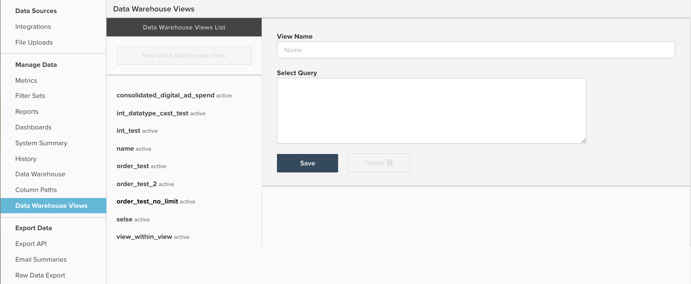

# Data Warehouse 보기 작업

이 문서에서는 `Data Warehouse Views` 으로 이동하여 액세스 가능 **[!UICONTROL Manage Data]** > **[!UICONTROL Data Warehouse Views]**. 다음은 기능 및 새 보기를 만드는 방법에 대한 설명과 사용 방법의 예입니다 `Data Warehouse Views` 통합하기 [!DNL Facebook] 및 [!DNL AdWords] 데이터 사용.

## 일반 목적

다음 `Data Warehouse Views` 이 기능은 기존 테이블을 수정하거나 SQL을 사용하여 여러 테이블을 함께 결합하거나 병합하여 새 웨어하우스 테이블을 만드는 방법입니다. 한 번 `Data Warehouse View` 은 업데이트 주기에 의해 생성 및 처리되며, Data Warehouse에 `Data Warehouse Views` 드롭다운을 참조하십시오.


여기에서 새 보기는 다른 테이블과 마찬가지로 작동하며 새 계산된 열을 만들거나 지표 및 보고서를 맨 위에 만들 수 있습니다.

`Data Warehouse Views` 는 주로 비슷하지만 서로 다른 여러 테이블을 함께 통합하는 데 사용되므로 모든 보고를 하나의 새 표에 작성할 수 있습니다. 몇 가지 일반적인 예로는 기존 데이터베이스와 라이브 데이터베이스의 테이블을 통합하여 이전 데이터와 현재 데이터를 결합하거나 Facebook 및 AdWords와 같은 여러 광고 소스를 단일 데이터베이스로 통합하는 경우가 있습니다 `Consolidated ad spend` 테이블.

SQL을 잘 알고 있는 경우 이 두 통합 예는 모두 `UNION` 그러나 새 보기를 작성할 때 모든 PostgreSQL 구문 및 함수를 사용할 수 있습니다.

## Data Warehouse 보기 만들기 및 관리

새로 만들기 `Data Warehouse Views` 을(를) 만들 수 있으며, **[!UICONTROL Manage Data]** > **[!UICONTROL Data Warehouse Views]**&#x200B;를 아래와 같이 표시합니다.



여기에서 아래 샘플 지침에 따라 새 보기를 만들 수 있습니다.

1. 기존 보기를 관찰하는 경우 **[!UICONTROL New Data Warehouse View]** 빈 쿼리 창을 열려면 다음을 수행합니다. 빈 쿼리 창이 이미 열려 있는 경우 다음 단계로 진행합니다.
1. 을 입력하여 보기에 이름을 지정합니다. `View Name` 필드. 여기에 제공된 이름이 Data Warehouse에서 보기에 대한 표시 이름을 결정합니다. `View names` 소문자, 숫자 및 밑줄(_)로 제한됩니다. 다른 모든 문자는 사용할 수 없습니다.
1. 라는 창에 질의를 입력합니다. `Select Query`를 사용 중이어야 합니다.
   >[!NOTE]
   >
   >쿼리는 특정 열 이름을 참조해야 합니다. 의 사용 `*`모든 열을 선택할 수 있는 문자는 허용되지 않습니다.

1. 완료되면 를 클릭합니다. **[!UICONTROL Save]** 보기를 저장하려면 을 클릭합니다. 보기에 일시적으로 `Pending` 다음 전체 업데이트 주기에 의해 처리될 때까지 상태. 이 경우 상태가 `Active`. 업데이트로 처리된 후에는 보기에서 보고서를 사용할 수 있습니다.

저장한 후에 `Data Warehouse View` 편집할 수 없습니다. 어떤 이유로든 `Data Warehouse View`새 보기를 만들고 계산된 열, 지표 또는 보고서를 원래 보기에서 새 보기로 수동으로 마이그레이션해야 합니다. 마이그레이션이 완료되면 원래 보기를 안전하게 삭제할 수 있습니다. 왜냐면 `Data Warehouse Views` 편집할 수 없는 경우에는 `SQL Report Builder` 쿼리를 Data Warehouse 보기로 저장하기 전에

## 예: [!DNL Facebook] 및 [!DNL Google AdWords] 데이터

이 문서에서 앞서 언급된 예제 중 하나를 자세히 살펴보겠습니다. 통합 [!DNL Facebook] 및 [!DNL AdWords] 데이터를 새로운 통합 광고 표에 지출합니다. 일반적으로 이 작업에는 아래에 샘플 데이터 세트가 있는 두 개의 테이블이 통합됩니다.

`Ad source: Google AdWords`

`Table name: campaigns67890`

`Sample data:`

| **`_id`** | **`campaign`** | **`adClicks`** | **`date`** | **`impressions`** | **`adCost`** |
|--- |--- |--- |--- |--- |--- |
| 1 | eee | 60 | 2017-05-05 00:00:00 | 2000년 | 10.2 |
| 2개 | g | 40 | 2017-05-23 00:00:00 | 900년 | 4.6 |
| 3 | aaa | 22 | 2017-06-12 00:00:00 | 400년 | 2.5 |
| 4 | eee | 350년 | 2017-06-30 00:00:00 | 14500 | 35 |
| 5개 | fff | 280년 | 2017-07-10 00:00:00 | 10200 | 28.5 |

`Ad source: Facebook`

`Table name: facebook_ads_insights_12345`

`Sample data:`

| **`_id`** | **`campaign`** | **`adClicks`** | **`date`** | **`impressions`** | **`adCost`** |
|--- |--- |--- |--- |--- |--- |
| 1 | aaa | 25년 | 2017-05-01 00:00:00 | 1200년 | 5개 |
| 2개 | ddd | 12 | 2017-05-15 00:00:00 | 800년 | 2.5 |
| 3 | aaa | 40 | 2017-05-22 00:00:00 | 2000년 | 7 |
| 4 | aaa | 110년 | 2017-06-08 00:00:00 | 6000년 | 10 |
| 5개 | ccc | 5개 | 2017-07-06 00:00:00 | 300년 | 1.2 |

둘 다 포함하는 단일 광고 비용 테이블을 만들려면 [!DNL Facebook] 및 [!DNL AdWords] 캠페인에서는 SQL 쿼리를 작성하여 `UNION ALL` 함수 위에 있어야 합니다. A `UNION ALL` 문은 각 쿼리의 결과를 단일 출력에 추가하는 동안 여러 개의 개별 SQL 쿼리를 결합하는 데 가장 많이 사용됩니다.

에는 몇 가지 요구 사항이 있습니다 `UNION` PostgreSQL에 요약된 대로 언급할 가치가 있는 명령문 [설명서](https://www.postgresql.org/docs/8.3/queries-union.html):

* 모든 쿼리는 동일한 수의 열을 반환해야 합니다
* 해당 열에는 동일한 데이터 유형이 있어야 합니다

실행 시 `UNION` 또는 `UNION ALL` 문, 최종 출력의 열 이름은 첫 번째 쿼리에 열 이름을 반영합니다.

대부분의 경우 [!DNL Facebook] 및 [!DNL Google AdWords] 데이터를 `Data Warehouse View` 은 7개의 열이 있는 테이블을 만들어야 하며, 쿼리는 아래와 같습니다.

```sql
    SELECT
        "_id" as id,
        'AdWords' as ad_source,
        "date",
        "campaign",
        "adCost" as spend,
        "impressions",
        "adClicks" as clicks
    FROM campaigns67890
    UNION
    SELECT
        "_id" as id,
        'Facebook' as ad_source,
        "date_start" as date,
        "campaign_name" as campaign,
        "spend",
        "impressions",
        "clicks"
    FROM facebook_ads_insights_12345
```

위에 대한 몇 가지 중요한 사항:

* 명확성을 위해 모든 열의 위에 별칭이 지정되므로 모든 쿼리에서 이름이 일치합니다. 그러나 이것은 요구 사항이 아닙니다. SELECT 쿼리에서 열이 호출되는 순서는 열이 정렬되는 방식을 나타냅니다.
* 새 열 `ad_source` 을(를) 사용하여 보다 쉽게 필터링할 수 있도록 [!DNL AdWords] 또는 [!DNL Facebook] 데이터. 이 쿼리는 두 테이블의 모든 데이터를 결합합니다. 다음과 같은 열을 만들지 않는 경우 `ad_source`를 사용하면 특정 소스에서 비용을 쉽게 파악할 수 없습니다.

위의 쿼리를 `Data Warehouse View` 이 두 가지 모두 [!DNL Facebook] 및 [!DNL AdWords] 아래와 같이 지출합니다.

| **`id`** | **`ad_source`** | **`date`** | **`campaign`** | **`spend`** | **`impressions`** | **`clicks`** |
|--- |--- |--- |--- |--- |--- |--- |
| **1** | [!DNL Facebook] | 2017-05-01 00:00:00 | aaa | 5개 | 1200년 | 25년 |
| **1** | [!DNL Google AdWords] | 2017-05-05 00:00:00 | eee | 10.2 | 2000년 | 60 |
| **2개** | [!DNL Facebook] | 2017-05-15 00:00:00 | ddd | 2.5 | 800년 | 12 |
| **2개** | [!DNL Google AdWords] | 2017-05-23 00:00:00 | g | 4.6 | 900년 | 40 |
| **3** | [!DNL Facebook] | 2017-05-22 00:00:00 | aaa | 7 | 2000년 | 40 |
| **3** | [!DNL Google AdWords] | 2017-06-12 00:00:00 | aaa | 2.5 | 400년 | 22 |
| **4** | [!DNL Facebook] | 2017-06-08 00:00:00 | aaa | 10 | 6000년 | 110년 |
| **4** | [!DNL Google AdWords] | 2017-06-30 00:00:00 | eee | 35 | 14500 | 350년 |
| **5개** | [!DNL Facebook] | 2017-07-06 00:00:00 | ccc | 1.2 | 300년 | 5개 |
| **5개** | [!DNL Google AdWords] | 2017-07-10 00:00:00 | fff | 28.5 | 10200 | 280년 |

이제 각 광고 소스에 대해 별도의 마케팅 지표 세트를 만들지 않고 위의 표를 사용하여 단일 지표 세트만 만들어 모든 광고를 캡처할 수 있습니다.

**추가 도움말을 찾고 계십니까?**

SQL 쓰기 및 만들기 `Data Warehouse Views` 기술 지원에는 포함되지 않습니다.  그러나 서비스 팀은 보기 생성에 대한 지원을 제공합니다. 기존 데이터베이스의 마이그레이션 및 통합에서부터 특정 분석을 위해 단일 Data Warehouse 보기 만들기에 이르기까지, 모든 데이터 구조 문제를 해결하기 위해 SQL 기반 솔루션을 조정하는 데 능숙합니다.

대부분의 경우 새 `Data Warehouse View` 2-3의 유사한 구조화된 테이블을 통합하려면 5시간의 서비스 시간이 필요하며 이는 대략 1250달러의 작업 시간을 필요로 합니다. 그러나 다음은 예상 투자를 늘릴 수 있는 몇 가지 일반적인 요소입니다.

* 3개 이상의 테이블을 단일 뷰로 통합
* 두 개 이상의 데이터 웨어하우스 보기 만들기
* 복잡한 결합 논리 또는 필터링 조건
* 서로 다른 데이터 구조를 사용하여 2개 이상의 테이블 통합
