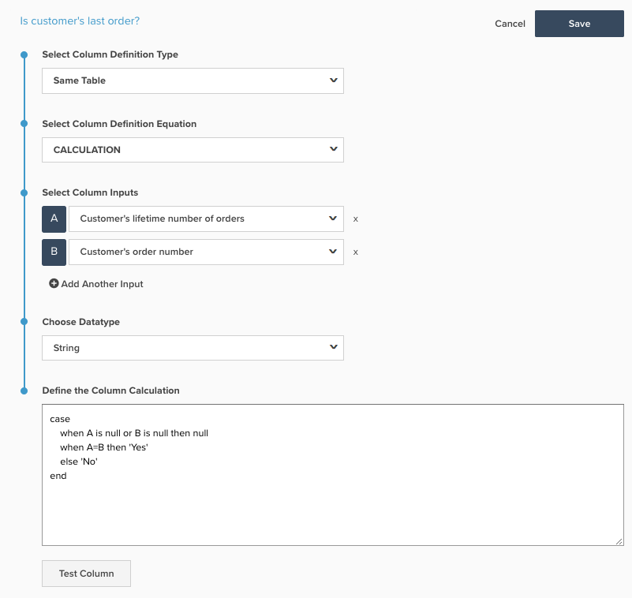

# SQL 계산 열 만들기

이 항목에서는 의 목적과 용도를 간략하게 설명합니다. `Calculation` 을 사용하여 테이블에 추가할 수 있는 열 유형입니다. [Data Warehouse 관리자](../data-warehouse-mgr/tour-dwm.md). 아래에서는 SQL 계산의 기능, 계산 사용 이유, SQL 계산 생성 프로세스에 대해 설명하고 두 가지 예를 포함합니다.

**설명**

과거에는 `advanced` 고객 지원 팀의 분석가만 수행할 수 있습니다. [!DNL Adobe Commerce Intelligence]. 이제 모든 권한이 최종 사용자의 손에 있으며 고급 열을 다음 형식으로 만들 수 있습니다. `SQL Calculation` 새 열 [!DNL Commerce Intelligence] 아키텍처.

다음 `Calculation` 이제 Data Warehouse 관리자에서 옵션으로 사용할 수 있는 열 유형은 PostgreSQL 논리를 사용하여 테이블의 열을 변환할 수 있는 동일한 테이블 작업입니다. 에서 사용할 수 있는 함수 및 연산자에 대한 설명서 `Calculation` 열 유형은 PostgreSQL 웹 사이트에서 찾을 수 있습니다. [여기](https://www.postgresql.org/docs/9.6/functions.html).

로 만들 수 있는 다양한 열 `Calculation` 열은 거의 무제한이지만 대부분의 열은 아래 예에서 사용하는 IF-THEN 문과 기본 산술을 사용하여 만들 수 있습니다.

**예 1: 고객의 마지막 주문입니까?**

대부분의 계정에는 `Is customer's last order?` 다음에 대한 `orders` 반복 구매율과 이탈한 고객에 대한 분석을 수행하는 표입니다. 계정이 새 아키텍처에 있는 경우 이 열은 `Calculation` 열 및 은 아래 스크린샷에서 볼 수 있습니다.

다음 `Is customer's last order?` 열은 입력을 사용합니다. `Customer's lifetime number of orders` 및 `Customer's order number` 다음으로 별칭 지정됨 `A` 및 `B` 각각.

PostgreSQL의 의미는 한 줄에 하나씩 표시됩니다.

* case: 일련의 If - Then 문이 시작됩니다.
* 조건 `A` 은(는) null이거나 `B` is null then null: 입력 중 하나가 비어 있으면 출력도 비어 있어야 합니다. SQL 오류를 방지하기 위한 것입니다.
* 조건 `A=B` 그러면 `Yes`: 경우 `Customer's lifetime number of orders` 다음과 같음 `Customer's order number` 이 행에 대해 를 반환한 다음 `Yes`. 따라서 고객이 4개의 주문을 했다면 4번째 주문에 대한 행이 반환됩니다 `Yes` 대상 `Is customer's last order?`
* else `No`: 문이 충족될 때 다른 문이 없으면 을 반환합니다. `No`
* end: If - Then 문을 종료합니다.

이 열에서 반환할 수 있는 가능한 값(`NULL`, `Yes`, `No`)에 숫자가 아닌 문자가 포함되어 있으므로 여기에 있는 데이터 유형은 문자열입니다.

**예제 2: 주문 품목 총 금액(수량 * 가격)**

많은 클라이언트가 다음과 같은 필드별로 분할하면서 항목 수준에서 매출을 분석하는 것을 좋아합니다. `product name` 또는 `category`. 대부분의 데이터베이스는 실제로 주문에서 제품의 수익을 제공하지 않습니다. 대신 주문에서 판매된 수량과 품목의 가격을 제공합니다.

제품 매출 분석을 활성화하기 위해 대부분의 계정에 라는 열이 있습니다. `Order item total value (quantity * price)` 다음에 대한 `Orders Items` 테이블. 계정이 새 아키텍처에 있는 경우 이 열도 `Calculation` 열 및 은 아래 스크린샷에서 볼 수 있습니다.

상거래 스키마에서 `Order item total value (quantity * price)` 열은 입력을 사용합니다. `qty ordered` 및 `base price` 다음으로 별칭 지정됨 `A` 및 `B` 각각.

이 새 열에서 반환되는 값은 달러 및 센트로 표시되므로 올바른 데이터 유형은 다음과 같습니다. `Decimal(10,2)`.

**역학**

새 항목 `Calculation` 열로 이동하여 테이블에 추가할 수 있습니다. **[!DNL Manage Data > Data Warehouse]** 아래와 같이:

여기에서 다음을 만들 수 있습니다. `Calculation` 아래 단계를 수행하여 열을 만듭니다.

1. 추가할 테이블을 선택합니다. `Calculation` 열.
1. 올바른 테이블에 있는 동안 **[!UICONTROL Create New Column]** 화면 오른쪽 상단에 있습니다.
1. 다음에서 `Select a definition` 드롭다운, 선택 `Same Table`.
1. 선택 `Calculation` (으)로 `column definition equation`.
1. 열 이름을 입력합니다.
1. 다음을 선택합니다. `input` 새 열의 논리에 사용되는 테이블의 열입니다. 추가하는 각 열에는 문자 별칭이 있으므로 첫 번째 열은 `A`, 두 번째는 `B` 기타 등등.
1. 창에서 입력의 문자 별칭을 사용하여 새 열에 대한 PostgreSQL 논리를 입력합니다. SQL 계산은 SQL 쿼리의 SELECT 문과 FROM 문 사이의 모든 논리를 포함하는 단일 열 정의로 제한되어야 합니다. 입력 문자를 사용하는 SQL 키워드는 소문자여야 합니다. 예를 들어 `CASE` statement, 소문자로 작성되어야 함 - `case`. 시스템에서는 대문자를 가정합니다 `A` 는 입력 중 하나를 나타냅니다.
1. 적절한 데이터 유형을 선택합니다.
   * `Integer` - 정수
   * `Decimal(10,2)` - 총 10자리의 십진수이며, 그 중 2는 소수점의 오른쪽에 있음
   * `String` - 숫자가 아닌 모든 텍스트 유형 또는 일련의 문자
   * `Datetime` - yyyy-MM-dd hh:mm:ss 형식

1. 클릭 **[!UICONTROL test column]**. 이렇게 하면 각 입력에 대해 5개의 테스트 값 목록이 생성되고 각 테스트 값 세트에 대해 6단계의 논리 결과가 표시됩니다. SQL의 어느 부분에서든 오류가 발생하면 적절한 오류 메시지가 반환됩니다. 모든 입력 열이 기본 필드인 경우에만 샘플 결과를 생성할 수 있습니다. 입력 열이 계산된 열인 경우 지표에 열을 추가하고 시각적 Report Builder에서 표시하여 결과를 확인해야 합니다

1. 결과가 만족스러우면 다음을 클릭하십시오. **[!UICONTROL Save]**. 이 열은 을 사용할 수 있도록 설정합니다.
