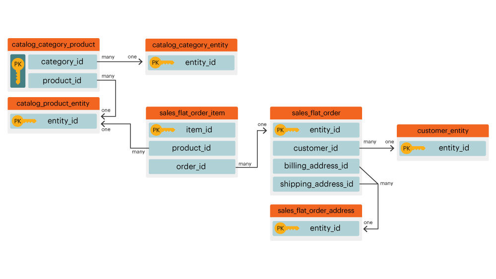

# 엔터티 관계 다이어그램

정의 **[!UICONTROL entity relationship (ER) diagram]**? An `ER` 다이어그램은 데이터베이스 내의 테이블 및 테이블 간의 관계 시각화입니다. 이 문서에는 몇 가지 ER 다이어그램이 포함되어 있으므로 소수의 공통 Commerce 데이터베이스 테이블 간의 관계를 시각화할 수 있습니다.

>[!NOTE]
>
>이 글을 읽으면, 그 단어들이 보입니다 **가입**, **관계** 및 **경로**. 이 단어들은 두 개의 테이블이 어떻게 연결되는지를 설명하는데 모두 사용됩니다.

## Core Commerce `ER` 다이어그램

이 `ER` 다이어그램은 상거래 데이터베이스 내의 코어 테이블 간의 관계를 나타냅니다. 여러 관계를 한 번에 확인하면 여러 테이블에서 데이터가 어떻게 관련되는지를 확인할 수 있습니다.

아래 섹션에는 다음이 포함되어 있습니다 `ER` 한 번에 두 테이블에 대한 다이어그램입니다. 다이어그램과 함께 제공되는 설명을 보려면 해당 섹션의 헤더를 클릭합니다.

## `customer\_entity & sales\_flat\_order`

한 고객이 많은 주문을 할 수 있습니다. 이 두 테이블 간의 관계는 `customer\_entity.entity\_id = sales\_flat\_order.customer\_id`

>[!IMPORTANT]
>
>`customer\_entity.entity\_id` 다음과 같지 않음 `sales\_flat\_order.entity\_id`. 첫 번째는 `customer\_id` 그리고 두번째는 `order\_id.` 자세한 내용은 [`entity\_id` 섹션](https://support.magento.com/hc/en-us/articles/360016729951) 우리의 _[!DNL Magento]: 일반적인 오해_ 문서.

내 [!DNL MBI]로 설정하는 경우 이 두 테이블 사이의 경로가 아직 존재하지 않으면 다음을 수행할 수 있습니다 [경로 만들기](../data-warehouse-mgr/create-paths-calc-columns.md) Data Warehouse 탭 내에 있어야 합니다. 경로를 만들 준비가 되면 다음과 같이 정의됩니다.

## `sales\_flat\_order & sales\_flat\_order\_item`

하나의 주문에 여러 항목이 포함될 수 있습니다. 이 두 테이블 간의 관계는 `sales\_flat\_order.entity\_id = sales\_flat\_order\_item.order\_id`.

내 [!DNL MBI]로 설정하는 경우 이 두 테이블 사이의 경로가 아직 존재하지 않으면 다음을 수행할 수 있습니다 [경로 만들기](../data-warehouse-mgr/create-paths-calc-columns.md) Data Warehouse 탭 내에 있어야 합니다. 경로를 만들 준비가 되면 다음과 같이 정의됩니다.

## `catalog\_product\_entity & sales\_flat\_order\_item`

하나의 제품은 여러 품목을 구매할 수 있습니다. 이 두 테이블 간의 관계는 `catalog\_product\_entity.entity\_id = sales\_flat\_order\_item.product`.

내 [!DNL MBI]로 설정하는 경우 이 두 테이블 사이의 경로가 아직 존재하지 않으면 다음을 수행할 수 있습니다 [경로 만들기](../data-warehouse-mgr/create-paths-calc-columns.md) Data Warehouse 탭 내에 있어야 합니다. 경로를 만들 준비가 되면 다음과 같이 정의됩니다.

