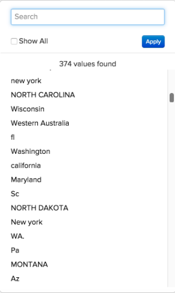

# 매핑 테이블을 사용하여 데이터 표준화

다음 단계에 있다고 상상해 보십시오. `Report Builder` 빌드 a `Revenue by State` 보고서. 을(를) 추가하려고 할 때까지 모든 것이 잘 진행되고 있습니다. `billing state` 보고서를 그룹화하면 다음과 같은 결과가 표시됩니다.

## 어떻게 이런 일이 일어날 수 있죠?

안타깝게도, 표준화의 부족은 보고서를 작성할 때 때때로 지저분한 데이터와 골칫거리로 이어질 수 있습니다. 이 예에는 고객이 청구 상태 정보를 입력할 수 있는 드롭다운 메뉴 또는 표준화된 방법이 없을 수 있습니다. 이렇게 하면 다양한 값이 만들어집니다. `pa`, `PA`, `penna`, `pennsylvania`, 및 `Pennsylvania` &quot; 같은 상태라도 유지되다 보니 `Report Builder`.

데이터를 정리하거나 필요한 열을 데이터베이스에 직접 삽입하는 데 도움이 되는 기술 리소스가 있을 수 있습니다. 그렇지 않은 경우 다른 해결 방법이 있습니다. **매핑 테이블**. 매핑 테이블을 사용하면 데이터를 단일 출력에 매핑하여 지저분한 데이터를 빠르고 쉽게 정리하고 표준화할 수 있습니다.

>[!NOTE]
>
>Adobe 지원 팀의 도움 없이는 통합 테이블에 대한 매핑 테이블을 생성할 수 없습니다.

## 만들려면 어떻게 해야 합니까? {#how}

**데이터 서식 새로 고침:**

* 스프레드시트에 머리글 행이 있는지 확인합니다.
* 쉼표를 사용하지 마십시오! 이 경우 파일을 업로드할 때 문제가 발생합니다.
* 표준 날짜 형식 사용 `(YYYY-MM-DD HH:MM:SS)` 날짜용입니다.
* 백분율을 소수 자릿수로 입력해야 합니다.
* 선행 또는 후행 0이 제대로 유지되는지 확인합니다.

시작하기 전에 Adobe은 다음을 권장합니다. [원시 테이블 데이터 내보내기](../../tutorials/export-raw-data.md). 원시 데이터를 먼저 확인하면 정리해야 하는 데이터에 대해 가능한 모든 조합을 탐색할 수 있으므로 매핑 테이블이 모든 항목을 포함하도록 할 수 있습니다.

매핑 테이블을 만들려면 다음에 오는 2열 스프레드시트를 만들어야 합니다. [파일 업로드에 대한 규칙 서식 지정](../../data-analyst/importing-data/connecting-data/using-file-uploader.md).

첫 번째 열에서 데이터베이스에 저장된 값을 **각 행에 하나의 값만 있음**. 예를 들어, `pa` 및 `PA` 동일한 줄에 있을 수 없습니다. 각 입력에 고유한 행이 있어야 합니다. 예제는 아래를 참조하십시오.

두 번째 열에 다음 값을 입력합니다 **다음이어야 함:**. 원하는 경우 청구 상태 예를 계속 진행합니다. `pa`, `PA`, `Pennsylvania`, 및 `pennsylvania` 간단히 말하자면 `PA`를 입력하면 됩니다. `PA` 각 입력 값에 대해 이 열에서 확인하십시오.

## 에서 수행해야 하는 작업 [!DNL Commerce Intelligence] 사용하시겠습니까? {#use}

매핑 테이블 생성을 완료한 후에는 다음을 수행해야 합니다 [파일 업로드](../../data-analyst/importing-data/connecting-data/using-file-uploader.md) 대상 [!DNL Commerce Intelligence] 및 [조인된 열 만들기](../../data-analyst/data-warehouse-mgr/calc-column-types.md) 새 필드를 원하는 테이블로 재배치합니다. 파일이 Data Warehouse에 동기화된 후 이 작업을 수행할 수 있습니다.

이 예에서는 `mapping_state` 표 (`state_input`) 로 이동합니다. `customer_address` 조인된 열을 사용하는 테이블입니다. 이렇게 하면 정하게 그룹화할 수 있습니다. `state_input` 보고서의 열 `state` 열.

다음을 만들려면 `joined` 열에서 Data Warehouse 관리자에서 필드를 재배치할 테이블로 이동합니다. 이 예에서 는 `customer_address` 테이블.

1. 클릭 **[!UICONTROL Create a Column]**.
1. 선택 `Joined Column` 다음에서 `Definition` 드롭다운입니다.
1. 열과 을 구분하는 이름을 지정합니다. `state` 데이터베이스의 열입니다. 열 이름 지정 `billing state (mapped)` report builder에서 세그먼트화할 때 사용할 열을 알 수 있습니다.
1. 테이블을 연결하는 데 필요한 경로가 없으므로 경로를 생성해야 합니다. 클릭 **[!UICONTROL Create new path]**  다음에서 `Select a table and column` 드롭다운입니다.

   테이블 관계가 무엇인지 또는 기본 키와 외래 키를 제대로 정의하는 방법을 잘 모를 경우 체크 아웃합니다 [튜토리얼](../../data-analyst/data-warehouse-mgr/create-paths-calc-columns.md) 도움이 필요하시면.

   * 다음에서 `Many` 필드를 재배치할 테이블을 선택합니다(다시 말해 다음과 같음). `customer_address`) 및 `Foreign Key` 열 또는 `state` 열, 예
   * 다음에서 `One` 측면을 선택하고 `mapping` 테이블 및 `Primary key` 열. 이 경우 다음을 선택합니다. `state_input` 의 열 `mapping_state` 테이블.
   * 다음은 경로의 모양입니다.

     

1. 완료되면 다음을 클릭: **[!UICONTROL Save]** 을 클릭하여 경로를 만듭니다.
1. 저장 후 경로가 바로 채워지지 않을 수 있습니다. 이런 경우 `Path` 을 클릭하고 만든 경로를 선택합니다.
1. 클릭 **[!UICONTROL Save]** 열을 만듭니다.

## 이제 어떻게 해야 합니까? {#wrapup}

업데이트 주기가 완료되면 새로 결합된 열을 사용하여 데이터베이스의 지저분한 열 대신 데이터를 적절하게 세그먼트화할 수 있습니다. 이제 그룹화 옵션을 살펴보십시오. 더 이상 스트레스를 주지 않습니다.

매핑 테이블은 Data Warehouse에서 잠재적으로 지저분한 데이터를 정리할 때 언제든지 유용합니다. 그러나 다음과 같은 다른 멋진 사용 사례에도 매핑 테이블을 사용할 수 있습니다. [복제 중 [!DNL Google Analytics channels] 위치: [!DNL Commerce Intelligence]](../data-warehouse-mgr/rep-google-analytics-channels.md).

### 관련 항목

* [테이블 관계 이해 및 평가](../data-warehouse-mgr/table-relationships.md)
* [계산된 열에 대한 경로 생성/삭제](../data-warehouse-mgr/create-paths-calc-columns.md)
