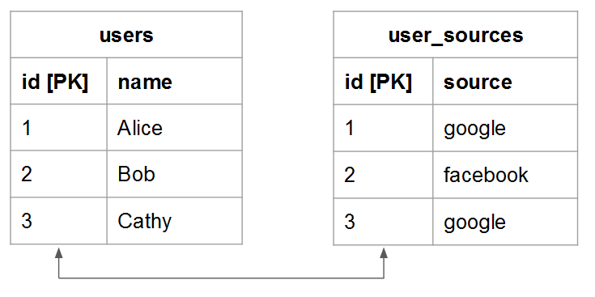

# 테이블 관계 이해 및 평가

지정된 두 테이블 간의 관계를 평가할 때 한 테이블의 발생 가능한 항목이 다른 테이블의 엔터티에 속할 수 있는지, 그 반대의 경우도 얼마나 되는지 이해해야 합니다. 예를 들어 `users` 테이블 및 `orders` 테이블. 이 경우 몇 명인지 **주문** 주어진 **사용자** 배치되었으며 가능한 횟수는 얼마나 됩니까 **사용자** an **주문** 에 속할 수 있습니다.

데이터 무결성을 유지하기 위해서는 관계의 정확성이 필요합니다. [계산된 열](../data-warehouse-mgr/creating-calculated-columns.md) 및 [차원](../data-warehouse-mgr/manage-data-dimensions-metrics.md). 자세한 내용은 [관계 유형](#types) 및 [Data Warehouse에서 표를 평가하는 방법](#eval)

## 관계 유형 {#types}

두 테이블 사이에 세 가지 유형의 관계가 있을 수 있습니다.

* [&#39;일대일&#39;](#onetoone)
* [&#39;일대다&#39;](#onetomany)
* [&#39;다대다&#39;](#manytomany)

### `One-to-One` {#onetoone}

다음 `one-to-one` 관계, 테이블의 레코드 `B` 는 테이블에서 하나의 레코드에만 속합니다. `A`. 그리고 테이블의 레코드 `A` 는 테이블에서 하나의 레코드에만 속합니다. `B`.

예를 들어, 사람과 운전면허 번호 사이의 관계에서, 사람은 하나의 운전면허번호만을 가질 수 있고, 운전면허증은 1명의 사람에게만 속합니다.

### `One-to-Many` {#onetomany}

다음 `one-to-many` 관계, 테이블의 레코드 `A` 테이블의 여러 레코드에 속할 수 있습니다. `B`. 다음 사이의 관계에 대해 생각해 보십시오 `orders` 및 `items` - 주문에는 많은 항목이 포함될 수 있지만 하나의 품목이 단일 주문에 속합니다. 이 경우 `orders` 테이블은 한쪽이고 `items` 테이블이 다면입니다

### `Many-to-Many` {#manytomany}

다음 `many-to-many` 관계, 테이블의 레코드 `B` 테이블의 여러 레코드에 속할 수 있습니다. `A`. 반대로, 테이블의 레코드 `A` 테이블의 여러 레코드에 속할 수 있습니다. `B`.

다음 사이의 관계에 대해 생각해 보십시오 **products** 및 **카테고리**: 제품은 여러 카테고리에 속할 수 있으며 카테고리에는 여러 제품이 포함될 수 있습니다.

## 테이블 평가 {#eval}

테이블 간에 존재하는 관계 유형이 주어지면 데이터 웨어하우스에서 테이블을 평가하는 방법을 배울 수 있습니다. 이러한 관계가 다중 테이블 계산된 열이 정의되는 방식을 형성하므로 테이블 관계를 식별하는 방법과 어떤 측면을 이해하는 것이 중요합니다. `one` 또는 `many` - 테이블이 속합니다.

Data Warehouse 내에서 주어진 테이블 쌍의 관계를 평가하는 데 사용할 수 있는 방법에는 두 가지가 있습니다. 첫 번째 방법은 [개념 체계](#concept) 테이블의 엔티티가 상호 작용하는 방식을 고려합니다. 두 번째 방법은 [테이블의 스키마](#schema).

### 개념 프레임워크 사용 {#concept}

이 방법은 개념 프레임워크를 사용하여 두 테이블의 엔티티가 서로 상호 작용할 수 있는 방법을 설명합니다. 관계가 주어진 이 프레임워크는 가능한 것을 평가하는 것을 이해하는 것이 중요합니다.

예를 들어 사용자 및 주문에 대해 고려할 때 관계에서 가능한 모든 것을 고려합니다. 등록된 사용자는 자신의 라이프타임 내에 주문, 하나의 주문 또는 여러 개의 주문을 하지 않을 수 있습니다. 방금 사업을 시작했는데 아직 주문이 실행되지 않은 경우, 주어진 사용자가 라이프타임 동안 많은 주문을 할 수 있고 테이블이 이러한 주문에 맞게 작성될 수 있습니다.

이 메서드를 사용하려면 다음을 수행하십시오.

1. 각 테이블에 설명된 엔티티를 식별합니다. **힌트: 보통 명사입니다**. 예: `user` 및 `orders` 표는 사용자와 순서를 명시적으로 설명합니다.
1. 이러한 엔티티가 상호 작용하는 방법을 설명하는 동사를 식별합니다. 예를 들어 사용자를 주문과 비교할 때, 사용자는 &quot;주문&quot;을 수행합니다. 다른 방향으로 진행하면 주문은 사용자에게 &quot;속함&quot;입니다.

이러한 유형의 프레임워크는 Data Warehouse의 모든 테이블 쌍에 적용할 수 있으므로 관계 유형과 한 쪽의 테이블 및 여러 쪽의 테이블을 쉽게 식별할 수 있습니다.

두 테이블의 상호 작용을 설명하는 용어를 식별했으면 첫 번째 엔티티의 지정된 인스턴스가 두 번째 엔티티와 어떻게 상호 작용하는지를 고려하여 두 방향 모두에서 상호 작용 프레임을 지정합니다. 다음은 각 관계의 몇 가지 예입니다.

### `One-to-One`

주어진 한 사람은 한 사람만이 운전면허증을 받을 수 있다. 주어진 운전면허증 번호가 1인 유일한 사람의 것이다.

이것은 `one-to-one` 각 테이블이 한 쪽인 관계입니다.

### `One-to-Many`

주어진 순서 중 하나에 많은 항목이 포함될 수 있습니다. 주어진 품목 하나는 하나의 주문에만 속합니다.

이것은 `one-to-many` 관계: 주문 테이블이 일측이고 품목 테이블이 다면입니다.

### `Many-to-Many`

주어진 상품 하나는 많은 카테고리에 속할 수 있다. 주어진 카테고리 중 하나는 많은 제품을 포함할 수 있습니다.

이것은 `many-to-many` 각 테이블이 많은 관계입니다.

### 테이블의 스키마 사용 {#schema}

두 번째 메서드는 테이블 스키마를 활용합니다. 스키마는 어떤 열을 정의하며 [`Primary`](http://en.wikipedia.org/wiki/Unique_key) 및 [`Foreign`](https://en.wikipedia.org/wiki/Foreign_key) 키. 이러한 키를 사용하여 테이블을 함께 연결하고 관계 유형을 확인할 수 있습니다.

두 테이블을 함께 연결하는 열을 식별하면 열 유형을 사용하여 테이블 관계를 평가합니다. 다음은 몇 가지 예입니다.

### `One-to-one`

테이블이 `primary key` 두 테이블 모두에서 동일한 고유 엔티티가 각 테이블에 설명되어 있고 관계는 `one-to-one`.

예: `users` 표는 보충 자료로 대부분의 사용자 특성(예: 이름)을 캡처할 수 있습니다 `user_source` 테이블이 사용자 등록 소스를 캡처합니다. 각 테이블에서 행은 하나의 사용자를 나타냅니다.

### `One-to-many`

>[!NOTE]
>
>손님주문을 받나요? [게스트 주문](../data-warehouse-mgr/guest-orders.md) 게스트 주문이 테이블 관계에 미치는 영향을 알아보기 위해

표를 `Foreign key` 가리키기 `primary key`, 이 설정에서는 `one-to-many` 관계. 한쪽이 테이블 `primary key` 그리고 많은 면이 `foreign key`.

### `Many-to-many`

다음 중 하나가 true이면 관계는 `many-to-many`:

* `Non-primary key` 두 테이블을 연결하는 데 열을 사용합니다.
   
* 컴포지션의 일부 `primary key` 두 테이블을 연결하는 데 사용됩니다.

## 다음 단계

테이블 관계를 올바로 평가하는 것은 데이터를 정확하게 모델링하는 데 중요합니다. 표가 서로 어떻게 관련되는지를 이해했으므로 다음을 참조하십시오. [Data Warehouse 관리자로 수행할 수 있는 작업](../data-warehouse-mgr/tour-dwm.md).
