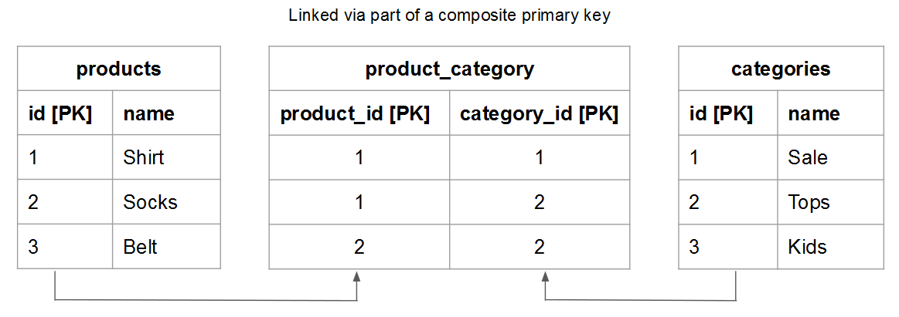

# 테이블 관계 이해 및 평가

주어진 두 테이블 간의 관계를 평가할 때 한 테이블에서 다른 테이블의 엔티티에 속할 수 있는 발생 횟수 또는 그 반대의 발생 횟수를 이해해야 합니다. 예를 들어, `users` 테이블 및 `orders` 테이블. 이 경우, 당신은 얼마나 많은 **주문 수** 특정 **사용자** 이(가) 을(를) 배치했으며 가능한 개수 **사용자** an **주문** 이(가)에 속할 수 있습니다.

데이터 무결성은 고객의 정확성에 영향을 주므로 관계를 이해하는 것이 중요합니다. [계산된 열](../data-warehouse-mgr/creating-calculated-columns.md) 및 [치수](../data-warehouse-mgr/manage-data-dimensions-metrics.md). 자세한 내용은 다음을 참조하십시오. [관계 유형](#types) 및 [Data Warehouse의 표를 평가하는 방법.](#eval)

## 관계 유형 {#types}

두 테이블 사이에 있을 수 있는 관계에는 세 가지 유형이 있습니다.

1. [&#39;일대일&#39;](#onetoone)
1. [일대다](#onetomany)
1. [다대다](#manytomany)

### `One-to-One` {#onetoone}

다음 기간 `one-to-one` 관계, 테이블의 레코드 `B` 는 테이블의 한 레코드에만 속합니다. `A`. 그리고 표의 레코드 `A` 는 테이블의 한 레코드에만 속합니다. `B`.

예를 들어, 사람과 운전면허번호 간의 관계에서 사람은 운전면허번호를 하나만 가질 수 있고 운전면허번호는 사람에게만 속한다.

### `One-to-Many` {#onetomany}

다음 기간 `one-to-many` 관계, 테이블의 레코드 `A` 테이블의 여러 레코드에 포함될 수 있음 `B`. 다음 사이의 관계에 대해 생각해 보십시오. `orders` 및 `items` - 주문에는 여러 항목이 포함될 수 있지만 한 항목은 단일 주문에 속합니다. 이 경우 `orders` 테이블은 한쪽이고 `items` 테이블이 여러 쪽입니다

### `Many-to-Many` {#manytomany}

다음 기간 `many-to-many` 관계, 테이블의 레코드 `B` 테이블의 여러 레코드에 포함될 수 있음 `A`. 그 반대도 마찬가지입니다. 테이블의 레코드 `A` 테이블의 여러 레코드에 포함될 수 있음 `B`.

다음 사이의 관계에 대해 생각해 보십시오. **products** 및 **카테고리**: 제품은 여러 범주에 속할 수 있으며 한 범주에 여러 제품이 포함될 수 있습니다.

## 테이블 평가 {#eval}

표 사이에 존재하는 관계 유형이 주어지면 Data Warehouse에서 표를 평가하는 방법을 배울 수 있습니다. 이러한 관계는 다중 테이블 계산 열이 정의되는 방식을 형성하므로 테이블 관계를 식별하는 방법과 어느 측면을 이해하는 것이 중요합니다. `one` 또는 `many` - 테이블이 속합니다.

Data Warehouse 내에 있는 주어진 테이블 쌍의 관계를 평가하는 데 사용할 수 있는 방법에는 두 가지가 있습니다. 첫 번째 방법은 [개념 체계](#concept) 즉, 테이블의 엔티티가 서로 상호 작용하는 방식을 고려합니다. 두 번째 메서드는 [테이블 스키마](#schema).

### 개념 프레임워크 사용 {#concept}

이 방법에서는 개념 프레임워크를 사용하여 두 테이블의 엔티티가 상호 작용하는 방법을 설명합니다. 이 틀은 관계를 고려할 때 무엇이 가능한지 평가한다는 것을 이해하는 것이 중요하다.

예를 들어, 사용자와 주문에 대해 생각할 때 관계에서 가능한 모든 것을 고려합니다. 등록된 사용자는 라이프타임 내에 주문을 하지 않거나 한 개의 주문만 또는 여러 개의 주문을 할 수 있습니다. 비즈니스를 시작하고 주문이 없는 경우 주어진 사용자가 생애에 많은 주문을 할 수 있습니다. 이를 위해 테이블이 만들어져 있다.

이 메서드를 사용하려면 다음을 수행하십시오.

1. 각 테이블에 설명되어 있는 엔티티를 식별합니다. **힌트: 일반적으로 명사입니다**. 예를 들어 `user` 및 `orders` 표는 사용자 및 주문을 명시적으로 설명합니다.

1. 이러한 엔티티가 상호 작용하는 방법을 설명하는 하나 이상의 동사를 식별합니다. 예를 들어 사용자를 주문과 비교할 때 사용자는 &quot;주문&quot;을 합니다. 다른 방향으로 이동하면, 주문이 사용자에게 &quot;속함&quot;입니다.

이 유형의 프레임워크는 Data Warehouse에 있는 모든 테이블 쌍에 적용할 수 있습니다. 이를 통해 관계의 유형과 어느 테이블이 한 면이고 어느 테이블이 여러 면인지 쉽게 식별할 수 있습니다.

두 테이블의 상호 작용 방식을 설명하는 용어를 식별한 후에는 첫 번째 엔티티의 특정 인스턴스가 두 번째 엔티티와 어떤 관계를 갖는지 고려하여 상호 작용을 양방향으로 프레임화합니다. 다음은 각 관계의 몇 가지 예입니다.

### `One-to-One`

주어진 한 사람이 단 하나의 운전면허증 번호만을 가질 수 있다. 주어진 운전면허증 번호 하나는 오직 한 사람의 것이다.

(이)는 `one-to-one` 각 테이블이 한 변인 관계.

### `One-to-Many`

주어진 한 주문에는 여러 항목이 포함될 수 있습니다. 주어진 항목 하나는 오더 하나에 속합니다.

(이)는 `one-to-many` orders 테이블이 한 쪽이고 items 테이블이 many 쪽인 관계입니다.

### `Many-to-Many`

주어진 한 가지 제품이 아마도 많은 범주에 속할 수 있다. 하나의 주어진 카테고리에 많은 제품이 포함될 수 있습니다.

(이)는 `many-to-many` 각 테이블이 여러 측면인 관계.

### 테이블의 스키마 사용 {#schema}

두 번째 메서드는 테이블 스키마를 사용합니다. 스키마는 열 정의 [`Primary`](https://en.wikipedia.org/wiki/Unique_key) 및 [`Foreign`](https://en.wikipedia.org/wiki/Foreign_key) 키. 이러한 키를 사용하여 테이블을 서로 연결하고 관계 유형을 결정할 수 있습니다.

두 테이블을 함께 연결하는 열을 식별하면 열 유형을 사용하여 테이블 관계를 평가합니다. 다음은 몇 가지 예입니다.

### `One-to-one`

테이블이 다음을 사용하여 연결된 경우 `primary key` 두 테이블 모두에서 동일한 고유 엔티티가 각 테이블에 설명되고 관계는 다음과 같습니다 `one-to-one`.

예: `users` 테이블은 보충 자료 동안 대부분의 사용자 속성(예: 이름)을 캡처할 수 있습니다. `user_source` 테이블은 사용자 등록 소스를 캡처합니다. 각 테이블에서 행은 한 명의 사용자를 나타냅니다.

### `One-to-many`

>[!NOTE]
>
>손님 주문도 받으시나요? 다음을 참조하십시오 [게스트 주문](../data-warehouse-mgr/guest-orders.md) 게스트 주문이 테이블 관계에 미치는 영향을 알아봅니다.

표를 사용하여 연결하는 경우 `Foreign key` 을(를) 가리키기 `primary key`, 이 설정에서는 `one-to-many` 관계. 한쪽은 가 포함된 테이블입니다. `primary key` 그리고 많은 면은 `foreign key`.

### `Many-to-many`

다음 중 하나가 참이면 관계는 다음과 같습니다. `many-to-many`:

* `Non-primary key` 열은 두 테이블을 연결하는 데 사용됩니다.
  
* 복합 부품 `primary key` 는 두 테이블을 연결하는 데 사용됩니다.

## 다음 단계

테이블 관계를 올바르게 평가하는 것은 데이터를 정확하게 모델링하는 데 중요합니다. 표가 서로 어떻게 연관되어 있는지 이해했으므로 [Data Warehouse 관리자로 수행할 수 있는 작업](../data-warehouse-mgr/tour-dwm.md).
