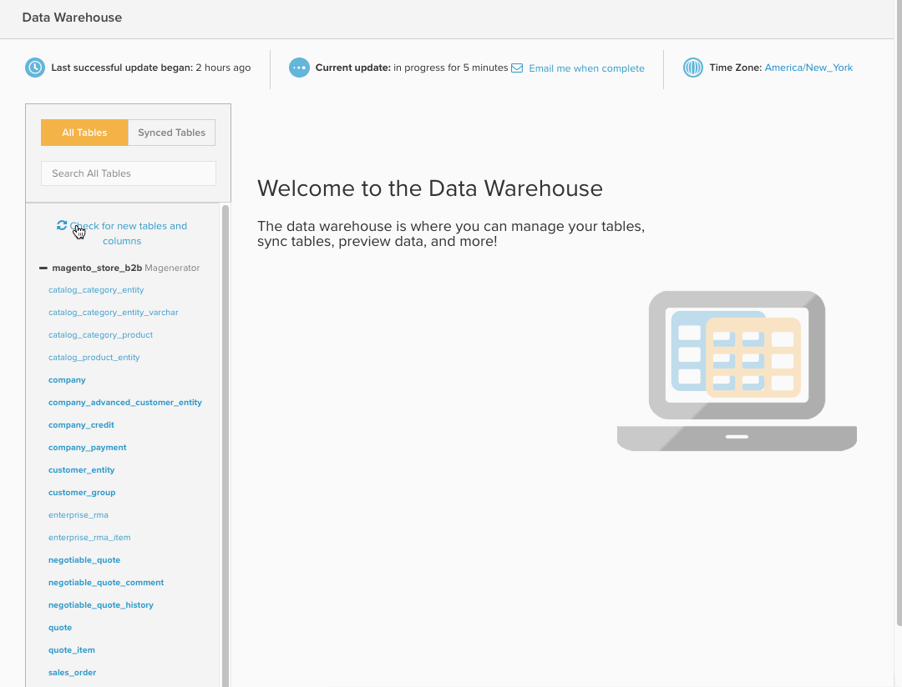

# Data Warehouse Manager

>[!NOTE]
>
>[관리자 권한 필요](../../administrator/user-management/user-management.md)

**[!UICONTROL Manage Data > Data Warehouse]**&#x200B;을(를) 클릭하여 액세스하는 Data Warehouse 관리자는 [!DNL Adobe Commerce Intelligence] Data Warehouse의 포털입니다. Data Warehouse 관리자를 사용하여 테이블 및 열 동기화 설정을 관리하고, 테이블의 스키마를 드릴다운하며, 보고서에 사용할 계산된 열을 만들 수 있습니다.

이 주제에서는 다음 주제를 다룹니다.

* [학습 방법](#learning)
* [표 및 열 동기화](#syncing)
* [계산된 열 만들기](#calculated)
* [테이블 삭제 및 열 제거](#delete)
* [백그라운드에서 새 테이블 동기화 중](#syncnew)
* [그러면 새 열은 언제 사용할 수 있습니까?](#when)

## 학습 방법 {#learning}

`Data Warehouse Manager` 페이지의 왼쪽에 표 목록이 포함되어 있으므로 표 간에 쉽게 전환할 수 있습니다. 목록에서 테이블을 선택하면 테이블 관리 영역이 선택된 테이블을 수정할 수 있는 테이블의 스키마로 채워집니다.

테이블 목록 내에서 테이블은 연결 소스별로 그룹화됩니다. 이러한 소스는 [!UICONTROL Manage Data > Integrations] 아래에 추가되며 데이터베이스, [API](https://developer.adobe.com/commerce/services/reporting/) 또는 서드파티 커넥터일 수 있습니다. 테이블 목록 맨 위에는 원하는 테이블을 쉽게 찾을 수 있는 검색 상자가 있습니다.

검색 상자 아래에 `All Tables`과(와) `Synced Tables` 두 가지 옵션이 표시됩니다. `All Tables` 옵션은 Data Warehouse에서 사용할 수 있도록 설정한 모든 테이블을 나열하며 여기에는 동기화된 테이블과 동기화되지 않은 테이블이 모두 포함됩니다.

`Synced Tables` 옵션은 Data Warehouse에 이미 추가되었으며 선택한 열에서 데이터를 복제하고 있는 모든 테이블을 표시합니다.

`All Tables` 목록에 원하는 테이블이 표시되지 않습니까? 다음과 같은 몇 가지 가능한 이유가 있습니다.

* 데이터 소스가 아직 추가되지 않았습니다.
* 데이터 원본은 데이터베이스이며 만든 [!DNL Commerce Intelligence] 사용자에게 액세스 권한이 없습니다. 이 경우 사용자 또는 데이터베이스 관리자가 액세스 권한을 부여해야 합니다.
* 데이터 소스 또는 테이블이 최근에 추가되었으며 아직 동기화되지 않았습니다

## 표 및 열 동기화 {#syncing}

### 새 테이블 및 기본 열 동기화

Data Warehouse Manager는 데이터 소스를 쉽게 보고 관리할 수 있을 뿐만 아니라, 동기화할 개별 테이블 및 열을 자유롭게 선택할 수 있습니다.

1. `All Tables` 옵션을 클릭하고 동기화할 테이블을 찾습니다.
1. 스키마를 미리 보려면 테이블 이름을 클릭합니다. 새 테이블인 경우 모든 열이 `Unsynced`(으)로 표시됩니다.
1. 동기화할 열을 확인합니다.

   >[!NOTE]
   >
   >테이블에 고유한 열은 `Location` 열에 From Your Database가 있습니다.

1. `Primary Key`개의 열을 확인하세요. 이러한 열에는 열 이름 옆에 키 기호가 있습니다. 데이터를 Data Warehouse에 올바르게 동기화하려면 `Primary Key`이(가) 필요합니다.

   데이터베이스에서 직접 가져온 테이블을 동기화하는 경우 `Primary Keys`이(가) 표시되지 않을 수 있습니다. 이 경우 데이터베이스 관리자에게 문의하여 기본 키를 테이블에 추가하도록 요청하십시오.
1. 완료되면  단추를 클릭합니다.

*성공!* 메시지가 표시되고 선택한 열에 대해 상태가 `Pending`(으)로 변경됩니다. 다음 전체 업데이트가 완료되면 새로 동기화된 테이블 및 열을 보고서에서 사용할 수 있습니다. 초기 동기화 후에 새 [복제 메서드](./cfg-replication-methods.md)를 설정할 수도 있습니다.

전체 프로세스를 간략하게 살펴보겠습니다.

### 백그라운드에서 새 테이블 동기화 중 {#syncnew}

대형 테이블을 처음 동기화하는 경우 Data Warehouse은 지속적으로 새 데이터를 캡처하기 전에 테이블의 모든 데이터 포인트를 소급하여 캡처해야 합니다. 테이블이 큰 경우 **업데이트 주기**&#x200B;와(과) 순서대로 초기 동기화를 실행하지 않는 것이 좋습니다. 이 경우 현재 실행 중인 업데이트와 함께 *병렬*&#x200B;에서 초기 동기화가 백그라운드에서 일어나도록 할 수 있습니다.

이렇게 하려면 해당 테이블을 처음으로 동기화하는 `Save and Sync Data Immediately` 옵션을 선택해야 합니다.

### 새 테이블 및 열 확인 {#forceupdate}

Data Warehouse은 추가되는 즉시 새 소스, 테이블 또는 열을 자동으로 감지하지 않습니다. 동기화 프로세스는 주 내내 실행되어 새로운 추가 사항을 찾아 사용할 수 있지만, 프로세스가 실행되기 전에 새로 추가된 테이블 및 열에 액세스하려는 경우 구조를 강제로 동기화할 수 있습니다.

표 목록의 검색 창 아래에는 `Check for new tables and columns` 링크가 있습니다. 이 링크를 클릭하면 구조 동기화 프로세스가 강제로 시작됩니다. 일반적으로 10분 후에 새 추가 기능을 사용할 수 있습니다. 페이지를 새로 고쳐 새 소스, 테이블 또는 열을 확인합니다.

## 계산된 열 만들기 {#calculated}

모든 소스에서 데이터를 보고 관리할 수 있다는 것만으로도 비즈니스에 대한 통찰력을 훨씬 쉽게 얻을 수 있습니다. 그러나 Data Warehouse Manager 내에서는 테이블 내에 계산된 열을 만들어 한 단계 더 나아갈 수 있습니다. `Calculated` 열은 기존 데이터에서 새 정보를 가져옵니다.

`user's lifetime revenue` 테이블에 `users`을(를) 추가하여 고부가가치 사용자를 찾는다고 가정합니다. 또는 성별에 따라 매출을 분할하려는 경우 `customer's gender` 표에 `orders`을(를) 추가할 수 있습니다.

자세한 내용은 이 [자습서](../../data-analyst/data-warehouse-mgr/creating-calculated-columns.md)를 참조하세요.

## 테이블 삭제 및 열 제거 {#delete}

Data Warehouse에 동기화할 테이블 및 열을 선택할 수 있는 것처럼 삭제하거나 제거할 수도 있습니다.

>[!NOTE]
>
>테이블을 삭제하거나 열을 제거하면 삭제를 확인하면 모든 종속 보고서, 지표, 필터 세트 및 열이 삭제됩니다. 이 작업을 수행할지 확인하십시오. **이 작업은 취소할 수 없습니다.**

실수로 **[!UICONTROL Delete]**&#x200B;을(를) 클릭해도 걱정하지 마십시오. 종속성 확인은 삭제되기 전에 실행되므로 확인하기 전에 모든 항목을 검토할 수 있습니다.

열을 제거하려면 열이 속한 표를 클릭합니다. 제거할 열을 확인하고  단추를 클릭합니다.

동기화된 테이블을 제거하려면 테이블에서 모든 열을 선택하고  단추를 다시 클릭합니다. 이렇게 하면 Data Warehouse에서 이 테이블을 사용하는 모든 기본 열과 계산된 열이 제거됩니다.

### 변경 사항 확인

테이블을 삭제하든 열을 제거하든 상관 관계 검사는 삭제 프로세스가 완료되기 전에 실행됩니다. 종속성은 제거되는 테이블 또는 열을 사용하는 계산된 열, 지표, 필터 세트 및 보고서입니다. 검색된 모든 종속성이 표시됩니다. 이 시점에서 프로세스를 취소하거나 **[!UICONTROL Confirm Changes]**&#x200B;을(를) 클릭하여 테이블을 삭제하거나 열을 제거할 수 있습니다.

삭제된 종속성은 복원할 수 없지만 나중에 네이티브 열을 다시 동기화해야 하는 경우 테이블과 열을 계속 사용할 수 있습니다.

다음은 열 제거에 대한 간략한 보기입니다.

## 그러면 새 열은 언제 사용할 수 있습니까? {#when}

새 동기화된 열과 새/업데이트된 계산된 열은 다음 전체 업데이트가 완료된 후에 사용할 수 있도록 준비됩니다. 업데이트가 아직 진행되지 않은 경우 **[!UICONTROL Force update]** 또는 `Data Warehouse` 페이지의 맨 위에 표시된 `Integrations`을(를) 클릭하여 강제로 업데이트할 수 있습니다. 업데이트가 완료되면 **[!UICONTROL Email me when complete]**&#x200B;을(를) 클릭하여 전자 메일 알림을 예약할 수도 있습니다.

보고서에서 새 열을 사용할 준비가 되면 [먼저 지표에 열을 추가해야](../data-warehouse-mgr/manage-data-dimensions-metrics.md). 업데이트가 완료될 때까지 데이터를 사용할 수 없지만 보고서에서는 새 열을 사용할 수 있습니다. 보고서 내의 데이터는 업데이트가 완료되면 표시됩니다.

## 요약

이 기사는 많은 자료를 다루었다. 이제 데이터베이스의 정의, 데이터 구성 방법, 표의 상호 관계 및 Data Warehouse Manager로 수행할 수 있는 작업에 대해 깊이 있게 이해해야 합니다.

[계산된 열을 만들기](../data-warehouse-mgr/creating-calculated-columns.md) 또는 [관심 있는 보고서를 만들기](../../tutorials/using-visual-report-builder.md)로 지식을 테스트해 보세요.
