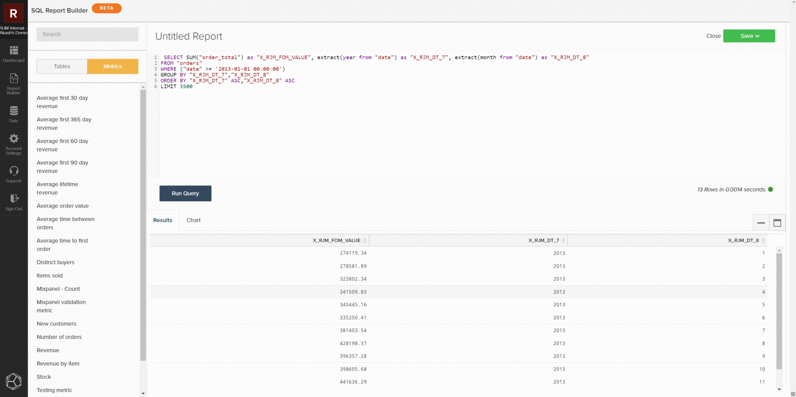

# [!DNL SQL Report Builder]

[!DNL SQL Report Builder]은(는) 주로 새 보고서를 작성하고 분석을 반복하는 데 사용되지만 데이터 및 지표를 효과적으로 감사하는 데에도 사용할 수 있습니다. 다음 정보는 결과를 로컬 데이터베이스의 데이터와 비교할 수 있도록 [!DNL SQL Report Builder]을(를) 사용하여 데이터 및 지표를 감사하는 방법을 설명합니다.

## 지표 쿼리

시작하려면 [!DNL SQL Report Builder]&#x200B;(으)로 이동하여 **[!UICONTROL Report Builder > SQL Report Builder > Create Report]**&#x200B;을(를) 엽니다. [!DNL SQL] 편집기의 사이드바를 사용하여 지표 위로 마우스를 이동하고 **[!UICONTROL Insert]**&#x200B;을(를) 클릭하여 지표를 쿼리에 직접 삽입할 수 있습니다. 이렇게 하면 해당 지표의 쿼리 정의가 편집기에 추가됩니다. 정의에는 다음 구성 요소가 포함됩니다.

- 수행 중인 **지표 작업**&#x200B;은(는) 아래 예에서 `SUM()`(으)로 표시됩니다.
- 지표가 빌드된 **table on**&#x200B;은(는) `FROM` 절로 표시됩니다.
- 지표에 추가된 모든 **필터(및 필터 집합)**(아래 예에서 `WHERE` 절로 표시됨).
- 데이터를 정렬할 **timestamp**(연도, 월)의 구성 요소이며 아래 예제에서는 `ORDER BY` 절이 표시되어 있습니다.

쿼리를 더 명확하게 보려면 쿼리 필드에 쿼리가 표시되는 방식을 다시 지정할 수 있습니다. 준비가 되면 `Run Query`을(를) 선택합니다. 결과는 쿼리 아래의 보고서 패널에 표로 채워집니다.

## 쿼리 제한

특정 불일치나 데이터 세트를 찾아내려면 쿼리를 특정 샘플로 제한하여 로컬 데이터베이스를 확인해야 합니다. 원하는 제한 사항과 일치하도록 쿼리를 편집하여 이 작업을 수행할 수 있습니다. 다음 예제에서는 2013년 1월 1일 이후의 매출만 포함하도록 쿼리를 제한합니다. 쿼리를 업데이트한 후 **[!UICONTROL Run Query]**&#x200B;을(를) 다시 선택하여 결과를 업데이트합니다.

## 저장 및 내보내기

보고서의 요구 사항이 충족되면 보고서에 고유한 이름을 지정하고 **[!UICONTROL Save]**&#x200B;을(를) 클릭한 다음 저장할 보고서 유형과 대시보드를 선택하십시오. 지표를 감사할 때 Adobe에서는 보고서를 `Table`(으)로 저장하여 테스트 대시보드에 저장하는 것이 좋습니다.

보고서가 저장되면 `Go to Dashboard`을(를) 선택하여 해당 대시보드로 이동합니다. 여기에서 보고서를 찾아 **[!UICONTROL Options gear > Full `.csv`내보내기]** 또는 **[!UICONTROL Full Excel Export]**&#x200B;를 선택하여 데이터를 내보낼 수 있습니다.

## 사용자 정의 쿼리

사용자 지정 쿼리를 작성하고 결과를 내보내 로컬 데이터베이스와 비교할 수도 있습니다. [쿼리 최적화에 대한 지침](../../best-practices/optimizing-your-sql-queries.md)에 따라 SQL 편집기에서 쿼리를 작성하십시오. 사이드바 상단의 단추를 사용하여 [!DNL SQL Report Builder]에서 사용할 수 있는 테이블 및 지표 목록 사이를 전환하고 쿼리에 추가할 수 있습니다. 사용자 지정 쿼리가 요구 사항에 맞으면 보고서를 저장하고 대시보드에서 해당 데이터를 내보낼 수 있습니다.

>[!NOTE]
>
>데이터를 감사한 후 불일치가 발견되면 [지원 센터에 문의: 데이터 불일치](https://experienceleague.adobe.com/docs/commerce-knowledge-base/kb/troubleshooting/miscellaneous/mbi-data-discrepancies.html) 지원 항목에서 다음에 수행할 작업에 대한 자세한 내용을 확인하십시오.
