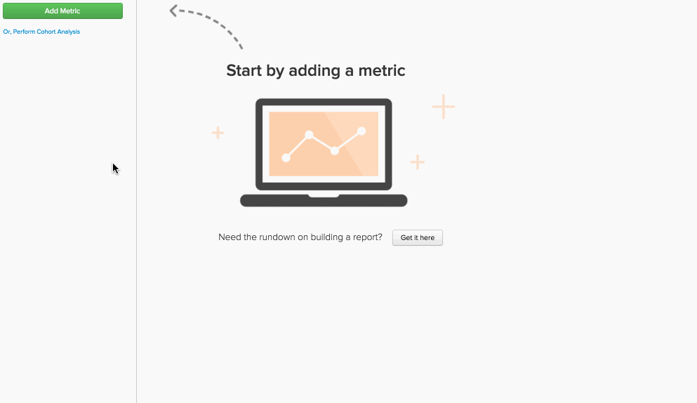

# `Qualitative Cohort Analysis` 만들기

[!DNL Google Adwords]에서 획득한 고객 세그먼트가 유기 검색에서 획득한 고객과 비교하여 LTV가 어떻게 증가하는지 알고 계십니까? 동일한 보고서에서 서로 다른 고객 세그먼트에 대해 나란히 `cohort` 분석을 수행해 본 적이 있습니까? 이 경우 `qualitative cohort analysis`을(를) 통해 이러한 질문에 답변할 수 있습니다.

이 항목에서는 질적 집단에 대한 설명, 이 분석을 빌드하는 데 관심이 있는 이유 및 [!DNL Commerce Intelligence]에서 만드는 방법에 대해 설명합니다.

## `qualitative cohorts`은(는) 무엇입니까? {#whatare}

일반적으로 `Cohort` 분석은 수명 주기 동안 유사한 특성을 공유하는 사용자 그룹의 분석으로 정의할 수 있습니다. 이를 통해 다양한 사용자 그룹 간 행동 트렌드를 식별할 수 있습니다.

대부분의 `cohort`은(는) 공통의 날짜(예: 주어진 달에 첫 번째 구매한 모든 고객 집합)별로 [!DNL Commerce Intelligence] 그룹 사용자를 함께 분석합니다. `qualitative cohort`은(는) 약간 다릅니다. 시간 기반이 아닌 특성으로 정의된 사용자 그룹입니다. 예를 들면 다음과 같습니다.

* 광고 캠페인에서 획득한 모든 사용자 세트
* 첫 구매에 쿠폰이 포함된(또는 포함되지 않은) 모든 사용자 세트
* 특정 연령의 모든 사용자 집합

## 일반 `cohort` 빌더와 어떻게 다릅니까? {#different}

[`Cohort Analysis Builder`](../dev-reports/cohort-rpt-bldr.md)은(는) 시간 기반 특성을 사용하여 집단을 그룹화하는 데 최적화되었습니다. 이 기능은 사용자의 특정 세그먼트(예: 유료 검색 캠페인을 통해 획득한 모든 사용자)에 중점을 둔 분석에 유용합니다. `Cohort Analysis Builder`에서는 (1) 특정 사용자 그룹에 초점을 맞추고 (2) 첫 번째 주문 날짜와 같은 날짜에 `cohort`을(를) 지정할 수 있습니다.

그러나 동일한 집단 보고서에서 여러 사용자 세그먼트의 집단 동작을 분석하려는 경우(`paid` 검색 대 `organic` 검색 대 직접 트래픽, 아마도?) `Report Builder`에서 이 고급 분석을 생성할 수 있습니다.

## 분석을 설정하기 위해 지원팀에 어떤 정보를 보내야 합니까? {#support}

`qualitative cohort`에서 `Report Builder` 보고서를 만들면 Adobe 분석 팀이 필요한 표에 [고급 계산 열](../data-warehouse-mgr/creating-calculated-columns.md)을 만드는 작업이 포함됩니다.

이를 만들려면 [지원 티켓](https://experienceleague.adobe.com/docs/commerce-knowledge-base/kb/troubleshooting/miscellaneous/mbi-service-policies.html)을 제출하세요(이 문서 참조!). 다음은 알고 있어야 하는 사항입니다.

* 집단 분석을 수행할 `metric`과(와) 이 분석에서 사용하는 테이블(예: `Revenue` 테이블에 빌드된 `orders`)입니다.

* 정의할 `user segments`과(와) 해당 정보가 데이터베이스에 있는 위치(예: `User's referral source` 테이블에 고유하고 `users`(으)로 재배치된 `orders`의 다른 값).

* 분석에 사용할 `cohort date`(예: `User's first order date` 타임스탬프)입니다. 이 예제를 통해 각 세그먼트를 보고 `How does a user's revenue grow in the months following their first order date?`에게 질문할 수 있습니다.

* 분석을 보려는 `time interval`(예: `weeks` 이후 `months`, `quarters` 또는 `User's first order date`).

Adobe 분석가 팀이 위의 내용에 응답하면 보고서를 작성할 새로운 고급 계산 열 두 개가 있습니다. 그러면 아래의 지시 사항을 따라 하시면 됩니다.

## 질적 집단 분석 만들기 {#create}

먼저 분석 중인 각 `cohort`에 대해 한 번씩 코호트하려는 지표를 추가합니다. 이 예에서는 고객의 첫 주문 후 몇 개월 동안 `Revenue`(으)로 세그먼트화된 누적 `User's referral source`을(를) 봅니다. 즉, 각 세그먼트에 대해 특정 세그먼트에 대해 하나의 `Revenue` 지표와 필터를 추가합니다.

둘째, 보고서의 시간 옵션을 두 가지 변경해야 합니다.

1. `time interval`을(를) `None`(으)로 설정합니다. 이는 일반적인 시간 옵션을 사용하는 대신 시간 간격을 기준으로 차원을 그룹화하기 때문입니다.

1. `time range`을(를) 보고서에 적용할 시간으로 설정하십시오.

이 예제에서는 `all time`의 `Revenue` 보기를 확인합니다. 그런 다음 일련의 점으로 끝나야 합니다.

셋째, `cohorts`을(를) 설정하도록 조정합니다. Adobe 분석 팀에 지정한 `cohort date` 및 `time interval`을(를) 기반으로, 계정에 `cohort` 데이트를 수행하는 차원이 있습니다. 이 예제에서는 사용자 지정 차원을 `Months between this order and customer's first order date`이라고 합니다. 이 차원을 사용하면 다음 작업을 수행할 수 있습니다.

* `Group by` 옵션이 있는 차원 `group by`

* 관심 있는 `dimension`의 값을 모두 선택하십시오.

* `Show top/bottom option`을(를) 사용하여 관심있는 상위 X개월을 선택하고 `Months between this order and customer's first order date` 차원별로 정렬합니다

이제 지정한 각 `cohort`에 대해 한 줄씩 볼 수 있습니다. 이제 예제를 확인해 보십시오. 각 조회 소스의 사용자가 제공한 `Revenue`, 첫 번째 주문과 이후 주문 사이의 개월 수를 `grouped by`합니다. `Cumulative perspective` 집계 증가를 보기 위해 `cohorts'`도 추가했습니다. 자세한 내용은 결과 테이블을 참조하십시오.

이것이 우리에게 무엇을 말해주나요? 여기서 특정 추천 소스 `Paid search`은(는) 고객의 구매 수명 첫 달에 유용하지만, 반복 매출로 고객 기반을 유지하지 못합니다. `Direct Traffic`이(가) 낮은 금액으로 시작하는 동안 이후 달의 매출은 실제로 비슷한 속도로 누적됩니다.

`cohort` 분석은 분석 도구 상자의 강력한 도구입니다. 이러한 유형의 분석을 통해 기존 `time-based cohorts`에서는 얻을 수 없었던 비즈니스에 대한 흥미로운 통찰력을 얻을 수 있으므로 더 나은 데이터 기반 결정을 내릴 수 있습니다.
