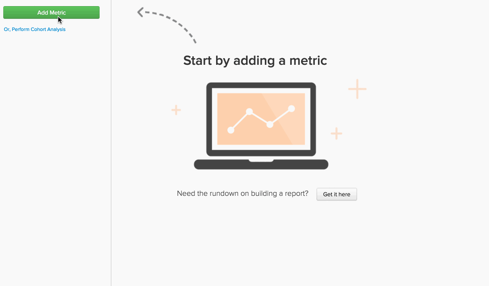

# `Report Builder`의 공식

[`Report Builder`](../../tutorials/using-visual-report-builder.md)에서는 계정의 [정의된 지표](../../data-user/reports/ess-manage-data-metrics.md)를 사용하여 강력한 시각화를 만들 수 있습니다. 이러한 지표를 수식에 결합하면 데이터에서 추가적인 통찰력을 얻을 수 있습니다. 이 항목에서는 `Report Builder`에서 수식을 사용하는 방법을 자세히 설명합니다. 바로 시작할 수 있습니다.

## `formula`이란? {#what}

`Report Builder`에서 `formula`은(는) 일부 수학 논리를 기반으로 한 하나 이상의 지표의 조합입니다. 일반적인 예는 다음과 같습니다.

이 예제에서는 `Number of orders metric (A)`과(와) `Distinct buyers metric (B)`을(를) 사용하며 목표는 구매자가 매달 주문하는 평균 주문 수가 얼마냐는 질문에 답하는 것입니다. 공식의 매개 변수는 다음과 같습니다.

* `Definition`: 여기에서 입력 지표에 계산을 적용합니다. 이 예에서 주문의 수를 개별 구매자의 수로 나누면 평균 주문 수를 알 수 있습니다. 따라서 정의는 (A/B)입니다.

* `Format`: 수식이 숫자, 기간 또는 통화 금액을 반환하고 있습니까? 공식의 정의 옆에는 반환의 형식을 지정하는 데 사용할 수 있는 드롭다운이 있습니다. 이 경우 숫자입니다.

* `Miscellaneous`: 수식의 타임스탬프, 그룹화, 관점 및 필터가 모두 해당 입력 지표에 상속됩니다. 여기에는 할 일이 없습니다!

## 보고서에서 `formulas`을(를) 사용하려면 어떻게 해야 합니까? {#how}

이제 기본 사항을 다루었으니 몇 가지 예를 살펴보십시오.

### 예: 첫 번째 주문으로 인한 매출의 몇 퍼센트를 확인하려고 합니다.

이 예제에서는 `Revenue` 및 `Revenue (first time orders)` 지표를 사용했습니다. `Revenue (first time orders)(B)` 지표를 `Revenue metric (A)`(으)로 나누고 반환 형식을 `Percent`(으)로 설정하면 첫 번째 주문으로 인한 매출 비율을 찾을 수 있습니다.

### 예: `promo code`을(를) 제공하고 제공하지 않을 때의 주문당 평균 매출액을 알고 싶습니다.

이 예제에서는 `Revenue` 및 `Number of orders` 지표를 사용했습니다. 이 질문에 대한 답변에는 `Revenue (A)`을(를) `Number of orders (B)`(으)로 나누고 반환 형식을 `Currency`(으)로 설정하는 두 단계가 포함됩니다. 그런 다음 수식 결과(`Avg. Revenue per order`)만 표시하도록 허용하고 결과를 `Promo code`(으)로 그룹화했습니다.

### 예: 새 고객의 UTM 소스 분포를 알고 싶습니다.

이 질문에 대한 답을 찾는 데는 다음 몇 가지 단계가 포함됩니다.

1. 먼저 `New Customers` 지표를 추가한 다음 `utm_source - all`(으)로 그룹화했습니다. `A` 또는 `New Customers (grouped)` 지표입니다.

1. 그런 다음 `New Customers (grouped)` 지표를 복제하고 독립 차원을 사용하도록 설정합니다. 지표 `B` - `New customers (ungrouped)` - 새 고객의 총 수를 표시합니다.

1. 두 지표를 모두 숨긴 후 수식 정의를 `A/B`(으)로 설정합니다. `New customers (grouped)`을(를) `New Customers (ungrouped)`(으)로 나눕니다.

1. 그런 다음 결과 형식을 `Percent`(으)로 설정합니다.

이 예제에서는 `Stacked Columns` 관점을 사용하여 월별 결과를 표시했습니다. 이를 통해 신규 고객의 분포를 월별로 비교할 수 있다.

## 요약 {#wrapup}

위의 예에서 수식의 `timestamp`, `groupings`, `perspectives` 및 `filters`이(가) 해당 입력 지표에서 상속됨을 알았습니까? 지표가 사용할 수 있는 것처럼 수식을 사용하여 `perspectives` 및 [독립적인 시간 옵션](../../tutorials/time-options-visual-rpt-bldr.md){: target="_blank"}을 사용할 수 있습니다.

`Report Builder`에서 수식 사용에 대한 추가 질문이 있는 경우 [지원팀에 문의](https://experienceleague.adobe.com/docs/commerce-knowledge-base/kb/troubleshooting/miscellaneous/mbi-service-policies.html)하세요.
