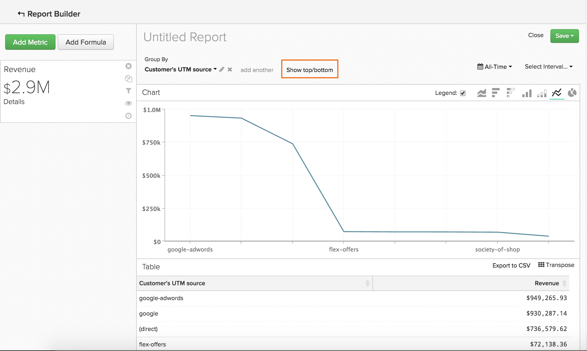

# 데이터 순서 지정 `Show Top/Bottom` 기능

다음에서 더 많은 작업을 수행할 수 있습니다. `Visual Report Builder` 시간에 따른 트렌드를 분석하는 데 사용됩니다. 예를 들어, 획득 및 마케팅 채널의 가치를 보여주는 보고서를 작성할 수 있지만, 상위 5명의 성과자만 표시하는 보고서를 작성할 수도 있습니다. 마찬가지로, 가장 많은 매출을 창출하는 상태를 보여 주는 보고서를 만들어 마케팅 활동에 다시 집중할 수 있습니다.

이러한 종류의 데이터 정렬 및 정렬은 두 가지를 모두 사용하는 보고서에서 수행할 수 있습니다. `Group By` 및 a `Time Interval of None`. 이 두 요소가 모두 보고서에 있으면 `Show Top/Bottom` 차트 미리 보기 위에 기능이 표시됩니다. 이 기능을 사용하면 설정한 매개 변수를 기반으로 하여 위쪽(가장 높은 것에서 가장 낮은 것)과 아래쪽(가장 낮은 것에서 가장 높은 것)의 데이터 포인트를 볼 수 있습니다.

## 어떻게 사용해야 합니까? {#how}

을(를) 클릭한 후 **[!UICONTROL Show Top/Bottom link]**&#x200B;을 입력하면 표시 및 정렬 매개 변수를 설정할 수 있는 창이 표시됩니다. 텍스트 상자의 숫자는 정수일 수 있습니다(예: `5`) 또는 `ALL`. 다음으로, 지표 또는 그룹별로 보고서를 정렬하도록 선택할 수 있습니다.

예를 들어, 가장 많은 매출을 가져온 5개의 조회 소스를 표시하려면 다음과 같이 합니다.

1. 추가 `Revenue` 지표를 보고서에 추가합니다.

1. 추가 `Group By` 참조 소스로 지표를 세그먼트화합니다.

1. 설정 `Time Interval` 끝 `None`.

1. 다음에서 `Show Top/Bottom` 설정, 디스플레이 설정 `5` 따라서 상위 5개의 총 수익 금액이 있는 추천 소스만 보고서에 포함됩니다.

>[!NOTE]
>
>보고서에 `Time Interval`, 값(이 경우 상위 5개 참조 소스)은 시간이 지남에 따라 변경될 수 있습니다. 매출 측면에서 한 조회 출처가 다른 조회 출처를 능가하는 경우 출처의 표시 순서가 변경됩니다.

## 여러 지표를 사용하는 것은 어떻습니까? {#multiplemetrics}

각 지표는 자체 또는 그룹화 중 하나로만 정렬할 수 있으므로 보고서에 둘 이상의 지표가 있을 때 이 기능을 사용하는 것은 복잡해집니다.

다음 두 가지를 모두 사용하여 보고서를 작성했다고 가정합니다. `Revenue` 및 `Number of orders` 지표, 참조 소스별로 그룹화됨. `Revenue` 은(는) 다음 기준으로만 정렬할 수 있습니다. `Revenue` 또는 참조 소스 및 `Number of orders` 은(는) 다음 기준으로만 정렬할 수 있습니다. `Number of orders` 또는 참조 소스입니다.

즉, 다음을 표시할 수 있습니다. `Revenue` 맨 위에서만 `5` 수익 생성 조회 출처, 최상위 주문 수도 표시할 수 없습니다. `5` 수익을 창출하는 레퍼러 소스. 간단히 말해, 여러 지표가 있을 때 가장 좋은 방법은 그룹화별로 각 지표를 정렬하는 것입니다.

다음은 를 정렬한 차트의 예입니다. `Revenue` 지표를 그룹화하지 않고 단독으로 표시합니다. 보시다시피 그룹별로 지표를 정렬하지 않으면 이상한 (그리고 궁극적으로 도움이 되지 않는) 보고서가 작성되었습니다.

그룹별로 두 지표를 모두 정렬한 경우 차트는 다음과 같습니다.

## 기본적으로 값은 어떻게 정렬됩니까? {#defaultsorting}

지표가 한 개만 포함된 경우 `Group by` 및 a `Time Interval` / `None`, 의 기본 순서 `Visual Report Builder` 지표를 기반으로 최상위 값을 표시합니다. 이 인스턴스에서는 `Show Top/Bottom` 이 기능이 사용자의 요구에 부합하면 필요하지 않을 수 있습니다.

이 예에서는 sales rep 가 마감한 opportunity 를 살펴봅니다. 이 테이블은 이 경우 지표를 기반으로 최상위 항목에서 최하위 항목까지 자동으로 정렬됩니다. `Won Opportunities`.

그러나 두 번째 지표가 추가되면 기본적으로 그룹화를 기준으로 맨 위 순서를 지정합니다. 지표와 그룹화가 추가되면 기본 정렬은 첫 번째 그룹화, 두 번째 그룹화 등을 기반으로 합니다.

## 요약 {#wrapup}

몇 가지 기본 기능이 여기에 설명되어 있지만 이 기능에는 흥미로운 용도가 많이 있습니다.

이전 영업 담당자와 영업 기회 사례를 생각해 보십시오. 제거 `Time Interval`, 적용 `Group By`, 그리고 그룹화에 따라 데이터를 정렬하면 각 담당자의 성공 기회 수에 대한 세부 정보를 얻을 수 있습니다. 또한 `Show Top/Bottom` 기능 을 통해 최고의 연기자가 누구인지 알아볼 수 있습니다.
