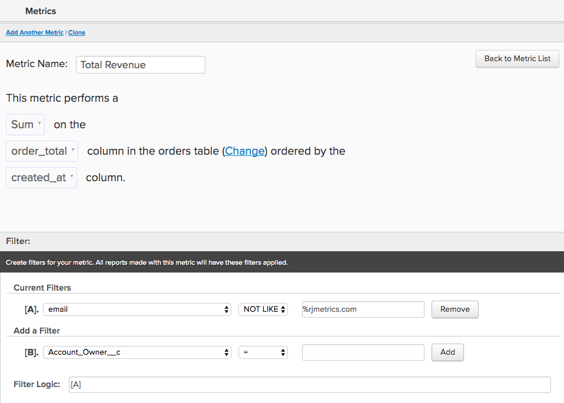

# MBI에서 SQL 쿼리 번역

SQL 쿼리가 [계산된 열](../data-warehouse-mgr/creating-calculated-columns.md), [지표](../../data-user/reports/ess-manage-data-metrics.md), 및 [보고서](../../tutorials/using-visual-report-builder.md) 에서 를 사용합니다. [!DNL MBI]? SQL 사용자가 많은 경우 SQL이 변환되는 방법을 이해합니다. [!DNL MBI] 당신은 더 똑똑하게 [Data Warehouse 관리자](../data-warehouse-mgr/tour-dwm.md) 그리고 최대한 [!DNL MBI] 플랫폼.

이 문서의 끝에 **번역 매트릭스** SQL 쿼리 절 및 [!DNL MBI] 요소를 생성하지 않습니다.

먼저 일반적인 쿼리를 봅니다.

|  |  |
|--- |--- |
| `SELECT` |  |
| `a,` | 보고서 `group by` |
| `SUM(b)` | `Aggregate function` (열) |
| `FROM c` | `Source` 표 |
| `WHERE` |  |
| `d IS NOT NULL` | `Filter` |
| `AND time < X`   `AND time >= Y` | 보고서 `time frame` |
| `GROUP BY a` | 보고서 `group by` |

이 예는 대부분의 번역 사례를 다루지만 몇 가지 예외가 있습니다. 먼저, `aggregate` 함수가 번역됩니다.

## 집계 함수

집계 함수(예: `count`, `sum`, `average`, `max`, `min`)를 쿼리 문자열에서 **지표 집계** 또는 **열 합계** in [!DNL MBI]. 차별화 요소는 합계를 수행하는 데 조인이 필요한지 여부입니다.

위의 각 예를 살펴보겠습니다.

## 지표 합계 {#aggregate}

집계할 때는 지표가 필요합니다 `within a single table`. 예를 들어, `SUM(b)` 위의 쿼리의 집계 함수는 열을 합계하는 지표로 표시될 수 있습니다 `B`. 

다음의 특정 예를 살펴보겠습니다. `Total Revenue` 지표는 [!DNL MBI]. 아래 쿼리를 보고 번역해 보겠습니다.

|  |  |
|--- |--- |
| `SELECT` |  |
| `SUM(order_total) as "Total Revenue"` | `Metric operation` (열) |
| `FROM orders` | `Metric source` 표 |
| `WHERE` |  |
| `email NOT LIKE '%@magento.com'` | 지표 `filter` |
| `AND created_at < X`  `AND created_at >= Y` | 지표 `timestamp` (및 보고) `time range`) |

을 클릭하여 지표 빌더로 이동 **[!UICONTROL Manage Data** > **&#x200B;지표&#x200B;**> **새 지표 만들기]**, 먼저 적절한 `source` 표(이 경우 `orders` 테이블. 그러면 지표가 다음과 같이 설정됩니다.

## 열 합계

다른 테이블에서 조인된 열을 집계할 때는 계산된 열이 필요합니다. 예를 들어 `customer` 라는 테이블 `Customer LTV`- 에서 해당 고객과 연관된 모든 주문의 총 값을 합합니다. `orders` 테이블.

이 집계에 대한 쿼리는 다음과 같을 수 있습니다.

|  |  |
|--- |--- |
| `Select` |  |
| `c.customer_id` | 합계 소유자 |
| `SUM(o.order_total) as "Customer LTV"` | 집계 작업(열) |
| `FROM customers c` | 합계 소유자 테이블 |
| `JOIN orders o` | 합계 소스 테이블 |
| `ON c.customer_id = o.customer_id` | 경로 |
| `WHERE o.status = 'success'` | 집계 필터 |

설정 [!DNL MBI] 를 사용하려면 Data Warehouse 관리자를 사용해야 합니다. 여기서 는 `orders` 및 `customers` 그런 다음 새 열을 만듭니다. `Customer LTV` 을 참조하십시오.

먼저 이 사이의 새로운 길을 어떻게 설정하는지 봅시다 `customers` 및 `orders`. 최종 목표는 `customers` 표를 보려면 먼저 `customers` 표를 클릭한 다음 **[!UICONTROL Create a Column** > **&#x200B;정의 선택&#x200B;**> **SUM]**.

다음으로 소스 테이블을 선택해야 합니다. 경로가 이미 `orders` 테이블에서 간단히 선택합니다. 그러나 새 경로를 만드는 경우에는 **[!UICONTROL Create new path]** 그리고 아래 화면이 표시됩니다.

여기에서 함께 결합하려는 두 테이블 간의 관계를 신중하게 고려해야 합니다. 이 경우 `Many` 와 연관된 주문 `One` 따라서 `orders` 테이블이 `Many` 반면에 `customers` 테이블에서 선택된 테이블 `One` 합니다.

>[!NOTE]
>
>in [!DNL MBI], *경로* 은 `Join` 입니다.

경로가 저장되면 모두 새 경로를 만들도록 설정됩니다 `Customer LTV` 열! 아래 내용을 살펴보십시오.

이제 새로운 `Customer LTV` 열 `customers` 표, 이제 [지표 집계](#aggregate) 이 열 사용(예: 고객당 평균 LTV 찾기) 또는 `group by` 또는 `filter` 보고서 세트에 대해 `customers` 테이블.

>[!NOTE]
>
>후자의 경우 언제든지 새 계산된 열을 만들어야 합니다 [기존 지표에 차원 추가](../data-warehouse-mgr/manage-data-dimensions-metrics.md) 를 `filter` 또는 `group by`.

자세한 내용은 [계산된 열 만들기](../data-warehouse-mgr/creating-calculated-columns.md) Data Warehouse 관리자 사용.

## `Group By` 조항

`Group By` 쿼리의 함수는 [!DNL MBI] 는 시각적 보고서를 세그먼트화하거나 필터링하는 데 사용되는 열입니다. 예를 들어, 을 다시 방문하겠습니다 `Total Revenue` 이전에 탐색한 내용에 대해 쿼리하지만, 이번에는 `coupon\_code` 어떤 쿠폰이 가장 많은 수입을 발생하는지 더 잘 이해하기 위해서.

먼저 아래의 쿼리로 시작합니다.

|  |  |
|--- |--- |
| `SELECT coupon_code,` | 보고서 `group by` |
| `SUM(order_total) as "Total Revenue"` | `Metric operation`(열) |
| `FROM orders` | `Metric source` 표 |
| `WHERE` |  |
| `email NOT LIKE '%@magento.com'` | 지표 `filter` |
| `AND created_at < '2016-12-01'`   `AND created_at >= '2016-09-01'` | 지표 `timestamp` (및 보고) `time range`) |
| `GROUP BY coupon_code` | 보고서 `group by` |

>[!NOTE]
>
>이전에 시작한 쿼리와 유일하게 다른 점은 &#39;coupon\_code&#39;를 &#39;by&#39; 그룹으로 추가하는 것입니다._

동일 사용 `Total Revenue` 이전에 만든 지표에서 이제 쿠폰 코드로 세그먼트화된 수익 보고서를 만들 준비가 되었습니다! 9월부터 11월까지 데이터를 보고 이 시각적 보고서를 설정하는 방법을 보여주는 아래 gif를 살펴보십시오.

## 공식

경우에 따라 쿼리에 여러 집계가 포함되어 별도의 열 간의 관계를 계산할 수 있습니다. 예를 들어 다음 두 가지 방법 중 하나를 통해 쿼리의 평균 순서 값을 계산할 수 있습니다.

* `AVG('order\_total')` 또는
* `SUM('order\_total')/COUNT('order\_id')`

이전 방법에는 `order\_total` 열. 하지만 지표를 계산하도록 이미 설정했다고 가정할 경우 후자를 Report Builder에서 직접 만들 수 있습니다 `Total Revenue` 및 `Number of orders`.

한 걸음 물러서서 전체 질의 `Average order value`:

|  |  |
|--- |--- |
| `SELECT` |  |
| `SUM(order_total) as "Total Revenue"` | 지표 `operation` (열) |
| `COUNT(order_id) as "Number of orders"` | 지표 `operation` (열) |
| `SUM(order_total)/COUNT(order_id) as "Average order value"` | 지표 `operation` (열) / 지표 작업(열) |
| `FROM orders` | 지표 `source` 표 |
| `WHERE` |  |
| `email NOT LIKE '%@magento.com'` | 지표 `filter` |
| `AND created_at < '2016-12-01'`  `AND created_at >= '2016-09-01'` | 지표 타임스탬프(및 보고 시간 범위) |

또한 지표를 계산하기 위해 이미 설정했다고 가정해 보겠습니다 `Total Revenue` 및 `Number of orders`. 이러한 지표가 이미 있으므로 를 열어 볼 수 있습니다 `Report Builder` 및 를 사용하여 임시 계산을 생성합니다 `Formula` 기능:

## 포장

이 문서의 시작 부분에서 언급했듯이, 많은 SQL 사용자인 경우 쿼리를 번역하는 방법을 고려합니다 [!DNL MBI] 을(를) 사용하면 계산된 열, 지표 및 보고서를 작성할 수 있습니다.

빠른 참조를 위해 아래 표를 확인하십시오. SQL 절의 해당 내용이 표시됩니다 [!DNL MBI] 요소 및 쿼리에서 사용하는 방법에 따라 두 개 이상의 요소에 매핑할 수 있는 방법입니다.

## MBI 요소

|**`SQL Clause`**|**`Metric`**|**`Filter`**|**`Report group by`**|**`Report time frame`**|**`Path`**|**`Calculated column inputs`**|**`Source table`**| |—|—|—|—|—|—|—|—| |`SELECT`|X|-|X|-|-|X|-| |`FROM`|-|-|-|-|-|-|X| |`WHERE`|-|X|-|-|-|-|-| |`WHERE` (시간 요소 사용)|-|-|-|X|-|-|-|-|| |`JOIN...ON`|-|X|-|-|X|X|-| |`GROUP BY`|-|-|X|-|-|-|-|
