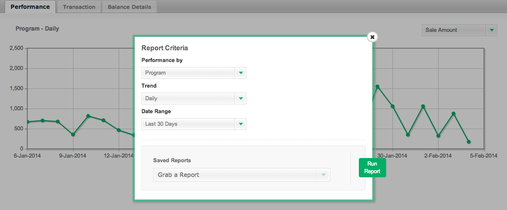

# [!DNL CJ Affiliate] 데이터 가져오기

[!DNL CJ Affiliate (Commission Junction)] 데이터를 [!DNL Adobe Commerce Intelligence]&#x200B;(으)로 가져오려면 아래 단계에 따라 결과 파일을 [지원 티켓](https://experienceleague.adobe.com/docs/commerce-knowledge-base/kb/troubleshooting/miscellaneous/mbi-service-policies.html?lang=ko)에 첨부하기만 하면 됩니다. Adobe은 계정에 데이터 테이블을 설정하고 독립적으로 데이터를 계속 업로드할 수 있습니다.

## [!DNL CJ Affiliate] 데이터 내보내기

1. [!DNL CJ Affiliate] 계정에서 `Reports` 탭으로 이동합니다.

1. `Performance` 탭에서 `Report Options`을(를) 선택합니다.

1. `Performance By`을(를) `Program`과(와) 같게 설정하고, `Trend`을(를) `Daily`과(와) 같게 설정하고, `Date Range`을(를) 감사되는 날짜 범위와 같게 설정합니다.

   <!--{:.zoom}-->

1. `Run Report`을(를) 선택합니다.

1. `File Format` 드롭다운에서 `CSV`을(를) 선택합니다.  **[!UICONTROL Download]**&#x200B;을(를) 클릭합니다.

   <!--{:.zoom}-->

1. 파일을 다운로드한 후에는 [&#x200B; Data Warehouse에 &#x200B;](../connecting-data/using-file-uploader.md)파일을 업로드[!DNL Commerce Intelligence]할 수 있습니다.

   이렇게 하면 정기적으로 새 데이터를에 계속 업로드할 수 있는 [!DNL Commerce Intelligence] Data Warehouse에 테이블이 만들어집니다. 파일을 업로드할 때 [파일 업로더 사용](../connecting-data/using-file-uploader.md)에 나열된 서식 요구 사항을 따릅니다.
