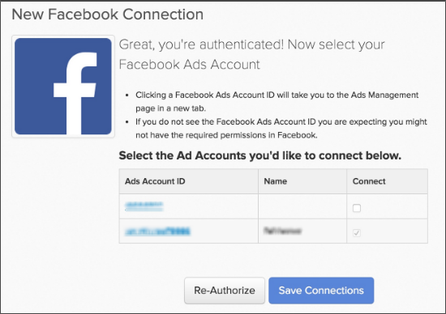

# Connect [!DNL Facebook Ads]

>[!NOTE]
>
>필요한 경우 [관리자 권한](../../../administrator/user-management/user-management.md).

연구를 하고 광고를 만들고 캠페인을 시작했죠 [!DNL Facebook]. 이제 광고 비용 데이터를 분석하고 비용이 효과적으로 사용되고 있는지 확인할 차례입니다. 광고 비용 데이터를 사용하여 다음을 수행할 수 있습니다 [광고 비용과 CLV(고객 생애 가치)와 결혼하여 캠페인 ROI를 측정합니다](../../../data-analyst/analysis/roi-ad-camp.md) 캠페인에서 획득한 사용자 수.

facebook 광고 데이터 연결 [!DNL MBI] 는 간단한 3단계 프로세스입니다.

1. [추가 [!DNL Facebook] 의 데이터 소스로 사용 [!DNL MBI]](#stepone)
1. [허용 [!DNL MBI] 액세스 권한 [!DNL Facebook Ads] 데이터](#steptwo)
1. [선택 [!DNL Facebook Ads] 데이터 가져오기 계정](#stepthree)

## 추가 [!DNL Facebook] 의 데이터 소스로 사용 [!DNL MBI] {#stepone}

1. 를 추가하려면 [!DNL Facebook] 계정에 통합하려면 `Connections` 아래의 페이지 **[!UICONTROL Manage Data** > **Integrations]**.
1. 클릭 **[!UICONTROL Add Integration]**: 데이터 위의 화면 오른쪽에 있습니다 `Sources` 테이블.
1. 을(를) 클릭합니다. [!DNL Facebook] 아이콘. 그러면 [!DNL Facebook] 권한 부여 페이지.
1. 클릭 **[!UICONTROL Authorize]**.

## 허용 [!DNL MBI] 액세스 권한 [!DNL Facebook Ads] 데이터 {#steptwo}

클릭 후 **[!DNL Facebook Authorize]**&#x200B;로 설정되면 다음과 같은 작은 팝업 창이 표시됩니다.

다음 일련의 단계에 따라 다음을 허용합니다 [!DNL MBI] 공개 프로필에서 데이터에 액세스하려면 [!DNL Facebook Ads] 관련 통계 클릭 **[!UICONTROL OK]** 계속하려면 다음 단계를 수행하십시오.

## 선택 [!DNL Facebook Ads] 데이터 가져오기 계정 {#stepthree}

1. 인증이 완료되면 [!DNL Facebook Ads] 데이터를 가져올 계정 에서 확인란을 클릭하여 원하는 계정을 선택합니다 `Connect` 열.

   

1. 클릭 **[!UICONTROL Save Connections]**.

   연결에 성공하면 *연결에 성공했습니다!* 페이지 상단에 메시지가 표시됩니다.

## 다음은 무엇입니까? {#next}

추적 중인지 확인하십시오 [!DNL Facebook] 캠페인 [!DNL Google Analytics]. 이렇게 하면 `utm\_campaign` 필드 [!DNL Google Analytics] 에 대해 올바르게 채워지지 않음 [!DNL Facebook] 캠페인.

## 관련

* [통합 재인증](https://experienceleague.adobe.com/docs/commerce-knowledge-base/kb/how-to/mbi-reauthenticating-integrations.html?lang=en)
* [연결 [!DNL Google Adwords] account](../integrations/google-ecommerce.md)
* [를 통해 주문 참조 소스 추적 [!DNL Google eCommerce]](../integrations/google-ecommerce.md)
* [데이터베이스에서 사용자 참조 소스 추적](../../analysis/google-track-user-acq.md)
* [데이터베이스에서 사용자 장치, 브라우저 및 OS 데이터 추적](../../analysis/track-usr-dev-browser.md)
* [가장 가치 있는 획득 소스 및 채널 살펴보기](../../analysis/most-value-source-channel.md)
* [광고 캠페인에 대한 ROI 향상](../../analysis/roi-ad-camp.md)
* [어떻게 [!DNL Google Analytics] UTM 속성 작업?](../../analysis/utm-attributes.md)
