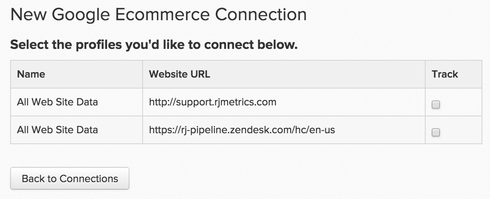

# 연결 [!DNL Google ECommerce]

>[!NOTE]
>
>필요 [관리자 권한](../../../administrator/user-management/user-management.md).

트래픽과 주문의 흐름이 일정하기 때문에 효과적으로 고객을 확보하고 있습니다. 하지만 가장 가치 있는 추천 채널은 무엇입니까? 한 소스에서 다른 소스에서 획득한 고객의 평균 라이프타임 값은 얼마입니까? 의 주문 조회 출처 데이터를 연결하여 [!DNL Google ECommerce] 끝 [!DNL Commerce Intelligence], 를 식별하는 데 도움이 되는 분석을 빌드할 수 있습니다. [가장 가치 있는 마케팅 채널](../../../data-analyst/analysis/most-value-source-channel.md).

다음을 입력하여 시작하기 [!DNL Google ECommerce] 자격 증명 대상 [!DNL Commerce Intelligence]:

1. 로 이동 `Connections` 아래 페이지 **[!UICONTROL Admin** > **Connections]**.

1. 클릭 **[!UICONTROL Add a New Source]**, 위의 화면 오른쪽에 있음 `Data Sources` 테이블.

1. 다음을 클릭합니다. [!DNL Google ECommerce] 아이콘. 이렇게 하면 [!DNL Google ECommerce] 자격 증명 페이지입니다.

1. 다음을 입력하십시오. [!DNL Google Analytics] 자격 증명. 인증 프로세스가 완료되면 다시 로 리디렉션됩니다. [!DNL Commerce Intelligence].

1. 프로필 ID 목록이 표시됩니다. 연결할 프로필을 확인하십시오. [!DNL Commerce Intelligence].

   프로필이 여러 개 있고 어느 프로필인지 식별하는 데 도움이 필요한 경우 **다중 연결 을 참조하십시오 [!DNL Google Analytics] 아래의 프로필 섹션에 자세히 설명되어 있습니다.

   <!--{: width="500"}-->

1. 변경 사항이 자동으로 저장되므로 **[!UICONTROL Back to Connections]** 다 끝나면

## 여러 개 연결 중 [!DNL Google Analytics] 프로필 대상 [!DNL Commerce Intelligence]

하나의 웹 사이트에 여러 개의 웹 사이트가 연결되어 있을 수 있습니다. [!DNL Google Analytics] 계정, 자체 식별 [!DNL Google Analytics] 프로필 ID. 이 경우 모든 프로필 ID를에 포함할 수 있는 옵션이 있습니다 [!DNL Commerce Intelligence]. 프로필 선택 단계에서 포함할 프로필 ID를 확인합니다.

특정 웹 사이트를 식별하려면 [!DNL Google Analytics] 프로필 ID:

1. 에 로그인 [!DNL Google Analytics].
1. 특정 웹 사이트로 이동 [!DNL Google Analytics] 대시보드입니다.
1. URL을 확인합니다. 프로필 ID는 다음 8개의 숫자에 해당합니다. `p` 줄 끝에 있습니다.

   `www.google.com/analytics/web/#home/a11345062w43527078p**XXXXXXXX**/`

## 연결 끊기 [!DNL Google ECommerce] 출처: [!DNL Commerce Intelligence] {#disconnect}

1. 다음을 방문하십시오. [!DNL Google Analytics] [계정 설정](https://www.google.com/account/about/?hl=en) 페이지를 가리키도록 업데이트하는 중입니다.
1. 아래 `Security` 섹션, 클릭 **[!UICONTROL edit]** 다음에 `Authorizing` 애플리케이션 및 사이트
1. 클릭 **[!UICONTROL revoke access]** 다음에 [!DNL Commerce Intelligence].

## 관련 항목:

* [예상 [!DNL Google ECommerce] 데이터](../integrations/google-ecommerce-data.md)
* [통합 재인증](https://experienceleague.adobe.com/docs/commerce-knowledge-base/kb/how-to/mbi-reauthenticating-integrations.html)
* [설정 중 [!DNL Google ECommerce] 추적](https://support.google.com/analytics/answer/1009612?hl=en)
* [가장 가치 있는 확보 소스 및 채널 살펴보기](../../analysis/most-value-source-channel.md)
* [광고 캠페인에 대한 ROI 향상](../../analysis/roi-ad-camp.md)
