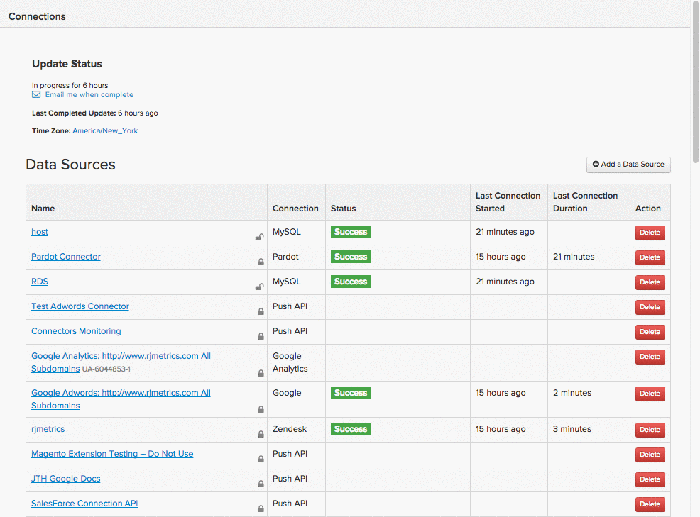

# 연결 [!DNL MongoDB] SSH 터널 사용

을(를) 연결하려면 [!DNL MongoDB] 데이터베이스 대상 [!DNL Commerce Intelligence] ssh 터널을 통해 다음과 같은 몇 가지 작업을 수행해야 합니다.

1. [검색 [!DNL Commerce Intelligence] 공개 키](#retrieve)
1. [에 대한 액세스 허용 [!DNL Commerce Intelligence] IP 주소](#allowlist)
1. [Commerce Intelligence용 Linux 사용자 만들기](#linux)
1. [만들기 [!DNL MongoDB] commerce Intelligence 사용자](#mongodb)
1. [에 연결 및 사용자 정보 입력 [!DNL Commerce Intelligence]](#finish)

>[!NOTE]
>
>Adobe 이 설정의 기술 특성으로 인해 이전에 이 작업을 수행하지 않았다면 개발자에서 루프하여 도움이 되도록 하는 것이 좋습니다.

## 검색 중 [!DNL Commerce Intelligence] 공개 키 {#retrieve}

다음 `public key` 을(를) 승인하는 데 사용됩니다. [!DNL Commerce Intelligence] `Linux` 사용자. 다음 섹션에서는 사용자를 만들고 키를 가져오는 과정을 안내합니다.

1. 다음으로 이동 **[!UICONTROL Data** > **Connections]** 및 클릭 **[!UICONTROL Add New Data Source]**.
1. 다음을 클릭합니다. [!DNL MONGODB] 아이콘.
1. 다음 이후 [!DNL MongoDB] 자격 증명 페이지가 열리면 `Encrypted` 전환 대상 `Yes`. SSH 설정 양식이 표시됩니다.
1. 다음 `public key` 은(는) 이 양식 아래에 있습니다.

자습서 전체에서 이 페이지를 열어 두십시오. 다음 섹션과 끝에서 필요합니다.

길을 조금 잃었다면 다음을 살펴보세요. [!DNL Commerce Intelligence] 키를 검색하려면 다음을 수행하십시오.

<!--{:.zoom}-->

## 에 대한 액세스 허용 [!DNL Commerce Intelligence] IP 주소 {#allowlist}

연결에 성공하려면 IP 주소에서 액세스를 허용하도록 방화벽을 구성해야 합니다. 다음과 같습니다 `54.88.76.97` 및 `34.250.211.151`, 하지만 또한 [!DNL MongoDB] 자격 증명 페이지:


## 만들기 `Linux` 사용자 [!DNL Commerce Intelligence] {#linux}

>[!IMPORTANT]
>
>다음과 같은 경우 `sshd_config` 서버와 연결된 파일이 기본 옵션으로 설정되지 않고 특정 사용자만 서버에 액세스할 수 있으므로 [!DNL Commerce Intelligence]. 이러한 경우 다음과 같은 명령을 실행해야 합니다. `AllowUsers` 허용 `rjmetric` 서버에 대한 사용자 액세스 권한.

실시간(또는 자주 업데이트되는) 데이터가 포함되어 있는 한 프로덕션 또는 보조 시스템일 수 있습니다. 에 연결할 수 있는 권한이 남아 있는 한 원하는 방식으로 이 사용자를 제한할 수 있습니다. [!DNL MongoDB] 서버입니다.

새 사용자를 추가하려면 다음 명령을 루트로 실행합니다. `Linux` 서버:

```bash
    adduser rjmetric -p
    mkdir /home/rjmetric
    mkdir /home/rjmetric/.ssh
```

다음을 기억하십시오. `public key` 첫 번째 섹션에서 검색하셨습니까? 사용자가 데이터베이스에 액세스할 수 있도록 하려면 키를 로 가져와야 합니다 `authorized_keys`. 전체 키를 `authorized_keys` 파일을 다음과 같이 지정합니다.

```bash
    touch /home/rjmetric/.ssh/authorized_keys
    "< PASTE KEY HERE >" >> /home/rjmetric/.ssh/authorized_keys
```

사용자 생성을 완료하려면 SSH를 통해 액세스할 수 있도록 /home/rjmetric 디렉토리에 대한 권한을 변경하십시오.

```bash
    chown -R rjmetric:rjmetric /home/rjmetric
    chmod -R 700 /home/rjmetric/.ssh
```

## 만들기 [!DNL Commerce Intelligence] [!DNL MongoDB] 사용자 {#mongodb}

[!DNL MongoDB] 서버에는 두 가지 실행 모드가 있습니다. [하나는 &quot;auth&quot; 옵션이 있음](#auth) `(mongod -- auth)` 하나 빼면, [기본값은 입니다](#default). 을(를) 만드는 단계 [!DNL MongoDB] 사용자는 서버에서 사용하는 모드에 따라 다릅니다. 계속하기 전에 모드를 확인하십시오.

### 서버에서 `Auth` 옵션: {#auth}

여러 데이터베이스에 연결할 때 로 로그인하여 사용자를 추가할 수 있습니다 [!DNL MongoDB] 를 관리자로 사용하고 다음 명령을 실행합니다.

>[!NOTE]
>
>사용 가능한 모든 데이터베이스를 보려면 [!DNL Commerce Intelligence] 을(를) 실행하려면 권한이 필요합니다. `listDatabases.`

이 명령은 [!DNL Commerce Intelligence] 사용자 액세스 `to all databases`:

```bash
    use admin
    db.createUser('rjmetric', '< secure password here >', true)
```

이 명령을 사용하여 다음을 부여합니다. [!DNL Commerce Intelligence] 사용자 액세스 `to a single database`:

```bash
    use < database name >
    db.createUser('rjmetric', '< secure password here >', true)
```

이렇게 하면 다음과 같은 응답이 인쇄됩니다.

```bash
    {
    "id": ObjectId("< some object id here >"),
    "user": "rjmetric",
    "readOnly": true,
    "pwd": "< some hash here >"
    }
```

### 서버에서 기본 옵션을 사용하는 경우 {#default}

서버에서 다음을 사용하지 않는 경우 `auth` 모드, [!DNL MongoDB] 사용자 이름과 암호가 없어도 서버에 액세스할 수 있습니다. 그러나 다음을 확인해야 합니다. `mongodb.conf` 파일 `(/etc/mongodb.conf)` 에는 다음 행이 있습니다. - 그렇지 않은 경우 추가한 후 서버를 다시 시작하십시오.

```bash
    bind_ip = 127.0.0.1
    noauth = true
```

을(를) 바인딩하려면 [!DNL MongoDB] 서버를 다른 주소로 바꾸려면 다음 단계에서 데이터베이스 호스트 이름을 적절하게 조정하십시오.

## 에 연결 및 사용자 정보 입력 [!DNL Commerce Intelligence] {#finish}

마무리하려면 연결 및 사용자 정보를 입력해야 합니다. [!DNL Commerce Intelligence]. 다음을 떠나셨나요? [!DNL MongoDB] 자격 증명 페이지가 열려 있습니까? 그렇지 않으면 다음으로 이동합니다. **[!UICONTROL Data > Connections]** 및 클릭 **[!UICONTROL Add New Data Source]**, 그런 다음 [!DNL MongoDB] 아이콘. 다음 사항을 변경하는 것을 잊지 마십시오. `Encrypted` 전환 대상 `Yes`.

이 페이지에 다음 정보를 입력하십시오. `Database Connection` 섹션:

* `Host`: `127.0.0.1`
* `Username`: [!DNL Commerce Intelligence] [!DNL MongoDB] 사용자 이름 (이어야 함) `rjmetric`)
* `Password`: [!DNL Commerce Intelligence] [!DNL MongoDB] 암호
* `Port`: 서버에 있는 MongoDB의 포트(`27017` (기본적으로)
* `Database Name` (선택 사항): 한 데이터베이스에 대한 액세스만 허용한 경우 여기에서 해당 데이터베이스의 이름을 지정합니다.

아래 `SSH Connection` 섹션:

* `Remote Address`: SSH를 사용할 서버의 IP 주소 또는 호스트 이름
* `Username`: [!DNL Commerce Intelligence] Linux(SSH) 사용자 이름(rjmetric이어야 함)
* `SSH Port`: 서버의 SSH 포트(기본적으로 22)

작업을 마치면 를 클릭합니다. **[!UICONTROL Save Test]** 설치를 완료합니다.

### 관련 항목

* [통합 재인증](https://experienceleague.adobe.com/docs/commerce-knowledge-base/kb/how-to/mbi-reauthenticating-integrations.html)
