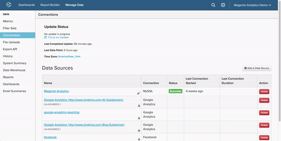

# [!DNL PostgreSQL]을(를) 통해 [!DNL SSH Tunnel] 연결

[!DNL PostgreSQL]을(를) 통해 [!DNL Commerce Intelligence] 데이터베이스를 `SSH tunnel`에 연결하려면 다음을 수행해야 합니다.

1. [&#x200B; [!DNL Commerce Intelligence] 공개 키 검색](#retrieve)
1. [&#x200B; [!DNL Commerce Intelligence] IP 주소에 대한 액세스 허용](#allowlist)
1. [&#x200B; [!DNL Linux] 의  [!DNL Commerce Intelligence]사용자 만들기](#linux)
1. [&#x200B; [!DNL PostgreSQL] 의  [!DNL Commerce Intelligence]사용자 만들기](#postgres)
1. [&#x200B; [!DNL Commerce Intelligence]에 연결 및 사용자 정보 입력](#finish)

## [!DNL Commerce Intelligence] [!DNL public key] 검색 중 {#retrieve}

`public key`은(는) [!DNL Commerce Intelligence] [!DNL Linux] 사용자를 승인하는 데 사용됩니다. 이제 사용자를 만들고 키를 가져옵니다.

1. **[!UICONTROL Manage Data** > **Connections]**(으)로 이동하여 **[!UICONTROL Add a Data Source]**&#x200B;을(를) 클릭합니다.
1. [!DNL PostgreSQL] 아이콘을 클릭합니다.
1. `PostgreSQL credentials` 페이지가 열린 후 `Encrypted` 전환을 `Yes`(으)로 설정합니다. `SSH` 설치 양식이 표시됩니다.
1. `public key`은(는) 이 양식 아래에 있습니다.

자습서 전체에서 이 페이지를 열어 두십시오. 다음 섹션과 끝에서 필요합니다.

다음은 [!DNL Commerce Intelligence]을(를) 탐색하여 키를 검색하는 방법을 보여 줍니다.



## [!DNL Commerce Intelligence] IP 주소에 대한 액세스 허용 {#allowlist}

연결에 성공하려면 IP 주소에서 액세스를 허용하도록 방화벽을 구성해야 합니다. `54.88.76.97/32`이지만 `PostgreSQL` 자격 증명 페이지에도 있습니다. 위의 GIF에 있는 파란색 상자를 참조하십시오.

## [!DNL Linux]에 대해 [!DNL Commerce Intelligence] 사용자를 만드는 중 {#linux}

실시간(또는 자주 업데이트되는) 데이터가 포함되어 있는 한 프로덕션 또는 보조 시스템일 수 있습니다. [&#x200B; 서버에 연결할 수 있는 권한이 있는 한 원하는 방식으로 &#x200B;](../../../administrator/account-management/restrict-db-access.md)이 사용자를 제한[!DNL PostgreSQL]할 수 있습니다.

1. 새 사용자를 추가하려면 [!DNL Linux] 서버에서 다음 명령을 root로 실행합니다.

```bash
        adduser rjmetric -p<password>
        mkdir /home/rjmetric
        mkdir /home/rjmetric/.ssh
```

1. 첫 번째 섹션에서 검색한 `public key`을(를) 기억하십니까? 사용자가 데이터베이스에 액세스할 수 있도록 하려면 키를 `authorized\_keys`(으)로 가져와야 합니다.

   다음과 같이 전체 키를 `authorized\_keys` 파일에 복사합니다.

```bash
        touch /home/rjmetric/.ssh/authorized_keys
        "<PASTE KEY HERE>" >> /home/rjmetric/.ssh/authorized_keys
```

1. 사용자 만들기를 완료하려면 `/home/rjmetric`을(를) 통해 액세스할 수 있도록 `SSH` 디렉터리에 대한 권한을 변경하십시오.

```bash
        chown -R rjmetric:rjmetric /home/rjmetric
        chmod -R 700 /home/rjmetric/.ssh
```

>[!IMPORTANT]
>
>서버와 연결된 `sshd\_config` 파일이 기본 옵션으로 설정되지 않은 경우 특정 사용자만 서버에 액세스할 수 있으므로 [!DNL Commerce Intelligence]에 연결할 수 없습니다. 이러한 경우 rjmetric 사용자가 서버에 액세스할 수 있도록 하려면 `AllowUsers`과(와) 같은 명령을 실행해야 합니다.

## [!DNL Commerce Intelligence] [!DNL Postgres] 사용자를 만드는 중 {#postgres}

조직에서는 다른 프로세스가 필요할 수 있지만 이 사용자를 생성하는 가장 간단한 방법은 권한을 부여할 수 있는 권한이 있는 사용자로 Postgres에 로그인할 때 다음 쿼리를 실행하는 것입니다. [!DNL Commerce Intelligence]에게 액세스 권한이 부여되는 스키마도 사용자가 소유해야 합니다.

```sql
    GRANT CONNECT ON DATABASE <database name> TO rjmetric WITH PASSWORD <secure password>;GRANT USAGE ON SCHEMA <schema name> TO rjmetric;GRANT SELECT ON ALL TABLES IN SCHEMA <schema name> TO rjmetric;ALTER DEFAULT PRIVILEGES IN SCHEMA <schema name> GRANT SELECT ON TABLES TO rjmetric;
```

`secure password`을(를) SSH 암호와 다를 수 있는 자체 보안 암호로 바꾸십시오. 또한 `database name` 및 `schema name`을(를) 데이터베이스에서 적절한 이름으로 바꾸십시오.

여러 데이터베이스 또는 스키마를 연결하려면 필요에 따라 이 프로세스를 반복합니다.

## [!DNL Commerce Intelligence]에 연결 및 사용자 정보 입력 {#finish}

마무리하려면 [!DNL Commerce Intelligence]에 연결 및 사용자 정보를 입력해야 합니다. [!DNL PostgreSQL] 자격 증명 페이지를 열어 두셨습니까? 그렇지 않으면 **[!UICONTROL Manage Data > Connections]**(으)로 이동하여 **[!UICONTROL Add a Data Source]**&#x200B;을(를) 클릭한 다음 [!DNL PostgreSQL] 아이콘을 클릭합니다. `Encrypted` 토글을 `Yes`(으)로 설정하는 것을 잊지 마십시오.

이 페이지에 `Database Connection` 섹션부터 다음 정보를 입력하십시오.

* `Username`: RJMetrics Postgres 사용자 이름(rjmetric이어야 함)
* `Password`: RJMetrics Postgres 암호
* `Port`: 서버에 있는 PostgreSQL 포트(기본적으로 5432)
* `Host`: 127.0.0.1

`SSH Connection`에서:

* `Remote Address`: SSH를 사용할 서버의 IP 주소 또는 호스트 이름
* `Username`: SSH 로그인 이름(rjmetric이어야 함)
* `SSH Port`: 서버의 SSH 포트(기본적으로 22)

완료되면 **저장 및 테스트**&#x200B;를 클릭하여 설정을 완료합니다.

### 관련 항목

* [통합 재인증](https://experienceleague.adobe.com/docs/commerce-knowledge-base/kb/how-to/mbi-reauthenticating-integrations.html?lang=ko)
