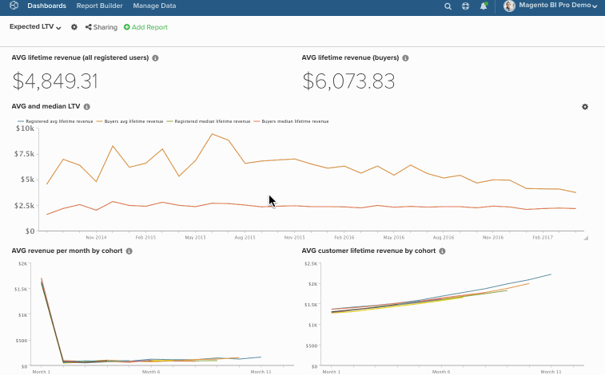

# 대시보드에서 차트 벌크 편집

벌크 편집 기능을 사용하면 대시보드에서 차트 이름과 날짜를 쉽게 변경할 수 있습니다. 예를 들어 특정 대시보드의 모든 차트가 단일 저장소를 참조하고 분기별이 아닌 월별 기준으로 보고하도록 할 수 있습니다. 모든 것을 수동으로 변경하는 대신 `bulk-editing` 기능이 작업을 수행합니다. 이 문서에서는 사용 방법에 대해 알아봅니다.

* [다음 ](#findreplace)

* [다음 ](#prepend)

* [다음 ](#dates)

말하자면, 이것을 고려하라 - *이러한 변경 사항을 영구적으로 적용해야 합니까?* 그렇지 않으면 대시보드를 복제한 다음 새 대시보드에서 날짜를 변경하는 것이 좋습니다. 이를 통해 필요한 변경 사항을 유지하면서 원래 대시보드를 유지할 수 있습니다.

>[!NOTE]
>
>많은 보고서를 변경하는 경우 업데이트 프로세스에 약간의 시간이 걸릴 수 있습니다.

## 사용 `Find/Replace` {#findreplace}

1. 톱니바퀴() 아이콘을 클릭하여 대시보드의 이름을 표시한 다음 [!UICONTROL Bulk Edit Reports] 창.

1. 클릭 **[!UICONTROL Chart Title Find and Replace]** 을 클릭합니다.

1. 다음에서 `Chart Title Find` 필드에서 찾을 단어나 문자를 입력합니다.

1. 다음에서 `Replace With` 필드에서 의 내용을 바꿀 단어 또는 문자를 입력합니다. `Find` 필드.

1. 클릭 **[!UICONTROL Update Reports]**.

예:

## 사전 보류 중 `Chart Names` {#prepend}

1. 톱니바퀴() 아이콘을 클릭하여 대시보드의 이름을 표시한 다음 [!UICONTROL Bulk Edit Reports] 창.

1. 클릭 **[!UICONTROL Prepend Report Names]** 을 클릭합니다.

1. 차트 앞에 추가할 단어 또는 문자를 입력합니다.

1. 클릭 **[!UICONTROL Update Reports]**.

예:

## 변경 중 `Dates` {#dates}

1. 톱니바퀴() 아이콘을 클릭하여 대시보드 이름 옆에 있는 다음 `!UICONTROL Bulk Edit Reports` 창.

1. 클릭 **[!UICONTROL Change Dates]** 을 클릭합니다.

1. 새로 설정 `Start/End Date` 및 `Time Interval`. 이러한 필드는 변경하지 않고 그대로 둘 수도 있습니다.

1. 클릭 **[!UICONTROL Update Reports]**.

예:

