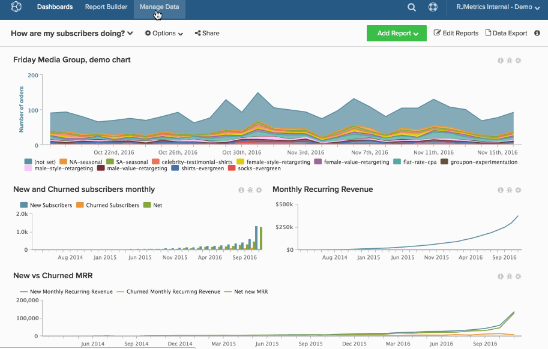

# 차트를 영구적으로 삭제

다음을 수행하는 경우에도 [대시보드에서 차트 제거](../../data-user/dashboards/remove-charts-dashboard.md), 이(가) 여전히 다음에 있습니다. [!DNL Commerce Intelligence] 계정입니다.

차트를 영구적으로 삭제하려면 다음을 수행합니다.

1. 클릭 **[!UICONTROL Account Setting]** 를 클릭합니다.

1. 클릭 **[!UICONTROL Charts]**.

1. 사용자 권한 및 차트 소유권에 따라 삭제할 수 있는 차트가 화면 오른쪽에 표시됩니다.

1. 삭제할 차트 선 옆의 확인란을 클릭합니다.

1. 클릭 **[!UICONTROL Delete Selected]**.

   >[!NOTE]
   >
   >차트가 대시보드 또는 이메일 요약에 사용되는 경우 알림이 표시됩니다. 계속하려면 삭제를 확인한 다음 을(를) 클릭합니다. **[!UICONTROL Force Deletion]**.

예:

<!--{: width="630" height="402"}-->
