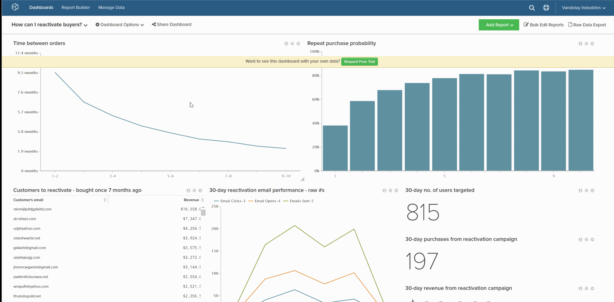

# 대시보드 삭제

대시보드 목록이 너무 복잡하지 않게 유지하려면 더 이상 필요하지 않은 대시보드를 삭제할 수 있습니다. 이 작업은 다음 두 가지 방법 중 하나로 수행할 수 있습니다.

1. [를 통해 `Account Settings` 페이지](#account) - 이 메서드는 [관리자 권한](../../administrator/user-management/user-management.md).

1. [를 통해 `Dashboard Options` 메뉴](#do) - 이 메서드를 사용하려면 대시보드를 소유하거나 `Edit` 사용 권한.

## 다음을 통해 대시보드 삭제 `Account Settings` 페이지 {#account}

1. 클릭 **[!UICONTROL Account Settings** > **Dashboards]**.

1. 대시보드 목록에서 삭제할 대시보드를 클릭합니다.

1. 클릭 **[!UICONTROL Delete Dashboard]**.

예:

<!--{: width="703" height="346"}-->

## 다음을 통해 대시보드 삭제 `Dashboard Options` 메뉴 {#do}

1. 다음을 클릭합니다. **[!UICONTROL Dashboard Options]** 화면 상단에 있는 메뉴.

1. 드롭다운에서 **[!UICONTROL Delete]**.

1. 확인을 묻는 메시지가 나타나면 **[!UICONTROL Delete]**.

예:

<!--{: width="703" height="347"}-->
