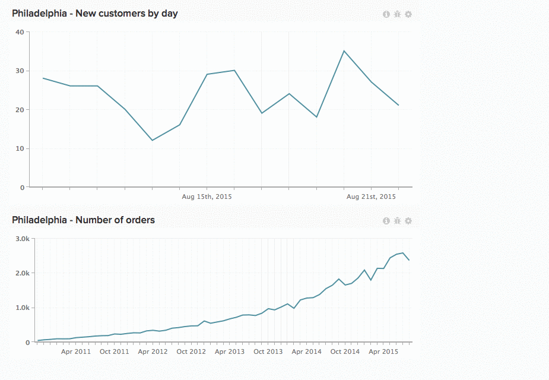

# 대시보드에서 차트 작업

스칼라 숫자. 막대 그래프. 장기간 확장되는 차트. 모든 차트는 정보를 다르게 표시합니다. 즉, 차트의 크기와 위치가 모든 크기의 솔루션이 아니라는 의미입니다. [!DNL Commerce Intelligence]에서 차트 크기를 조정하고 다시 정렬하여 이상적인 작업 영역을 만들 수 있습니다.

*차트 크기를 조정하려면*&#x200B;차트의 오른쪽 아래 모서리를 클릭하여 끕니다.

*차트를 이동하려면* `Move` 커서가 표시될 때까지 차트 위에 마우스를 올려 놓습니다. 을(를) 클릭하고 누른 채로 차트를 원하는 위치로 드래그합니다. 릴리스 클릭하여 차트를 배치합니다.

