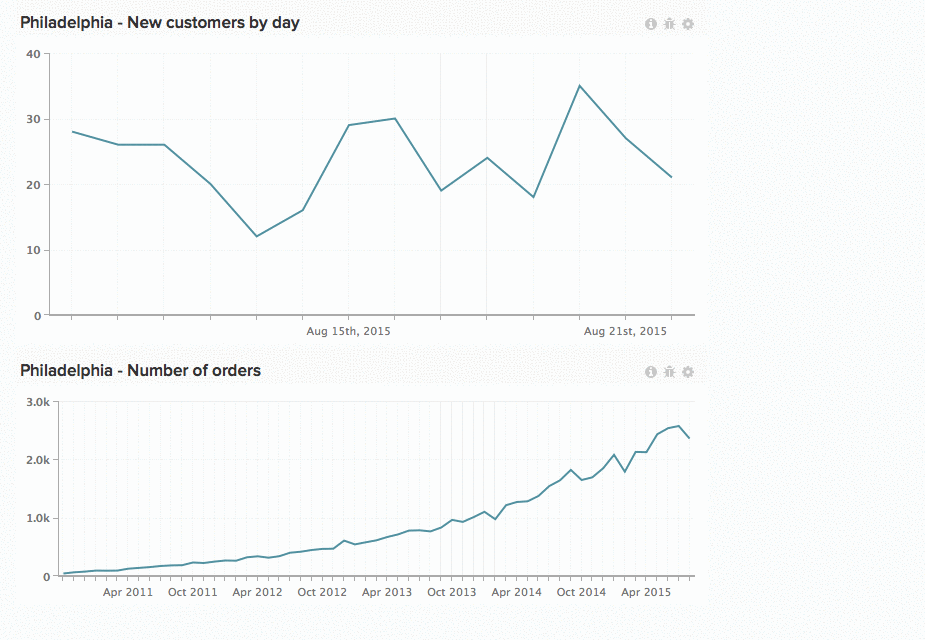

# 대시보드에서 차트 작업

스칼라 숫자입니다. 막대 그래프. 장기간에 걸쳐 연장된 차트. 모든 차트에는 정보가 다르게 표시됩니다. 즉, 차트의 크기와 위치는 단일 크기의 모든 솔루션이 아닙니다. in [!DNL MBI]차트 크기를 조정하고 다시 정렬하여 이상적인 작업 공간을 만들 수 있습니다.

*차트 크기를 조정하려면*&#x200B;를 클릭하고 차트의 오른쪽 아래 모서리를 드래그합니다.

*차트를 이동하려면 다음을 수행하십시오*&#x200B;를 마우스로 가리킨 다음 `Move` 커서가 표시됩니다. 을(를) 클릭하고 누른 다음 차트를 원하는 위치로 드래그합니다. 차트를 배치하려면 을(를) 클릭합니다.

