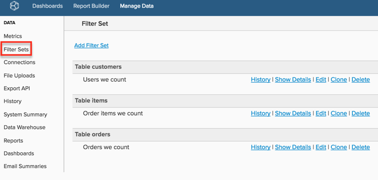

# 필터 세트 만들기

[!DNL Commerce Intelligence]에 유사한 방식으로 필터링해야 하는 지표가 여러 개 있는 경우(예: 테스트 주문 필터링) 저장된 필터 집합을 만들어 지표에 적용할 수 있습니다. 이렇게 하면 지표를 만들거나 편집할 때 개별 필터를 추가할 필요가 없어 시간을 절약할 수 있습니다.

자세한 내용은 [교육 비디오](https://experienceleague.adobe.com/docs/commerce-knowledge-base/kb/how-to/mbi-training-video-filter-sets.html)를 참조하세요.

>[!NOTE]
>
>[관리자 권한](../../administrator/user-management/user-management.md)이 필요합니다.

1. 사이드바에서 **[!DNL Manage Data** > **Filter Sets]**&#x200B;을(를) 클릭합니다.

   

1. 페이지 맨 위에서 **[!UICONTROL Add Filter Set]**&#x200B;을(를) 클릭합니다.

1. 필터링할 지표가 포함된 테이블을 선택합니다.

   예를 들어, `Total number of orders` 지표를 필터링하고 이 지표가 `orders` 테이블에 빌드되도록 하려면 해당 테이블을 선택합니다.

1. `Filter Set` 이름을 지정합니다.

1. 모든 관련 필터를 추가합니다.

   예를 들어, `Total number of orders` 지표에 완료 상태의 주문만 포함하려는 경우 상태가 `complete`이(가) 아닌 모든 주문을 제외하는 필터를 적용합니다.

1. 필터 논리를 확인하고 괄호와 연산자가 올바르게 배치되어 있는지 확인합니다(예: `\[A\] AND \[B\]; (\[A\] OR \[B\]) AND \[C\]`).

   잘못된 필터로 인해 [!DNL Commerce Intelligence] 보고서와 예상 결과 간의 데이터 불일치가 발생하는 경우가 많습니다.

1. `Filter Set` 저장.

필터 세트가 저장되면 동일한 테이블을 사용하는 모든 지표에 적용할 수 있습니다. 예를 들어 `Filter Set` 테이블에 `orders`을(를) 만든 경우 *과 같이 이 테이블에 빌드된*&#x200B;모든 지표`Revenue`에 적용할 수 있습니다.

>[!NOTE]
>
>`Filter Sets`은(는) [!DNL Commerce Intelligence]의 계산된 열에도 적용할 수 있습니다. 지원에 연락하여 [!DNL Commerce Intelligence]에서 만든 데이터 차원에 필터 집합을 적용하도록 요청할 수 있습니다.

## 관련 항목

* [세분화 및 필터링 우수 사례](../../best-practices/segment-filter.md)
