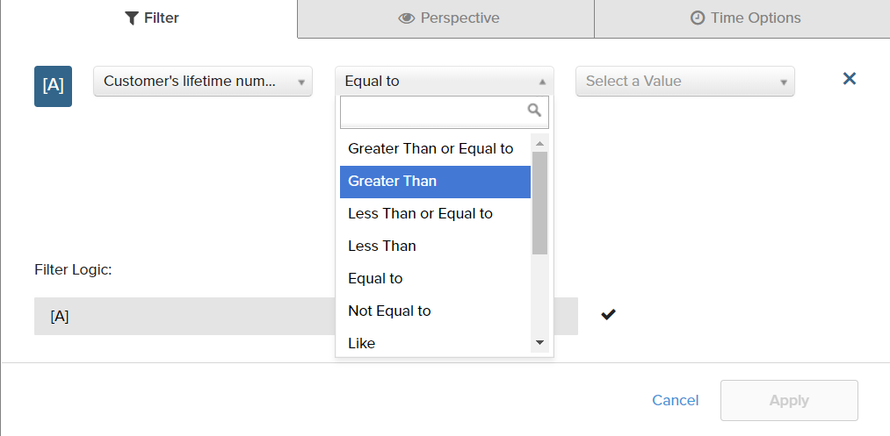

# 필터

보고서 제작에 사용되는 데이터를 제한하기 위해 하나 이상의 필터를 추가할 수 있습니다. 각 필터는 연관된 테이블의 열, 연산자 및 값을 포함하는 표현식입니다. 예를 들어 반복 고객만 포함하려면 두 개 이상의 주문을 한 고객만 포함하는 필터를 만들 수 있습니다. 여러 필터를 논리적에서 사용할 수 있습니다. `AND/OR` 연산자를 사용하여 보고서에 논리를 추가합니다.

>[!TIP]
>
>보고서에는 최대 3,500개의 데이터 포인트가 포함될 수 있습니다. 데이터 포인트 수를 줄이려면 필터를 사용하여 보고서를 생성하는 데 사용되는 데이터의 양을 줄이십시오.

[!DNL Adobe Commerce Intelligence] 에는 &quot;즉시 사용 가능한(OOTB)&quot;을 사용하거나 필요에 맞게 수정할 수 있는 다양한 필터가 포함되어 있습니다. 만들 수 있는 필터 수에는 제한이 없습니다.

## 필터를 추가하려면 다음 작업을 수행하십시오.

1. 차트에서 각 데이터 포인트 위로 마우스를 가져갑니다.

   이 보고서에서 각 데이터 포인트는 해당 월의 총 고객 수를 보여 줍니다.

1. 왼쪽 패널에서 필터 ( )를 클릭합니다.) 아이콘.

   

1. 클릭 **[!UICONTROL Add Filter]**.

   필터는 알파벳순으로 번호가 매겨져 있으며 첫 번째는 입니다. `[A]`. 필터의 처음 두 부분은 드롭다운 옵션이고 세 번째 부분은 값입니다.

   

   * 필터의 첫 번째 부분을 클릭하고 표현식의 주제로 사용할 열을 선택합니다.

     

   * 필터의 두 번째 부분을 클릭하고 연산자를 선택합니다.

     

   * 필터의 세 번째 부분에서 표현식을 완료하는 데 필요한 값을 입력합니다.

     

   * 필터가 완료되면 을 클릭합니다. **[!UICONTROL Apply]**.

     이제 보고서에는 반복 고객만 포함되며, 보고서에 대해 검색된 고객 레코드 수가 33,000개에서 12,600개로 감소했습니다.

     <!--{: .zoom}-->

1. 사이드바에서 원근 ( )을 클릭합니다. ) 아이콘.

   <!--{: .zoom}-->

1. 설정 목록에서 `Cumulative`. 그런 다음 을 클릭합니다. **[!UICONTROL Apply]**.

   

   다음 `Cumulative` 원근법은 매월 들쭉날쭉한 오르내림을 보이기보다는 시간에 따라 변화를 분배한다.

1. 입력 `Title` 보고서 및 클릭 **[!UICONTROL Save]** as a `Chart` 을 클릭하여 대시보드에 추가합니다.

   
