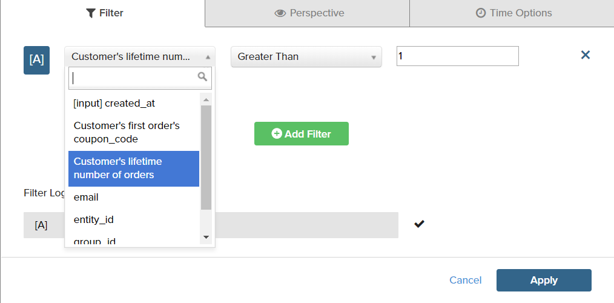
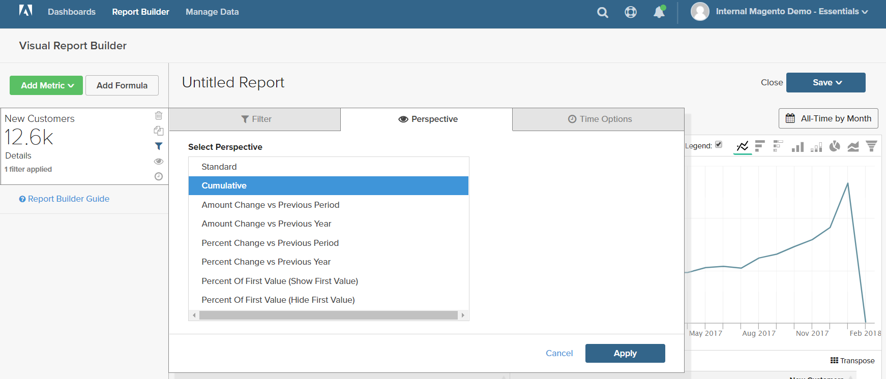

# 필터

보고서를 제조하는 데 사용되는 데이터를 제한하는 하나 이상의 필터를 추가할 수 있습니다. 각 필터는 연결된 테이블의 열, 연산자 및 값을 포함하는 표현식입니다. 예를 들어 반복 고객만 포함하도록 둘 이상의 주문을 한 고객만 포함하는 필터를 만들 수 있습니다. 여러 필터를 논리적 필터와 함께 사용할 수 있습니다 `AND/OR` 연산자를 사용하여 보고서에 논리를 추가합니다.

>[!TIP]
>
>보고서에는 최대 3,500개의 데이터 포인트가 있을 수 있습니다. 데이터 포인트 수를 줄이려면 필터를 사용하여 보고서를 생성하는 데 사용되는 데이터 양을 줄입니다.

MBI에는 &quot;즉시 사용(OOTB)&quot; 또는 사용자의 요구 사항에 맞게 수정할 수 있는 다양한 필터가 포함되어 있습니다. 만들 수 있는 필터 수에는 제한이 없습니다.

## 필터를 추가하려면 다음을 수행하십시오.

1. 차트에서 각 데이터 포인트를 마우스로 가리킵니다.

   이 보고서에서 각 데이터 포인트는 해당 월의 총 고객 수를 보여줍니다.

1. 왼쪽 패널에서 필터 () 아이콘을 클릭합니다.

   

1. 클릭 **[!UICONTROL Add Filter]**.

   필터는 알파벳순으로 번호가 매겨지며 첫 번째 필터는 `[A]`. 필터의 처음 두 부분은 드롭다운 옵션이며 세 번째 부분은 값입니다.

   

   * 필터의 첫 번째 부분을 클릭하고 표현식의 제어로 사용할 열을 선택합니다.

      

   * 필터의 두 번째 부분을 클릭하고 연산자를 선택합니다.

      

   * 필터의 세 번째 부분에서 표현식을 완료하는 데 필요한 값을 입력합니다.

      

   * 필터가 완료되면 를 클릭합니다. **[!UICONTROL Apply]**.

      이제 보고서에 반복 고객만 포함되며 보고서에 대해 검색된 고객 레코드 수가 33K에서 12.6k로 줄었습니다.

      <!--{: .zoom}-->

1. 사이드바에서 원근( ) 아이콘을 클릭합니다.

   <!--{: .zoom}-->

1. 설정 목록에서 `Cumulative`. 그런 다음 **[!UICONTROL Apply]**.

   

   다음 `Cumulative` 원근법은 각 달에 대해 톱니바퀴 모양과 다운을 표시하지 않고 시간에 따라 변경 사항을 분배합니다.

1. 을(를) 입력합니다. `Title` 를 클릭하고 **[!UICONTROL Save]** 그것은 `Chart` 대시보드에 업로드합니다.

   
