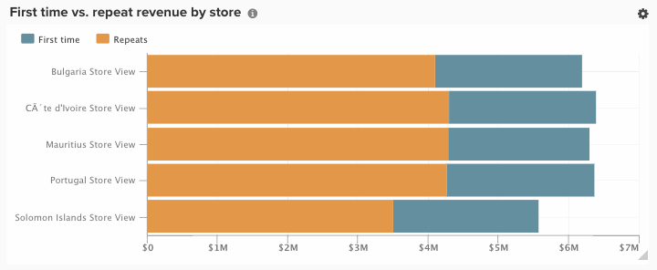

# 시각화 옵션

주어진 데이터 세트에 대해 올바른 시각화를 선택하는 것은 분석 프로세스의 중요한 부분입니다. 모든 데이터 집합에는 이야기할 스토리가 있지만, 해당 스토리의 효과는 시각적 영향과 가독성에 의해 강조됩니다.

[!DNL Commerce Intelligence] [!DNL Visual Report Builder]은(는) 각각 고유한 장점과 사용 사례를 가진 12개의 고유한 시각화 옵션을 제공합니다. 이 항목에서는 해당되는 경우 필요한 보고서 구성 및 사용 사례의 예를 포함하여 [!DNL Commerce Intelligence]의 다양한 시각화 옵션에 대해 설명합니다. [!DNL Commerce Intelligence]에서 다음 시각화를 사용할 수 있습니다.

* `Scalar`
* `Table`
* `Line`
* `Bar`
* `Stacked Bar`
* `Column`
* `Stacked Column`
* `Pie`
* `Area`
* `Funnel`
* `Scatter plot`
* `Bubble`
* `Heatmap`

## `Scalar`

`Scalar`개의 보고서가 단일 숫자 값으로 표시됩니다. 대부분의 경우 이 보고서는 매출이나 주문과 같은 주요 지표의 &quot;모든 시간&quot; 값을 표시하거나 두 개의 별도 스칼라 보고서를 사용하여 매출과 날짜 및 예산을 비교하는 데 사용됩니다. 아래 예에서는 지정된 보고 간격에 대한 총 주문 수를 보여 줍니다.

보고서를 스칼라로 저장하려면 필터 및 시간 설정을 구성한 다음 보고서의 오른쪽 상단 섹션에서 **[!UICONTROL Save]** 또는 **[!UICONTROL Update]**&#x200B;을(를) 클릭합니다. `Type` 드롭다운 아래에서 숫자: 지표 이름을 선택하여 왼쪽 막대에 표시된 값으로 보고서를 저장합니다.

**요구 사항**:

* `Time interval`: `None`
* `Group by`: `None`
* 1개 지표만

## `Table`

이름에서 알 수 있듯이 `table` 보고서는 테이블 형식 세부 정보를 표시하는 데 적합합니다. 단일 보고서에 값이나 지표로 많은 그룹을 표시해야 하는 경우 테이블이 가장 좋은 방법입니다. 예를 들어, 다음은 고객 이메일별로 그룹화된 주문 및 매출을 보여주는 &quot;고객 세부 정보&quot; 표입니다.

스칼라 보고서와 유사하게 Report Builder 내에서 **[!UICONTROL Save]** 또는 **[!UICONTROL Update]**&#x200B;을(를) 클릭한 다음 `Type` 드롭다운 아래에서 테이블 옵션을 선택하여 보고서를 테이블로 저장할 수 있습니다.

**요구 사항:**

* 보고서 구성 요구 사항은 없지만 표는 3500개의 행으로 제한되어 있습니다. 데이터 집합에 3500개 이상의 행이 포함된 경우 결과를 필터링하여 범위를 좁히거나 결과를 `.csv` 또는 `Excel`(으)로 내보내 전체 데이터 집합을 확인해야 합니다.

## `Line`

`Line` 차트는 유사한 지표 집단의 성능을 비교하기에 완벽한 선택입니다. 예를 들어, 아래와 같이 동일한 기간 동안 두 지역의 매출을 분석하거나 이행된 주문의 전년 대비 증가율을 비교할 수 있습니다.

보고서에 추가된 각 지표와 공식은 자체 라인으로 표시됩니다. 비슷한 단위와 비율의 지표를 비교할 때는 `Multiple Y-Axes`에 대한 확인란의 선택을 취소하여 같은 비율의 모든 지표를 표시합니다.

보고서를 라인 차트로 저장하려면 `Type` 보고서를 `Chart`(으)로 조정하고 Report Builder 내에서 적절한 시각화를 선택하십시오(아래 참조).

**요구 사항:**

* 없음

## `Bar`

`Bar` 차트는 데이터를 일련의 가로 막대로 표시하며 제한된 수의 지표 또는 값으로 그룹화된 전체 성능을 표시하는 데 가장 적합합니다. 예를 들어 막대 차트를 사용하여 스토어별 매출을 비교할 수 있습니다.

모든 개별 지표, 그룹화 기준 및 시간 간격 조합이 자체 막대로 표시됩니다. 서로 다른 세 개의 `group by` 값을 포함하는 하나의 `group by`을(를) 가진 두 개의 지표가 있는 경우 보고서에는 여섯 개의 개별 막대가 표시됩니다.

보고서를 막대형 차트로 저장하려면 `Type` 보고서를 `Chart`(으)로 조정하고 아래와 같이 `Bar` 옵션을 선택하십시오.

**요구 사항:**

* 없음

## `Stacked Bar`

`Stacked bar` 차트는 막대 차트 종류와 유사하며 각 막대의 비례 분류를 표시하는 기능도 추가로 포함됩니다. 대부분의 경우 스택 막대 차트는 두 개 이상의 지표와 하나의 그룹별로 설정되므로 각 막대는 해당 지표 구성 요소 간에 분할된 고유한 값별 그룹을 나타냅니다.

예를 들어, 아래 보고서에는 첫 번째 주문에 대해 필터링된 하나와 반복 주문에 대해 필터링된 하나를 갖는 두 개의 동일한 매출 지표가 있습니다. 매장별로 그룹화한 후에는 각 스토어에 대한 총 수익 기여도(막대의 총 너비로 표시됨)와 각 스토어에 대한 매출 분류를 처음 대 반복해서 볼 수 있습니다.

위와 같은 보고서를 설정할 때는 `Multiple Y-Axes` 상자를 선택 취소해야 합니다.

보고서를 스택 막대 차트로 저장하려면 `Type` 보고서를 `Chart`(으)로 조정하고 Report Builder에서 스택 막대 옵션을 선택하십시오.

**요구 사항:**

* 없음

## `Column`

`Column` 차트는 각 데이터 포인트를 세로 열로 나타내며 가로 막대형 차트 시각화보다 시간 트렌드 데이터를 표시하는 데 더 적합합니다. 조합에 의한 각 고유 지표와 그룹은 자체 일련의 막대로 표시됩니다. 열 보고서는 3개 이하의 지표가 있거나 1-3개의 그룹 by 값을 포함하여 단일 그룹이 있는 지표가 한 개 있는 보고서에 가장 적합합니다.

아래 예에는 두 개의 매출 지표가 표시되며, 하나는 첫 번째 매출에 대해 필터링되고 다른 하나는 반복 매출에 대해 필터링되어 월별 시간 경과에 따른 트렌드입니다.

보고서 `Type`을(를) `Chart`(으)로 변경하고 열 시각화 옵션을 선택하면 열 보고서를 저장할 수 있습니다.

**요구 사항:**

* 없음

## `Stacked Column`

`Stacked column` 보고서는 유사한 열이 서로 겹쳐서 총 높이가 값의 합계를 나타내도록 하는 것을 제외하고 열 차트와 거의 동일합니다. 스택 열은 다시 제한된 수의 지표 또는 그룹 키로 가장 잘 시각화됩니다.

위의 `Column` 섹션에 설명된 것과 동일한 보고서 구성을 사용하여 두 개의 매출 지표(첫 번째 및 반복으로 필터링됨)가 있는 보고서는 스택 열 시각화가 있는 아래와 같이 표시됩니다.

스택 열 시각화가 있는 여러 지표를 표시할 때는 `Multiple Y-Axes` 확인란의 선택을 취소하는 것이 중요합니다.

보고서를 누적 열로 저장하려면 `Type` 보고서를 `Chart`(으)로 설정하고 `stacked column` 옵션을 선택하십시오.

**요구 사항:**

* 없음

## `Pie`

`Pie` 차트는 하나 이상의 그룹 by가 있는 단일 지표 또는 그룹 by가 없는 여러 지표를 표시하는 데 가장 적합합니다. 두 경우 모두 파이 차트에 데이터를 표시하려면 시간 간격을 없음으로 설정해야 합니다. 아래 예에서 단일 주문 지표는 저장소별 주문 분류를 보여주는 저장소 이름별 그룹입니다.

보고서를 파이 차트로 저장하려면 `Type` 보고서를 `Chart`(으)로 설정하고 아래와 같이 `pie` 옵션을 선택하십시오.

**요구 사항:**

* `Time interval`: `None`
* 다음 중 하나를 수행합니다.
   * `Single metric with one or more group bys`
   * `Multiple metrics with no group bys`

## `Area`

`Area` 차트는 열이 연속적으로 표시된다는 점을 제외하면 스택 열 차트와 거의 동일합니다. 스택 열과 마찬가지로 영역 차트는 제한된 수의 그룹 바이트 또는 지표로 가장 잘 시각화됩니다.

`stacked column` 섹션에서 동일한 예를 들어 아래 보고서는 영역 차트 시각화를 사용한 첫 번째 시간과 반복 수익을 보여줍니다.

보고서를 영역 차트로 저장하려면 `Type`을(를) `Chart`(으)로 조정하고 영역 옵션을 선택하십시오.

**요구 사항:**

* 없음

## `Funnel`

`Funnel` 차트는 예상되는 이벤트 시퀀스 간에 전환을 시각화하기에 적합합니다. 잠재 고객에서 최종 거래까지 판매 단계의 잠재적 매출을 분석하거나 첫 번째 주문과 두 번째 주문, 두 번째 주문과 세 번째 주문 사이의 고객 감소를 측정하는 등의 몇 가지 예가 있습니다. 후자의 예가 아래에 표시됩니다.

단계 보고서에서, 단계의 지정된 단계의 상대값이 단계의 높이에 의해 반영됩니다. 보고서 구성은 단계가 표시되는 순서를 결정합니다. 단계 보고서를 구성하는 방법에는 두 가지가 있습니다.

* `Single metric with one group by`: - 그룹별 &quot;위쪽/아래쪽 표시&quot; 설정에 의해 결정된 단계 순서. 기본적으로 단계 단계는 가장 큰 값부터 가장 작은 값까지 순서대로 표시되지만 이름별로 그룹을 알파벳순으로 정렬할 수도 있습니다.

* `Multiple metrics with no group by`: - 지표가 보고서에 추가된 순서에 따라 결정되는 단계 순서.

보고서를 단계 차트로 저장하려면 `Type` 보고서를 `Chart`(으)로 조정하고 Report Builder 내에서 적절한 시각화를 선택하십시오.

**요구 사항:**

* `Time interval`: `None`
* 다음 중 하나를 수행합니다.
   * `Single metric with one group by`
   * `Multiple metrics with no group by`

## `Scatter plot`

`scatter plot`은(는) 상관 관계와 이상치를 쉽게 식별할 수 있도록 두 개의 다른 변수와 함께 지표의 관계를 검사하는 데 사용됩니다. 이 유형의 시각화는 숫자 차원에서만 사용하는 것이 가장 좋습니다. Orders 지표와 `Customer's lifetime number of coupons` 및 `Customer's lifetime revenue` 차원을 사용하여 쿠폰 사용이 매출과 어떤 관련이 있는지 확인해 보십시오. 추세선이 있는 산포도와 없는 산포도 중에서 선택할 수 있습니다.

**요구 사항:**

옵션 1:

* 두 개의 `metrics`
* 하나 `group by`
* `Time interval`: `None`

옵션 2:

* 두 개의 `metrics`
* `group by` 없음
* `time interval` 설정

## `Bubble` 차트

`bubble` 차트는 `X` 및 `Y` 축이 거품의 위치를 지정하는 최대 4개의 데이터 차원을 표시할 수 있습니다. `Z` 축은 버블의 크기이며 두 개의 그룹 바이트를 포함하여 버블에 색상을 추가할 수 있습니다. 이 유형의 시각화는 여러 데이터 차원을 단일 차트로 표시하려는 경우 가장 잘 사용됩니다.

예를 들어 다음 차트는 총 매출액 및 평균 라이프타임 주문에 대해 그려진 특정 획득 소스(버블 색상) 및 상태(특정 색상의 다양한 버블)별로 그룹화된 고객 수(버블 크기)를 보여 줍니다.

다음 차트는 평균 라이프타임 값 및 총 매출에 대해 표시되는 획득 소스(버블 색상) 및 상태(특정 색상의 다양한 버블)별로 그룹화된 고객 수(버블 크기)를 보여 줍니다.

**단일 계열 버블 차트에 대한 요구 사항:**

옵션 1

* 세 개의 `metrics`
* 하나 `group by`
* `Time interval`: `None`

옵션 2

* 세 개의 `metrics`
* `group by` 없음
* `time interval` 설정

**다중 계열 버블 차트에 대한 요구 사항:**

* 세 개의 `metrics`
* 두 개의 `group by`
* `Time interval`: `None`

## `Heatmap`

`heatmaps`을(를) 사용하여 데이터의 핫스팟을 시각화하십시오. 예를 들어 히트맵은 더 많은 볼륨을 정기적으로 가져오는 위치를 나타낼 수 있습니다. 이 데이터를 시각화하면 최대 기간 동안 수요를 충족하도록 재고 수준을 조정하는 데 도움이 될 수 있습니다.

다음 히트맵은 몇 주에 걸친 시간별 요일의 주문을 집계하여 보여줍니다.

<!--{: width="650"}-->

**요구 사항:**

옵션 1

* 하나 `metric`
* 두 개의 `group by`
* `Time interval`: `None`

옵션 2

* 하나 `metric`
* 하나 `group by`
* `time interval` 설정
