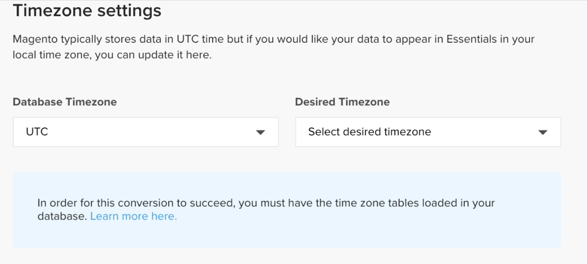
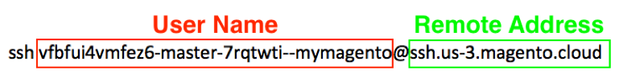

# 활성화 [!DNL MBI] 계정 `Cloud Starter` 구독

활성화하려면 [!DNL MBI] 대상 `Cloud Starter` 프로젝트, 먼저 만들기 [!DNL MBI] 계정을 만든 다음 `SSH` 키를 누른 다음 최종적으로 Commerce 데이터베이스에 연결합니다. 자세한 내용은 [온-프레미스 구독 활성화](../getting-started/onpremise-activation.md).

>[!NOTE]
>
>활성화 관련 도움말 [!DNL MBI] 대상 `Cloud Pro` 프로젝트에서 Adobe 계정 팀이나 고객 기술 관리자에게 문의하십시오.

1. 만들기 [!DNL MBI] 계정.

   - 이동 [Adobe Commerce 계정 로그인](https://account.magento.com/customer/account/login)

   - 이동 **[!UICONTROL My Account** > **My [!DNL MBI] Instances]**.

   - 클릭 **[!UICONTROL Create Instance]**. 이 단추가 표시되지 않으면 Adobe 계정 팀이나 고객 기술 관리자에게 문의하십시오.

   - 을(를) 선택합니다 `Cloud Starter` 구독. 단지 `cloud starter` 구독. 기본 선택 사항입니다.

   - 클릭 **[!UICONTROL Continue]**.

   - 정보를 입력하여 계정을 만듭니다.

   

   - 받은 편지함으로 이동하여 이메일 주소를 확인합니다.

   

   - 암호를 만듭니다.

   

   - 계정을 만든 후에 사용자를 새 계정에 추가할 수 있습니다. 이제 기술 관리자를 추가하여 다음 단계를 수행할 수 있습니다.

   

1. 저장소에 대한 정보를 입력하여 환경 설정을 지정합니다.

   

   온보딩 플로우의 세 번째 단계에 대해 데이터베이스를 연결하기 전에 몇 가지 정보를 수집합니다. 을(를) 완료합니다 `Connect your database` 9단계의 페이지.

1. 전용 만들기 [!DNL MBI] 사용자.

   - 에서 사용자 만들기 [Adobe Commerce 계정](https://account.magento.com/customer/account/login).

   - _새 사용자가 되는 이유_ [!DNL MBI] 프로젝트에 사용자를 추가하여 계정에 전송할 새 데이터를 지속적으로 가져와야 합니다 [!DNL MBI] Data Warehouse. 이 사용자는 해당 연결 역할을 합니다. 이 사용자를 프로젝트에 추가하는 작업은 4단계에서 다룹니다.

   - 전용 [!DNL MBI] 사용자는 추가된 사용자가 의도치 않게 비활성화되거나 삭제되지 않도록 방지하여 [!DNL MBI] 연결.

1. 새로 만든 사용자를 프로젝트의 기본 환경에 `Contributor`.

   

1. 다운로드 [!DNL MBI] `SSH` 키.

   - 로 이동합니다. `Connect your database` 페이지의 [!DNL MBI] 사용자 인터페이스를 설정하고 아래로 스크롤하여 `Encryption settings`.

   - 대상 `Encryption Type` 필드, 선택 `SSH Tunnel`.

   - 드롭다운에서 제공된 을(를) 복사하여 붙여넣을 수 있습니다 [!DNL MBI] `Public Key`.

   

1. 새 항목 추가 [!DNL MBI] `Public key` 변환 후 [!DNL MBI] 사용자가 5단계에서 생성되었습니다.

   - 이동 [cloud Adobe Commerce 계정](https://account.magento.com/cloud/customer/login/). 새로운 기능을 위해 계정 로그인 정보로 로그인 [!DNL MBI] 사용자가 생성되었습니다. 그런 다음 로 이동합니다. `Account Settings` 탭.

   - 페이지를 아래로 스크롤하고 드롭다운을 확장합니다. `SSH` 키. 그런 다음 **[!UICONTROL Add a public key]**.

   

   - 추가 [!DNL MBI] `SSH Public Key` 위로부터.

   

1. 제공 [!DNL MBI] MySQL 자격 증명.

   - 업데이트 `.magento/services.yaml`

   ```sql
   mysql:
       type: mysql:10.0
       disk: 2048
       configuration:
           schemas:
               - main
           endpoints:
               mysql:
                   default_schema: main
                   privileges:
                       main: admin
               mbi:
                   default_schema: main
                   privileges:
                       main: ro
   ```

   - 업데이트 `.magento.app.yaml`

   ```sql
           relationships:
               database: "mysql:mysql"
               mbi: "mysql:mbi"
               redis: "redis:redis"
   ```

1. 데이터베이스 연결에 대한 정보 가져오기 [!DNL MBI].

   실행
   `echo $MAGENTO_CLOUD_RELATIONSHIPS | base64 --decode | json_pp`

   데이터베이스 연결에 대한 정보를 보려면

   아래 출력과 유사한 정보를 수신해야 합니다.

   ```json
           "mbi" : [
                 {
                    "scheme" : "mysql",
                    "rel" : "mbi",
                    "cluster" : "vfbfui4vmfez6-master-7rqtwti",
                    "query" : {
                       "is_master" : true
                    },
                    "ip" : "169.254.169.143",
                    "path" : "main",
                    "host" : "[!DNL MBI].internal",
                    "hostname" : "3m7xizydbomhnulyglx2ku4wpq.mysql.service._.magentosite.cloud",
                    "username" : "mbi",
                    "service" : "mysql",
                    "port" : 3306,
                    "password" : "[password]"
                 }
              ],
   ```

1. 상거래 데이터베이스 연결

   

   - `Integration Name`: [통합 이름을 선택합니다.]

   - `Host`: `[!DNL MBI].internal`

   - `Port`: `3306`

   - `Username`: `mbi`

   - `Password`: [8단계의 출력에 제공된 입력 비밀번호.]

   - `Database Name`: `main`

   - `Table Prefixes`: [테이블 접두사가 없으면 비워 둡니다.]

1. 시간대 설정을 설정합니다.

   

   - `Database`: `Timezone: UTC`

   - `Desired Timezone`: [데이터를 표시할 시간대를 선택합니다.]

1. 암호화 설정에 대한 정보를 가져옵니다.

   - 프로젝트 UI는 `SSH` 액세스 문자열입니다. 이 문자열은 `Remote Address` 및 `Username` 설정 `Encryption` 설정. 를 사용하십시오 `SSH Access` 프로젝트 UI의 기본 분기에 있는 액세스 사이트 단추를 클릭하여 찾은 문자열입니다 `User Name` 및 `Remote Address` 아래와 같이 표시됩니다.

   

   

1. 에 대한 정보를 입력합니다 `Encryption` 설정

   

   **입력**

   - `Encryption Type`: `SSH Tunnel`

   - `Remote Address`: `ssh.us-3.magento.cloud`

   - `Username`: `vfbfui4vmfez6-master-7rqtwti--mymagento`

   - `Port`: `22`

1. 클릭 **[!UICONTROL Save Integration]**.

1. 이제 에 성공적으로 연결되었습니다. [!DNL MBI] 계정이 필요합니다.

1. 성공적으로 접속한 후 [!DNL MBI] 상거래 데이터베이스에 대해서는 Adobe 계정 팀에 연락하여 통합 설정 및 기타 구성 단계와 같은 다음 단계를 조정하십시오.

1. 구성을 마치면 다음을 수행할 수 있습니다 [로그인](../getting-started/sign-in.md) 아래와 같이 [!DNL MBI] 계정이 필요합니다.
