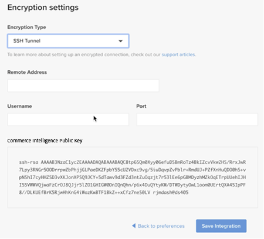

# 활성화 [!DNL Commerce Intelligence] 온-프레미스 및 스타터 구독 계정

활성화하려면 [!DNL Commerce Intelligence] 온-프레미스 구독의 경우 먼저 [!DNL Commerce Intelligence] 계정에서 설정 정보를 입력한 다음 연결합니다. [!DNL Commerce Intelligence] (으)로 [!DNL Commerce] 데이터베이스. <!-- For information about activation in `Cloud Starter` projects, see [Activating your [!DNL Commerce Intelligence] Account for `Cloud Starter` Subscriptions](../getting-started/cloud-activation.md).-->

## 사용자 만들기 [!DNL Commerce Intelligence] account

계정을 만들려면 Adobe 계정 팀이나 고객 기술 관리자에게 문의하십시오.

## 암호 만들기

계정을 만든 후에서 이메일에 계정 알림 이메일이 있는지 확인합니다. [!DNL The Magento BI Team@rjmetrics.com]. 이메일에 제공된 링크를 사용하여 [!DNL Commerce Intelligence] 계정을 만들고 암호를 만드십시오. 받은 편지함으로 이동하여 이메일 주소를 확인합니다.

이메일을 받지 못한 경우 [연락처 지원](https://experienceleague.adobe.com/docs/commerce-knowledge-base/kb/troubleshooting/miscellaneous/mbi-service-policies.html?lang=en).

## 스토어 환경 설정 지정

데이터베이스 연결을 구성하기 전에 저장소 정보 양식을 작성하십시오. 이 정보는 다음을 완료하는 데 필요합니다. **[!UICONTROL Connect your Database]** 설정.

## 추가 [!DNL Commerce Intelligence] 사용자

암호를 설정하고 로그인한 후 [!DNL Commerce Intelligence]에 다른 사용자를 추가할 수 있습니다. [!DNL Commerce Intelligence] 계정입니다. 사용자를 추가할 때 적절한 권한이 있는 관리자를 추가하여 활성화 프로세스를 완료합니다.

## 전용 만들기 [!DNL Commerce Intelligence] 의 사용자 [!DNL Commerce] admin

사용 [!DNL Commerce Intelligence]에 영구 및 전용 사용자를 추가해야 합니다. [!DNL Commerce] 프로젝트. 이 전용 사용자는 을(를) 영구적으로 연결하는 역할을 합니다. [!DNL Commerce] 새 데이터를 가져오고 계정에 전송할 수 있습니다. [!DNL Commerce Intelligence] Data Warehouse.

전용 구성 [!DNL Commerce Intelligence] 사용자는 계정이 비활성화되거나 삭제되지 않았는지 확인하여 [!DNL Commerce Intelligence] 연결.

>[!NOTE]
>
>Adobe은 영구 상태를 나타내는 계정 이름(예: ACI 전용, ACI-database-connector 등)을 사용할 것을 권장합니다.

다음에 대한 전용 사용자를 만든 후 [!DNL Commerce Intelligence] 관리자에서 동일한 사용자를 의 기본 환경에 추가합니다. [!DNL Commerce] 이 포함된 프로젝트 **[!UICONTROL Master]** 설정 `Contributor`.

## Commerce Intelligence SSH 키 가져오기

1. 다음에서 [!UICONTROL Connect your database] 페이지 [!DNL Commerce Intelligence] 설정, 아래로 스크롤 및 선택 **[!UICONTROL Encryption settings]**.

1. 대상 **암호화 유형**, 선택 `SSH Tunnel`.

1. 드롭다운에서 제공된 공개 키를 복사합니다.

   

## 공개 키를 [!DNL Commerce Intelligence]

1. 다음에서 [!DNL Commerce Admin], 로그인 정보 사용 [!DNL Commerce Intelligence] 방금 만든 사용자입니다.

1. 다음 항목 선택 **계정 설정** 탭.

1. 아래로 스크롤하고 를 확장합니다. **[!UICONTROL SSH Keys]** 드롭다운. 그런 다음 을 선택합니다. **[!UICONTROL Add a public key]**.

   

1. 복사한 공개 키를 [!DNL Encryption Type] 위쪽으로 이동하십시오.

   

## 제공 [!DNL Commerce Intelligence] 기본 사항 `MySQL` 자격 증명

1. 업데이트 `.magento/services.yaml`.

   

1. 업데이트 `.magento.app.yaml`.

   

## 데이터베이스 연결 정보 가져오기

데이터베이스 연결 정보를 [!DNL Commerce] 데이터베이스 대상 [!DNL Commerce Intelligence]

1. 정보를 얻으려면 다음을 실행하십시오.

   `echo $MAGENTO_CLOUD_RELATIONSHIPS | base64 --decode | json_pp`

1. 데이터베이스 정보를 검토합니다. 다음 예제와 비슷합니다.

   

## 연결 [!DNL Commerce Intelligence] (으)로 [!DNL Commerce] 암호화된 연결을 사용하는 데이터베이스

>[!NOTE]
>
>Adobe은 다음을 사용할 것을 권장합니다. [`SSH tunnel`](../data-analyst/importing-data/integrations/mysql-via-ssh-tunnel.md) 터널링하여 데이터베이스 연결을 만듭니다. 그러나 이 방법이 선택 사항이 아닌 경우 계속 연결할 수 있습니다 [!DNL Commerce Intelligence] 을 사용하여 데이터베이스에 [`direct connection`](../data-analyst/importing-data/integrations/mysql-via-a-direct-connection.md).

다음을 입력하십시오. [!DNL Commerce Intelligence] 의 정보 [!UICONTROL Connect your Magento Database] 화면.

**입력:**

[!UICONTROL Integration Name]: [이름 선택 [!DNL Commerce Intelligence] 인스턴스]

[!UICONTROL Host]: `mbi.internal`

[!UICONTROL Port]: `3306`

[!UICONTROL 사용자 이름]: `mbi`

[!UICONTROL Password]: [이전 섹션에 표시된 입력 암호]

[!UICONTROL Database Name]: `main`

[!UICONTROL Table Prefixes]: [테이블 접두사가 없으면 비워 둡니다.]

## 설정 [!UICONTROL **시간대**] 설정

**입력:**

[!UICONTROL Database Timezone]: `UTC`

[!UICONTROL Desired Timezone]: [데이터를 표시할 시간대를 선택합니다]

## 암호화 설정 정보 가져오기

프로젝트 UI는 SSH 액세스 문자열을 제공합니다. 이 문자열은 다음에 필요한 정보를 수집하는 데 사용할 수 있습니다. [!UICONTROL **원격 주소**] 및 [!UICONTROL **사용자 이름**]. 프로젝트 UI의 기본 분기에 있는 사이트 액세스 버튼을 선택하여 SSH Access 문자열을 사용합니다. 그런 다음 [!UICONTROL User Name] 및 [!UICONTROL Remote Address] 아래와 같이 표시됩니다.

## 을(를) 입력합니다 [!DNL Encryption] 설정

**입력:**

[!UICONTROL Encryption Type]: `SSH Tunnel`

[!UICONTROL Remote Address]: `ssh.us-3.magento.cloud`  [이전 단계에서]

[!UICONTROL Username]: `vfbfui4vmfez6-master-7rqtwti—mymagento`  [이전 단계에서]

[!UICONTROL Port]: `22`

## 통합을 저장합니다.

구성 단계를 완료한 후 을 선택하여 변경 사항을 적용합니다. [!UICONTROL **통합 저장**].

이제 을(를) 정상적으로 연결했습니다. [!DNL Commerce] 데이터베이스 대상 [!DNL Commerce Intelligence] 계정입니다.

>[!NOTE]
>
>다음과 같은 경우 [!DNL Adobe Commerce Intelligence Pro] 고객은 Customer Success Manager 또는 Customer Technical Advisor에게 문의하여 다음 단계를 조율하십시오.

구성을 완료한 후, [로그인](../getting-started/sign-in.md) (으)로 [!DNL Commerce Intelligence] 계정입니다.

<!---# Activate your [!DNL Commerce Intelligence] Account 

To activate [!DNL Commerce Intelligence] for on-premise or `Cloud Pro` subscriptions, [contact support](https://experienceleague.adobe.com/docs/commerce-knowledge-base/kb/troubleshooting/miscellaneous/mbi-service-policies.html).

>[!NOTE]
>
>Adobe no longer supports new `Cloud Starter` subscriptions.--->
