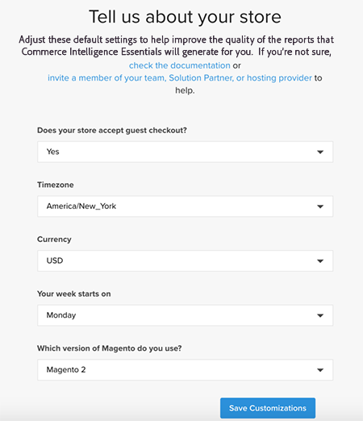

# 온-프레미스 및 스타터 구독에 대한 [!DNL Commerce Intelligence] 계정 활성화

온-프레미스 구독에 대해 [!DNL Commerce Intelligence]을(를) 활성화하려면 먼저 [!DNL Commerce Intelligence] 계정을 만들고 설정 정보를 입력한 다음 [!DNL Commerce Intelligence]을(를) [!DNL Commerce] 데이터베이스에 연결하세요. <!-- For information about activation in `Cloud Starter` projects, see [Activating your [!DNL Commerce Intelligence] Account for `Cloud Starter` Subscriptions](../getting-started/cloud-activation.md).-->

## [!DNL Commerce Intelligence] 계정 만들기

계정을 만들려면 Adobe 계정 팀 또는 고객 기술 관리자에게 문의하십시오.

## 암호 만들기

계정을 만든 후 [!DNL The Magento BI Team@rjmetrics.com]에서 보낸 계정 알림 전자 메일을 확인하세요. 전자 메일에 제공된 링크를 사용하여 [!DNL Commerce Intelligence] 계정에 액세스하고 암호를 만드십시오. 받은 편지함으로 이동하여 이메일 주소를 확인합니다.

전자 메일을 받지 못한 경우 [지원팀에 문의](https://experienceleague.adobe.com/docs/commerce-knowledge-base/kb/troubleshooting/miscellaneous/mbi-service-policies.html)하세요.

## 스토어 환경 설정 지정

데이터베이스 연결을 구성하기 전에 저장소 정보 양식을 작성하십시오. 이 정보는 **[!UICONTROL Connect your Database]** 설정을 완료하는 데 필요합니다.

## [!DNL Commerce Intelligence]명의 사용자 추가

암호를 설정하고 [!DNL Commerce Intelligence]에 로그인한 후 [!DNL Commerce Intelligence] 계정에 다른 사용자를 추가할 수 있습니다. 사용자를 추가할 때 적절한 권한이 있는 관리자를 추가하여 활성화 프로세스를 완료합니다.

## [!DNL Commerce Intelligence] 관리자의 전용 [!DNL Commerce] 사용자 만들기

[!DNL Commerce Intelligence]을(를) 사용하려면 [!DNL Commerce] 프로젝트에 영구 전용 사용자를 추가해야 합니다. 이 전용 사용자는 새 데이터를 가져와 계정의 [!DNL Commerce] Data Warehouse에 전송할 수 있도록 [!DNL Commerce Intelligence]에 대한 영구 연결 역할을 합니다.

전용 [!DNL Commerce Intelligence] 사용자를 구성하면 계정이 비활성화되거나 삭제되지 않으므로 [!DNL Commerce Intelligence] 연결이 중지됩니다.

>[!NOTE]
>
>Adobe에서는 영구 상태를 나타내는 계정 이름(예: ACI 전용, ACI-database-connector 등)을 사용할 것을 권장합니다.

관리자의 [!DNL Commerce Intelligence]에 대한 전용 사용자를 만든 후 [!DNL Commerce] 설정이 **[!UICONTROL Master]**&#x200B;인 `Contributor` 프로젝트의 기본 환경에 동일한 사용자를 추가하십시오.

## Commerce Intelligence SSH 키 가져오기

1. [!UICONTROL Connect your database] 설정의 [!DNL Commerce Intelligence] 페이지에서 아래로 스크롤하고 **[!UICONTROL Encryption settings]**&#x200B;을(를) 선택합니다.

1. **암호화 유형**&#x200B;에 대해 `SSH Tunnel`을(를) 선택하십시오.

1. 드롭다운에서 제공된 공개 키를 복사합니다.

   

## 공개 키를 [!DNL Commerce Intelligence]에 추가

1. [!DNL Commerce Admin]에서 방금 만든 [!DNL Commerce Intelligence] 사용자의 로그인 정보를 사용하여 로그인합니다.

1. **계정 설정** 탭을 선택합니다.

1. 아래로 스크롤하여 **[!UICONTROL SSH Keys]** 드롭다운을 확장합니다. **[!UICONTROL Add a public key]**&#x200B;을(를) 선택합니다.

   

1. 위의 [!DNL Encryption Type] 단계에서 복사한 공개 키를 붙여넣습니다.

   

## [!DNL Commerce Intelligence] Essentials `MySQL` 자격 증명 제공

1. `.magento/services.yaml`을(를) 업데이트합니다.

   

1. `.magento.app.yaml`을(를) 업데이트합니다.

   

## 데이터베이스 연결 정보 가져오기

[!DNL Commerce] 데이터베이스에 대한 데이터베이스 연결 정보를 [!DNL Commerce Intelligence]&#x200B;(으)로 가져오기

1. 정보를 얻으려면 다음을 실행하십시오.

   `echo $MAGENTO_CLOUD_RELATIONSHIPS | base64 --decode | json_pp`

1. 데이터베이스 정보를 검토합니다. 다음 예제와 비슷합니다.

   

## 암호화된 연결을 사용하여 [!DNL Commerce Intelligence]을(를) [!DNL Commerce] 데이터베이스에 연결

>[!NOTE]
>
>Adobe에서는 [`SSH tunnel`](../data-analyst/importing-data/integrations/mysql-via-ssh-tunnel.md) 터널을 사용하여 데이터베이스 연결을 만들 것을 강력히 권장합니다. 그러나 이 메서드가 옵션이 아닌 경우 [!DNL Commerce Intelligence]을(를) 사용하여 [`direct connection`](../data-analyst/importing-data/integrations/mysql-via-a-direct-connection.md)을(를) 데이터베이스에 연결할 수 있습니다.

[!DNL Commerce Intelligence] 화면에 [!UICONTROL Connect your Magento Database] 정보를 입력하십시오.

**입력:**

[!UICONTROL Integration Name]: [[!DNL Commerce Intelligence] 인스턴스의 이름 선택]

[!UICONTROL Host]: `mbi.internal`

[!UICONTROL Port]: `3306`

[!UICONTROL 사용자 이름]: `mbi`

[!UICONTROL Password]: [이전 섹션에 표시된 입력 암호]

[!UICONTROL Database Name]: `main`

[!UICONTROL Table Prefixes]: [테이블 접두사가 없으면 비워 둡니다]

## [!UICONTROL **표준 시간대**] 설정 설정

**입력:**

[!UICONTROL Database Timezone]: `UTC`

[!UICONTROL Desired Timezone]: [데이터를 표시할 시간대를 선택하십시오]

## 암호화 설정 정보 가져오기

프로젝트 UI는 SSH 액세스 문자열을 제공합니다. 이 문자열은 [!UICONTROL **원격 주소**] 및 [!UICONTROL **사용자 이름**]&#x200B;에 필요한 정보를 수집하는 데 사용할 수 있습니다. 프로젝트 UI의 기본 분기에 있는 사이트 액세스 버튼을 선택하여 SSH Access 문자열을 사용합니다. 그런 다음 아래와 같이 [!UICONTROL User Name] 및 [!UICONTROL Remote Address]을(를) 찾습니다.

## [!DNL Encryption] 설정 입력

암호화 유형, 원격 주소, 사용자 이름 및 포트 필드가 있는 

**입력:**

[!UICONTROL Encryption Type]: `SSH Tunnel`

[!UICONTROL Remote Address]: `ssh.us-3.magento.cloud` [이전 단계의 ]

[!UICONTROL Username]: `vfbfui4vmfez6-master-7rqtwti—mymagento` [이전 단계의 ]

[!UICONTROL Port]: `22`

## 통합을 저장합니다.

구성 단계를 완료한 후 [!UICONTROL **통합 저장**]&#x200B;을 선택하여 변경 내용을 적용합니다.

이제 [!DNL Commerce] 데이터베이스를 [!DNL Commerce Intelligence] 계정에 연결했습니다.

>[!NOTE]
>
>[!DNL Adobe Commerce Intelligence Pro] 고객인 경우 다음 단계를 조정하려면 고객 성공 관리자 또는 고객 기술 관리자에게 문의하십시오.

구성을 완료한 후 [ 계정에 ](../getting-started/sign-in.md)로그인[!DNL Commerce Intelligence]하세요.

<!---# Activate your [!DNL Commerce Intelligence] Account

To activate [!DNL Commerce Intelligence] for on-premise or `Cloud Pro` subscriptions, [contact support](https://experienceleague.adobe.com/docs/commerce-knowledge-base/kb/troubleshooting/miscellaneous/mbi-service-policies.html).

>[!NOTE]
>
>Adobe no longer supports new `Cloud Starter` subscriptions.--->
