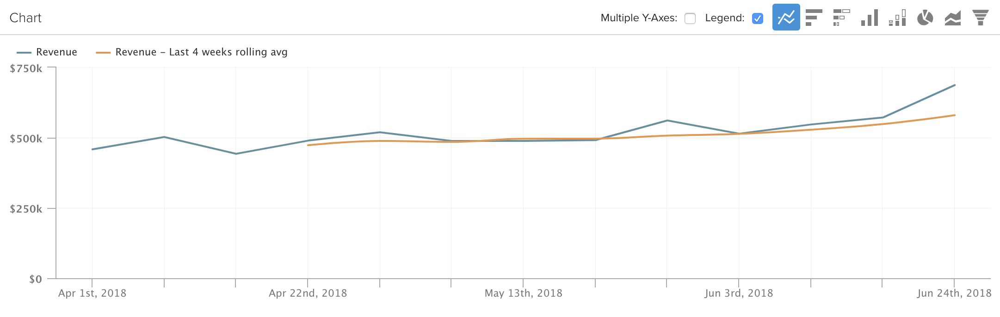

# [!DNL Visual Report Builder] 사용

[[!DNL Visual Report Builder]](../data-user/reports/ess-rpt-build-visual.md)을(를) 사용하면 데이터를 시각적으로 탐색하여 통찰력을 얻고 비즈니스 결정을 내리는 데 도움이 됩니다. 이 튜토리얼에서는 기본 보고서를 만드는 과정을 안내합니다.

>[!NOTE]
>
>대시보드에 보고서를 추가하려면 대시보드에 대한 `Standard` [사용자 권한](../administrator/user-management/user-management.md) 및 `Edit` 액세스 권한이 필요합니다.

## 1단계: 보고서 만들기

보고서 만들기를 시작하려면 사이드바에서 **[!UICONTROL Report Builder]**&#x200B;을(를) 클릭하거나 대시보드 맨 위에서 **[!UICONTROL Add Report]**&#x200B;을(를) 클릭하십시오. `Report Builder` 페이지가 표시되면 **[!UICONTROL Visual Report Builder]** 옵션을 클릭합니다.

[!DNL Visual Report Builder]에서 만든 보고서를 편집하려면 차트의 오른쪽 상단에 있는 톱니바퀴(옵션) 아이콘을 클릭한 다음 **[!UICONTROL Edit]**&#x200B;을(를) 클릭합니다.

## 2단계: 지표 추가

분석을 만드는 첫 번째 단계는 분석할 [지표](../data-user/reports/ess-manage-data-metrics.md)을(를) 선택하는 것입니다. 지표는 기본적으로 알파벳순으로 나열되지만 지표를 구동하는 표로 그룹화할 수도 있습니다.

초기 지표를 선택한 후 추가 지표를 추가하고 단일 보고서에 모든 지표를 오버레이하거나 공식을 추가하여 다중 지표 계산을 수행할 수 있습니다.

## 3단계: `Formulas` 추가

보고서의 지표 목록 바로 위에 있는 **[!UICONTROL Add Formula]**&#x200B;을(를) 클릭하여 `Formulas`을(를) 보고서에 추가합니다. [수식 편집기](../data-analyst/dev-reports/formulas-in-rpt-bldr.md)에서 보고서에 포함된 모든 지표를 입력으로 사용할 수 있습니다. 기본 수학 연산자는 다양한 지표를 조작하는 데 사용됩니다.

주문당 평균 매출을 보여주는 보고서를 만들려고 한다고 가정해 보겠습니다. 이 경우 `Revenue` 지표를 `Number of orders` 지표로 나눕니다.

## 4단계: `Time Period` 및 `Interval of Analysis` 설정 {#time}

특정 시간 동안 0이 되도록 분석의 기간을 설정할 수 있습니다. 시간 간격을 선택하여 데이터를 세그먼트화할 수도 있습니다(예: 연도별, 분기별 또는 월별). 차트의 오른쪽 위 모서리에 있는 메뉴를 사용하여 기간과 간격을 설정합니다.

기간에 대한 특정 날짜 범위를 설정할 때는 시작 날짜가 간격의 시작 날짜이고 종료 날짜가 간격의 종료 날짜인지 확인하십시오.

예를 들어 기간을 `January 1st`에서 `March 1st`(으)로 설정하고 `monthly` 간격을 선택하면 `March`이(가) 데이터 포인트로 표시되지만 `March 1`을(를) 제외하고 `March`에서는 매일 무시됩니다. 이 경우 `January 1 to March 31`에서 `Time Period`을(를) 만들어야 합니다.

## 5단계: `Group by` / `Segmenting the Analysis` {#groupby}

[지표를 데이터 차원으로 세그먼트화하려면](../best-practices/segment-filter.md) 차트의 왼쪽 상단에 있는 **[!UICONTROL Group by]** 메뉴를 클릭하십시오. 이렇게 하면 목록에 포함된 첫 번째 지표의 사용 가능한 모든 차원을 포함하는 드롭다운이 표시됩니다.

지표가 세그먼트화되지 않도록 `None`을(를) 선택할 수 있습니다. 예를 들어, 다른 매출 지표를 지역별로 세그먼트화하면서 세그먼트화하지 않고 총 매출을 반환하는 지표를 원할 수 있습니다.

주문당 평균 매출액 예제로 돌아가 그룹 기준 을 프로모션 코드로 설정합니다. 프로모션 코드가 있는 주문과 없는 주문의 주문당 평균 매출을 보여줍니다.

분석에 포함된 지표가 다른 데이터 테이블에 작성되어 있는 경우 팝업을 사용하여 각 테이블에서 일치하는 데이터 차원을 선택할 수 있습니다. 여기서의 목표는 세분화에 대한 값 유형을 공유하는 차원을 찾는 것입니다.

## 6단계: `Metric Filters`, `Perspective` 및 `Time Interval` 설정 {#metric-specific}

분석에 추가된 각 지표에 대해 필터를 추가하고 관련 데이터 관점을 선택하고 `time interval` 옵션을 설정할 수 있습니다. 이러한 기능에 액세스하려면 보고서에 포함된 지표 옆에 있는 단계(`Filter`), 눈(`Perspective`) 및 시계(`Time`) 아이콘을 클릭합니다.

### `Filters`

`Filters`에서 분석에 포함된 데이터 집합을 제한합니다. 필터는 예를 들어 개별 획득 채널을 평가하고 이상치를 제거할 때 유용합니다.

드롭다운 메뉴와 텍스트 상자 외에도 `LIKE` 또는 `IN`과 같은 특수 필터 연산자를 사용하여 필터를 만들 수도 있습니다.

`LIKE` 문과 함께 와일드카드(`%` 또는 `_`)를 사용할 수 있습니다. `%` 와일드카드는 여러 문자를 일치하지만 `_`은(는) 단일 문자만 일치합니다. For example:

- `affiliate's name Like B%`은(는) 이름이 `B`(으)로 시작하는 고객의 데이터만 허용합니다.

- `affiliate's name Like _ake`은(는) 이름이 `Jake`, `Rake` 또는 `Bake`과(와) 같지만 `Drake` 또는 `Blake`은(는) 아닌 고객의 데이터만 허용합니다.

여러 필터를 추가하면 차트의 데이터를 세밀하게 제어할 수 있습니다. 기본적으로 모든 필터 조건은 데이터 일부를 포함하기 위해 true여야 하지만 필터 규칙 텍스트 상자를 편집하여 OR 관계를 만들 수 있습니다.

### `Perspectives`

`Perspectives`을(를) 사용하면 데이터의 다양한 보기 사이를 쉽게 전환할 수 있습니다. 사용 가능한 항목 보기:

- `Standard perspective`: 표준 관점에서는 x축의 일치하는 날짜에 대한 결과를 보여 줍니다(예: 1월 매출). 다음은 주문당 평균 매출액 예제에서 사용하는 관점입니다.

- `Amount` 또는 `Percent Change` 대 `Previous Period` 관점: 이 관점은 한 간격에서 다음 간격으로의 변화량 또는 백분율을 보여주며 빠르게 변화하는 지표의 변화율을 측정하는 데 유용합니다. 전년 동기 대비 구간을 비교하여 연도별 성장률을 보려는 시각도 있다.

- `Cumulative perspective`: `cumulative perspective`은(는) 기간 동안 지표의 진행 중 또는 누적 합계를 표시합니다. 이는 종종 총 고객을 분석하고 향후 용량을 계획하는 데 사용됩니다.

- `Percent of First Value perspective`: 이 관점은 분석에 포함된 첫 번째 간격의 백분율로 데이터를 표시합니다. 이는 1기 성과 대비 특정 행동의 효과를 측정하는데 도움이 된다.

- `Rolling averages window perspective`: 순환 평균 창 관점은 지정된 시간 범위 동안 지표의 순환 평균 값을 표시합니다. 간격은 보고서 수준에 설정된 간격과 동일해야 합니다. 예를 들어 보고서에 주별 매출의 마지막 전체 분기가 표시되면 롤링 평균 기간 시간 범위를 4주로 설정할 수 있습니다. 이렇게 하면 처음 세 값은 null이고 네 번째 값은 매출의 처음 4주 평균을 나타냅니다. 아래 예제와 같이 롤링 평균이 있는 동일한 지표를 보고 있는 경우에는 `Multiple Y-Axes` 확인란을 해제해야 합니다.

### 지표별 시간 옵션

보고서에 사용된 지표에 대해 두 가지 옵션이 있습니다. 글로벌 시간 옵션에 따라 시간의 흐름에 따라 트렌드를 표시할 수 있으며, 그렇지 않으면 스칼라 숫자로 표시됩니다.

지표 시간 간격을 `None`(으)로 변경하면 `scalar` 숫자가 반환됩니다. 이는 시간 트렌드 지표를 `scalar` 숫자로 나누는 수식을 만들 때 유용합니다. 또한 `scalar` 지표의 시간 범위를 보고서에 대한 시간 범위와 무관한 시간 범위로 변경할 수도 있습니다.

예를 들어 2019년 월별 매출을 2019년 총 매출의 백분율로 표시하려고 했습니다. 2019년 1월 1일부터 2019년 12월 31일까지의 글로벌 시간 범위를 월별 간격으로 구분하여 보고서에 두 개의 `Revenue` 지표를 추가할 수 있습니다.

>[!NOTE]
>
>`group by` 차원을 추가하는 경우 새 시각화를 선택하거나 시간 간격을 조정한 다음 숫자(`scalar`)만 저장합니다. 다음 번에 대시보드에서 보고서를 열 때는 이러한 조정이 유지되지 않으며 시간 범위만 유지됩니다.

보고서에서 시간 옵션을 사용하는 방법에 대한 자세한 내용은 이 [자습서](../tutorials/time-options-visual-rpt-bldr.md)를 참조하세요.

## 7단계: 보고서 저장

차트를 만들 때 `Visual Report Builder`의 오른쪽 상단 모서리에서 **[!UICONTROL Save]**&#x200B;을(를) 클릭하여 저장할 수 있습니다.

`Type` 드롭다운을 사용하여 차트, 테이블 또는 숫자(`scalar`)를 저장하고 `Location` 드롭다운을 사용하여 보고서를 저장할 대시보드를 저장하도록 선택할 수 있습니다.

**[!UICONTROL Save to Dashboard]**&#x200B;을(를) 클릭하여 보고서를 저장할 수 있습니다.

## 보고서 출력

선택할 보고서 출력을 결정하는 데 도움이 되도록 하려면 다음을 참조하십시오.

### 차트

### 표

### 숫자(`scalar`)

축하합니다! 넌 끝났어.
