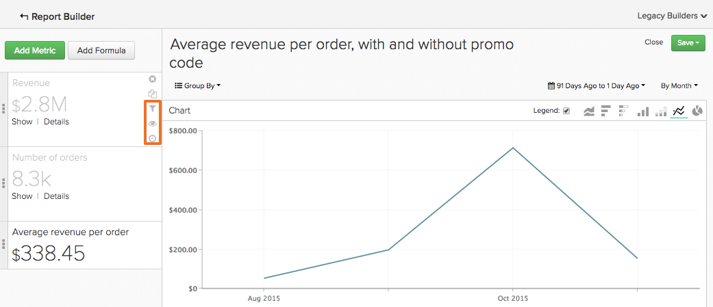
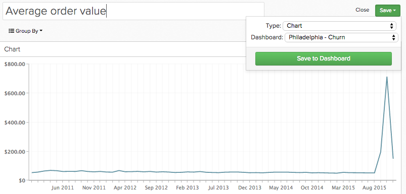

# 를 사용하십시오 `Visual Report Builder`

다음 [`Visual Report Builder`](../data-user/reports/ess-rpt-build-visual.md) 데이터를 시각적으로 탐색하여 인사이트를 도출하고 비즈니스 의사 결정을 내리는 데 도움이 됩니다. 이 자습서에서는 기본 보고서를 만드는 프로세스를 안내합니다.

>[!NOTE]
>
>보고서를 대시보드에 추가하려면 `Standard` [사용자 권한](../administrator/user-management/user-management.md) 및 `Edit` 대시보드에 액세스합니다.

## 1단계: 보고서 만들기

새 보고서 만들기를 시작하려면 **[!UICONTROL Report Builder]** 사이드바 또는 **[!UICONTROL Add Report]** 대시보드 맨 위에 있습니다. 이 `Report Builder` 선택 페이지가 표시되면 클릭 **[!UICONTROL Visual Report Builder]** 선택 사항입니다.

에서 만든 보고서를 편집하려면 `Visual Report Builder`차트의 오른쪽 위 모서리에 있는 톱니바퀴(옵션) 아이콘을 클릭한 다음, **[!UICONTROL Edit]**.

## 2단계: 지표 추가

분석을 만드는 첫 번째 단계는 을 선택하는 것입니다 [지표](../data-user/reports/ess-manage-data-metrics.md) 을 참조하십시오. 지표는 기본적으로 알파벳순으로 나열되지만 지표를 구동하는 테이블별로 그룹화할 수도 있습니다.

초기 지표를 선택한 후에 지표를 더 추가하고 모든 지표를 단일 보고서에 오버레이하거나 공식을 추가하여 다중 지표 계산을 수행할 수 있습니다.

## 3단계: 추가 중 `Formulas`

`Formulas` 를 클릭하여 보고서에 추가됩니다. **[!UICONTROL Add Formula]**: 보고서의 지표 목록 바로 위에 있습니다. 에서 [공식 편집기](../data-analyst/dev-reports/formulas-in-rpt-bldr.md)를 입력하면 보고서에 포함된 모든 지표를 입력으로 사용할 수 있습니다. 기본 수학 연산자는 다른 지표를 조작하는 데 사용됩니다.

주문당 평균 매출을 보여주는 보고서를 만들겠다고 했습니다. 이 경우에는 `Revenue` 지표 `Number of orders` 지표.

## 4단계: 설정 `Time Period` 및 `Interval of Analysis` {#time}

특정 시간 범위에서 0을 지정하려면 분석 기간을 설정할 수 있습니다. 시간 간격을 선택하여 데이터를 세그먼트화할 수도 있습니다(예: 연도, 분기 또는 개월별). 차트의 오른쪽 위 모서리에 있는 메뉴를 사용하여 기간과 간격을 설정합니다.

기간에 대한 특정 날짜 범위를 설정할 때 시작 날짜가 간격의 시작 부분에 있고 종료 날짜가 간격 끝에 있는지 확인합니다.

예를 들어 `January 1st to March 1st` 그리고 `monthly` 간격이 표시됩니다. `March` 데이터 포인트(datapoint)로 `March` 제외 `March 1`. 이 경우 `Time Period` 변환 전: `January 1 to March 31`.

## 5단계: `Group by` / `Segmenting the Analysis` {#groupby}

[데이터 차원별로 지표를 세그먼트화하는 방법](../best-practices/segment-filter.md)를 클릭하고 **[!UICONTROL Group by]** 메뉴 아래의 제품에서 사용할 수 있습니다. 이렇게 하면 목록에 포함된 첫 번째 지표의 사용 가능한 모든 차원을 포함하는 드롭다운이 표시됩니다.

선택할 수 있습니다 `None` 지표가 세그먼트화되지 않도록 합니다. 예를 들어 지역별로 세그먼트화된 다른 매출 지표를 확보하면서 세그먼트화하지 않고 총 수입을 반환하는 지표를 원할 수 있습니다.

주문당 평균 매출액으로 돌아가서 Group by 를 프로모션 코드로 설정합니다. 프로모션 코드가 있는 주문과 없는 주문 모두에 대한 주문당 평균 매출액을 보여줍니다.

분석에 포함된 지표가 다른 데이터 테이블을 기반으로 구축된 경우 팝업을 통해 각 테이블에서 일치하는 데이터 차원을 선택할 수 있습니다. 여기서 목표는 세그먼테이션을 위해 동일한 유형의 값을 공유하는 차원을 찾는 것입니다.

## 6단계: 설정 `Metric Filters`, `Perspective`, 및 `Time Interval` {#metric-specific}

분석에 추가된 각 지표에 대해 필터를 추가하고 관련 데이터 관점을 선택한 다음 설정할 수 있습니다 `time interval` 옵션. 이러한 기능에 액세스하려면 단계(`Filter`), 눈 ( )`Perspective`) 및 clock(`Time`) 보고서 세트에 포함된 지표 옆에 있는 아이콘을 클릭합니다.

### `Filters`

`Filters` 분석에 포함된 데이터 세트를 제한합니다. 필터는 개별 획득 채널을 평가하고 이상치를 제거할 때 매우 유용합니다.

드롭다운 메뉴 및 텍스트 상자 외에도 다음과 같은 특수 필터 연산자를 사용할 수도 있습니다 `LIKE` 또는 `IN` 필터를 만듭니다.

와일드카드 사용(`%` 또는 `_`) 내의 모든 세그먼트를 `LIKE` 문이 지원됩니다. 다음 `%` 와일드카드는 여러 문자와 일치하지만 `_` 은 단일 문자만 일치합니다. 예:

- `affiliate's name Like B%` 은 로 시작하는 고객의 데이터만 허용합니다 `B`.

- `affiliate's name Like _ake` 은 과 같은 이름을 사용하는 고객의 데이터만 허용합니다 `Jake`, `Rake`, 또는 `Bake` 하지만 `Drake` 또는 `Blake`.

여러 필터를 추가하면 차트의 데이터를 엄격히 제어할 수 있습니다. 기본적으로 데이터 일부가 포함되려면 모든 필터 조건이 true여야 하지만 필터 규칙 텍스트 상자를 편집하여 OR 관계를 생성할 수 있습니다.

### `Perspectives`

`Perspectives` 의 서로 다른 데이터 보기 간에 쉽게 전환할 수 있습니다. 사용 가능한 사항을 살펴보겠습니다.

- `Standard perspective`: 표준 원근은 x축에 있는 일치 날짜에 대한 결과를 보여줍니다(예: 1월의 수입). 이것은 주문당 평균 매출액 예에서 사용하고 있는 관점입니다.

- `Amount` 또는 `Percent Change` 비교 `Previous Period` 원근: 이 관점은 한 간격에서 다음 간격으로의 금액 또는 백분율 변경을 보여주며 빠르게 변화하는 지표의 변화율을 측정하는 데 유용합니다. 또한 간격을 작년 같은 기간과 비교하여 연간 증가율을 표시하는 관점도 있습니다.

- `Cumulative perspective`: 다음 `cumulative perspective` 기간 동안의 지표의 진행 중 또는 누적 합계 금액을 표시합니다. 이 기능은 전체 고객을 분석하고 향후 용량을 계획하는 데 종종 사용됩니다.

- `Percent of First Value perspective`: 이 관점에서 데이터는 분석에 포함된 첫 번째 시간 간격의 백분율로 표시됩니다. 이 기능은 첫 번째 기간 성능과 관련된 특정 작업의 효과를 측정하는 데 유용합니다.

- `Rolling averages window perspective`: 롤링 평균 창 관점은 지정된 시간 범위 동안 지표의 롤링 평균 값을 보여줍니다. 간격은 보고서 수준에서 설정된 간격과 같아야 합니다. 예를 들어, 보고서에 주별 수입의 마지막 전체 분기를 표시하는 경우, 롤링 평균 창 시간 범위를 4주로 설정할 수 있으며, 처음 3개의 값은 null이고, 네 번째 값은 처음 4주 매출액의 평균을 나타냅니다. 명확하게 하기 위해서는 `Multiple Y-Axes` 아래 예와 같이 롤링 평균과 동일한 지표를 보는 경우 확인란을 선택합니다.

### 지표별 시간 옵션

보고서에 사용된 지표에 대해 다음 두 가지 옵션이 있습니다. 시간 경과에 따른 트렌드를 스칼라 숫자로 표시하는 전역 시간 옵션에 따라 표시할 수 있습니다.

지표 시간 간격을 로 변경 `None` 반환 `scalar` 숫자 - 시간 트렌드 지표를 로 분할하는 공식을 만들 때 유용합니다 `scalar` 번호. 또한 시간 범위를 변경할 수도 있습니다 `scalar` 보고서에 대한 지표와 별개인 시간 범위입니다.

예를 들어, 2019년 총 매출액의 비율로 표현되는 2019년 월별 수입을 보고 싶었습니다. 두 개를 추가할 수 있습니다 `Revenue` 지표 를 2019년 1월 1일부터 2019년 12월 31일까지 월별 간격별로 세그먼트화한 보고서에 대한 전역 시간 범위입니다.

>[!NOTE]
>
>추가할 경우 `group by` 차원을 선택하거나 새 시각화를 선택하거나 시간 간격을 조정한 다음 숫자 (`scalar`) 이러한 조정은 다음에 대시보드에서 해당 보고서를 열 때 유지되지 않으며 시간 범위만 유지됩니다.

보고서에서 시간 옵션을 사용하는 방법에 대한 자세한 내용은 다음을 참조하십시오 [튜토리얼](../tutorials/time-options-visual-rpt-bldr.md).

## 7단계: 보고서 저장

새 차트를 만들 때 **[!UICONTROL Save]** 오른쪽 상단 모서리에서 `Visual Report Builder`.

차트, 표 또는 숫자를 저장하도록 선택할 수 있습니다(`scalar`) `Type` 드롭다운 및 `Location` 드롭다운.

그런 다음 을 클릭하여 보고서를 저장할 수 있습니다 **[!UICONTROL Save to Dashboard]**.

## 보고서 출력

선택할 보고서 출력을 결정하는 데 도움이 되도록 하려면 다음을 참조하십시오.

### 차트

### 표

### 숫자 (`scalar`)

축하합니다! 이제 다 끝났어
